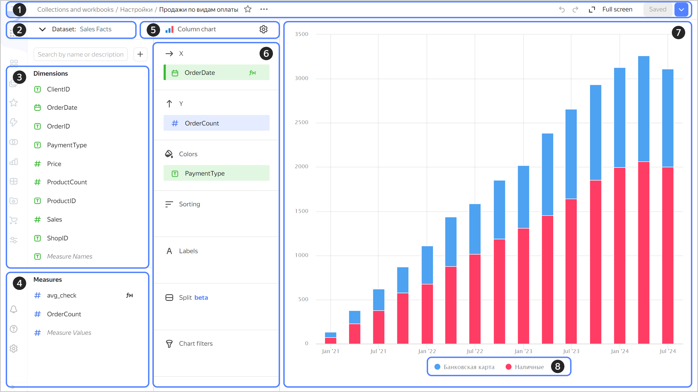

# Wizard charts

Charts are created in a wizard based on the data from one or more datasets (see [{#T}](./multidataset-chart.md) for details).



You can create an unlimited number of charts based on a single dataset.

The workspace in the wizard interface is divided into three main panels:

1. Dataset panel with available fields: **Dimensions** and **Measures**. You can also add a [calculated field](../calculations/index.md) to this list.
1. Visualization setup panel where you can select a [chart type](../../visualization-ref/index.md). Each type has its own sections, such as X axis, Y axis, and filters, where you can drag and drop fields. For more information, see [{#T}](settings.md).
1. Preview panel where the visualization is displayed.

Charts allow you to quickly analyze and test hypotheses. You can also save charts and add them to dashboards as widgets.



{{ datalens-short-name }} limits the number of data rows displayed in charts. For more information, see [{#T}](../limits.md).



When opening a chart in a wizard:

* At the top (1), you can see general information: location and name, as well as controls and saves that are common for all charts.
* At the bottom left (2), you can select a [dataset](../../dataset/index.md) to create a widget. Once you select a dataset, you will see a list of fields (3) you can use in the chart. The fields are grouped into [Dimensions (4) and Measures (5)](../../dataset/data-model.md#field).
* On the right, you can see the chart type selection button (6) and the  icon to open the general settings (7). Once the chart type is selected, you will see a list of sections (8) below. Its structure depends on the selected chart type.
* The Preview area (9) is on the right of the window.

