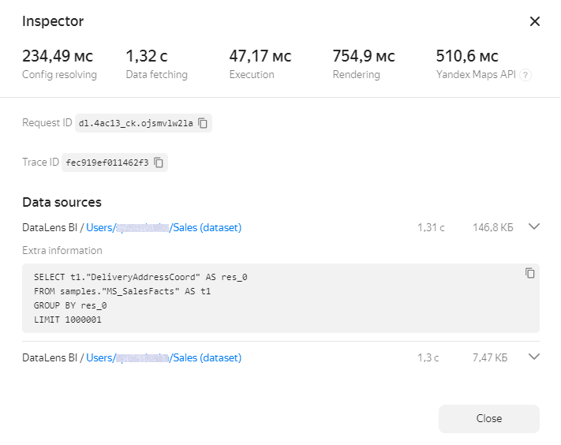

# Chart inspector

Multiple charts that are slow to load and process data may slow down the dashboard as a whole. You can analyze chart performance using the inspector.

Chart inspector is a {{ datalens-short-name }} tool that helps you diagnose issues when loading data and rendering them in your browser. You can use it to learn why your chart is slow or optimize data fetching and chart rendering.

​To open the chart inspector, click  in the top-right corner of the chart and select **Inspector**.





At the top of the inspector window, you can find the execution speed information for basic operations. Values above the optimal level are highlighted in either orange or red. To get recommendations for optimizing a measure, hover over the question mark next to its name.

Basic measures:

* **Config resolving**: Time to load chart configuration and generate a relevant request to the source. This measure is solely influenced by the service's internal logic. If the values are high (red), try reloading the chart or opening it later. If the values remain high, contact {{ yandex-cloud }} [support]({{ link-console-support }}). In your message,  specify a link to the chart and attach screenshots of the inspector window.
* **Data loading**: Time to execute a request in the source and transfer data to {{ datalens-short-name }}. Typically, it is the key measure in the overall chart execution time. To improve this measure, consider the following:

  * Choice of data source: Source DBMS must be calculated to support analytical workloads.
  * Source physical structure: Make efficient use of indexes, partitioning, and sorting, choose optimal table and data types.
  * Resources (RAM/CPU) allocated to the source: These must match the data volume and number of concurrent users.
  * Complexity of analytical computations: In some cases, it makes sense to simplify requests and use pre-processed data in the source.

* **Execution**: Time to process data received from the source in {{ datalens-short-name }}. Try to transfer data processing from {{ datalens-short-name }} to the source side as much as possible.
* **Rendering**: Chart data render time. When dealing with large volumes of output data, use filters, groupings, or pagination to limit the displayed dataset.

For some chart types, additional measures are displayed:

* **Columns / Rows**: Number of table columns and rows (for **Table** and **Pivot table** charts).
* **Yandex Maps API**: Time to load modules required by Yandex Maps (for **Map** charts).

The inspector also displays source request IDs and trace IDs.

The **Data sources** section displays information about the sources used in a chart:

* Source name.
* Link to source.
* Request body in JSON format.
* SQL query text sent to source (only if the SQL query is successful and its results are rendered in the chart).

#### See also {#see-also}

* [{#T}](../optimization_recommendations.md)