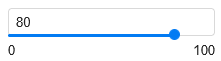

# Chart settings

Charts are configurable. For example, you can choose to display a legend, customize a color scheme, or set your own title.

Available settings depend on the type of chart being configured.

## General settings {#common-settings}

General settings affect the overall display of charts.
To open general settings, click  on the left side of the screen above the chart.



The settings specified below may not be available for some chart types.



#|
|| **Name** | **Description** ||
|| Header | Sets the header for the chart.  Available values:

* **Hide**: Hide header.
* **Show**: Show header. You can enter the header text in the text field on the right. ||
|| Legend | Displays the legend below the chart. The legend contains chart colors with text descriptions referring to the field values in the **Colors** section.  Available values:

* **On**: Displays the legend if the field is specified in the **Colors** [section](#color-settings).
* **Off**: Hides the legend. ||
|| Tooltip | Displays tooltips when hovering over a chart item.  Available values:

* **On**: Shows the tooltip.
* **Off**: Hides the tooltip. ||
|| Sum in tooltips | Displays a sum in a tooltip when you hover over the chart.  Available values:

* **On**: Displays a sum in a tooltip.
* **Off**: Hides a sum in a tooltip. ||
|| Navigator | Displays an additional element below the chart, the navigator. It allows to reduce the data selection displayed on the chart.  Available values:

* **On**: Shows the navigator.
* **Off**: Hides the navigator.

For more information, see [this guide](../../operations/chart/config-chart-navigator.md). ||
|| Pagination | Breaks a table into pages.  Available values:

* **On**: Displays the table part by part across a number of pages.
* **Off**: Displays the whole table. ||
|| Limit | Sets the number of rows to export. This is also the number of rows displayed per page. Available if **Pagination** is enabled. ||
|| Grouping | Displays unique field values.  Available values:

* **On**: Displays unique values.
* **Off**: Displays all values. ||
|| Summary | Displays a row with total values for table columns. The row values are calculated using the same formulas as [aggregation](../../dataset/data-model.md#aggregation) in the measure.  Available values:

* **On**: Shows the **Total** row.
* **Off**: Hides the **Total** row. ||
|| Stacking | Stacked or isolated data display for each category in the [area chart](../../visualization-ref/area-chart.md#stacking).  Available values:

* **On**: Displays stacked data.
* **Off**: Displays unstacked data. ||
|| Center | Sets the default coordinates of the center in [Maps](../../visualization-ref/map-chart.md).  Available values:

* **Auto**: Set the coordinates automatically.
* **Manually**: Set the coordinates manually, e.g., `54.630761, 39.736882`. You can use [Yandex Maps](https://yandex.ru/maps) to get the exact coordinates. ||
|| Scale | Sets the default scale in [Maps](../../visualization-ref/map-chart.md).  Available values:

* **Auto**: Enables autoscaling.
* **Manually**: Scale the map manually. The values correspond to the scale in Yandex Maps:
  
  * `1`: Minimum scale.
  * `21`: Maximum scale. ||
|#

## Field settings {#field-settings}

You can configure:

* Both dimensions and measures for [charts based on a dataset](./dataset-based-charts.md).
* Only measures for [QL charts](./ql-charts.md).

To open settings of a dimension or a measure, click the icon to the left of its name.



If you apply an aggregation to the dimension, it will become a measure and the relevant settings will become available for it.



### Dimensions {#measure-settings}

#|
|| **Name** | **Description** ||
|| Name | Sets a dimension name. ||
|| Type | Sets the type of dimension data. ||
|| Grouping | Sets the type of grouping or rounding. The setting is only available for the `Date` and `Date and time` type dimensions. ||
|| Format | Sets the format of how the values are displayed. ||
|| Date mode | Sets the date display mode. The setting is only available for the `Date` and `Date and time` type dimensions.  Available values:

* **Continuous**: Displays all dates continuously.
* **Discrete**: Displays dates that contain values. ||
|| Aggregation | Sets the aggregation type. Aggregation functions are available according to the [{#T}](../../dataset/data-model.md#aggregation) table. ||
|| Markup | The field value will be formatted according to the option you select:

* `None`: No markup.
* `HTML`: HTML markup. Available only for `String` type fields.
* `Markdown`: [{#T}](../../dashboard/markdown.md) markup. Available only for `String` type fields in relevant sections, depending on visualization type.
  
  #|
  || **Visualization types** | **Sections** ||
  || [Scatter chart](../../visualization-ref/scatter-chart.md) | X, Y, Points, [Colors](#color-settings), Shapes ||
  || [Tree chart](../../visualization-ref/tree-chart.md) | Dimensions ||
  || [Maps](../../visualization-ref/map-chart.md) | [Tooltip](#map-settings) ||
  || [Line](../../visualization-ref/line-chart.md), [Column](../../visualization-ref/column-chart.md), [Bar](../../visualization-ref/bar-chart.md), [Pie](../../visualization-ref/pie-chart.md), [Ring](../../visualization-ref/ring-chart.md), and [Area](../../visualization-ref/area-chart.md) chart | [Labels](#sign) ||
  |#

This setting is not available in the following visualizations: [Indicator](../../visualization-ref/indicator-chart.md), [Table](../../visualization-ref/table-chart.md) and [Pivot table](../../visualization-ref/pivot-table-chart.md). ||
|| Sub-totals | Shows columns and/or rows with subtotals. This setting is only available for [Pivot table](../../visualization-ref/pivot-table-chart.md) charts. ||
|#

### Measures {#indicator-settings}

#|
|| **Name** | **Description** ||
|| Name | Sets the measure name. ||
|| Type | Sets the type of measure data. Not available for [QL charts](./ql-charts.md). ||
|| Aggregation | Sets the aggregation type. Aggregation functions are available according to the [{#T}](../../dataset/data-model.md#aggregation) table. Not available for [QL charts](./ql-charts.md). ||
|| Format | Sets value display format. ||
|| Decimal places | Sets the number of decimal places. Not available for [QL charts](./ql-charts.md). ||
|| Display groups of thousands | Enables displaying groups of thousands for numeric values.  Available values:

* **With separator**: Displays spaces between groups of thousands.
* **Merged**: Hide spaces between groups of thousands. ||
|| Prefix | Sets a text displayed before a value. ||
|| Postfix | Sets a text displayed after a value. ||
|| Dimension | Sets a rounding scale of values. ||
|#

## Section settings {#section-settings}

To open section settings, click  in the row with the section name.

### Axes {#axis-settings}

Axis settings are only available for charts that have at least one X or Y axis:

* Line chart.
* Area chart (stacked and normalized).
* Column chart (including normalized).
* Bar chart (including normalized).
* Scatter chart.

You can configure settings for both the **X** and **Y** axes.



Some of these settings may not be available for some axes.



#|
|| **Name** | **Description** ||
|| Axis name | Sets an axis label.  Available values:

* **On**: Use the field name. If the section contains multiple fields, {{ datalens-short-name }} uses the name of the field listed first.
* **Off**: No axis label displayed.
* **Manually**: Allows setting an axis name manually in a text field. ||
|| Axis type | Defines the axis type. This setting is available if the fields in the axis section are of the `Fractional number` type.  Available values:

* **Linear**: Use linear axis.
* **Logarithmic**: Use logarithmic axis. Suitable for charts with a large spread of values. The logarithmic axis allows you to display a fast-growing graph in a convenient form for analysis, reducing values by an order of magnitude. ||
|| Graph axis | This setting allows you to hide all axis elements: lines, labels, and grid.  Available values:

* **Show**: Displays all axis elements.
* **Hide**: Hides all axis elements. ||
|| Display mode | Enables configuring continuous chart display.  Available values:

* **Discrete**: Plots the chart only for non-null values.
* **Continuous**: Plots the chart for all values continuously. You can only use continuous mode for the `Integer`, `Fractional number`, `Date`, or `Date and time` data types. ||
|| Axis formatting | Sets the formatting of numerical axis labels.  Available values:

* **Auto**: Default formatting.
* **By first field on the X axis**: Displays the X axis labels with the formatting specified in the **Format** setting for the first field in the **X** section. Available in the X axis settings.
* **By first field on the Y axis**: Displays the Y axis labels with the formatting specified in the **Format** setting for the first field in the **Y** section. Available in the Y axis settings. ||
|| Grid | Enables or disables grid display on the chart.  Available values:

* **On**: Shows grid.
* **Off**: Hides grid. ||
|| Grid increments, px | Sets grid increment in pixels. Available if the **Grid** setting is on.  Available values:

* **Auto**: Calculates grid size automatically.
* **Manual**: Specify grid size in pixels. ||
|| Labels | Shows or hides axis labels based on field values.  Available values:

* **On**: Shows axis labels.
* **Off**: Hides axis labels. ||
|| Label appearance | Sets the way the labels are displayed. Available if the **Labels** setting is on.  Available values:

* **Auto**: Displays axis labels.
* **Horizontal**: Displays axis labels horizontally.
* **Vertical**: Displays axis labels vertically.
* **Angled**: Displays axis labels at a 45-degree angle. ||
|| Null values | Allows you to select the handling method for null values.  Available values:

* **Hide**: Hides null values in charts.
* **Connect**: Connects field values where there are null values in between.
* **Display as 0**: Displays null values in charts as zero (0) field values.
* **Use previous**: Replaces null values with the value of the preceding point on the axis. Available in the Y axis settings for the [stacked chart](../../visualization-ref/area-chart.md).||
|| Scaling | Sets the chart axis scale.  Available values:

* **Auto**: Enables autoscaling. You can specify how {{ datalens-short-name }} sets the scale: from 0 to the maximum field value (**Autoscale from 0 to max**) or from the minimum to the maximum field values (**Autoscale from min to max**).
* **Manually**: Requires manual input of the axis scale. You can set the maximum and minimum values along the axis. {{ datalens-short-name }} will trim the chart lines by this value. ||
|#

### Colors {#color-settings}

Generally, you can set a specific color for any graph value.

For [tree chart](../../visualization-ref/tree-chart.md), [table](../../visualization-ref/table-chart.md) (including a [pivot table](../../visualization-ref/pivot-table-chart.md)), and [map](../../visualization-ref/map-chart.md), the following settings are available:

#|
|| **Name** | **Description** ||
|| Gradient type | Sets the number of gradient colors.  Available values:

* **Two-color**: Sets two colors for the gradient.
* **Tree-color**: Sets three colors for the gradient. ||
|| Color | Sets a color for a value. Available colors depend on the gradient type. ||
|| Set threshold values | Allows you to set threshold values that will refer to each color. ||
|| Borders | Sets borders for geopolygons.  Available values:

* **Show**: Displays geopolygon borders.
* **Hide**: Hides geopolygon borders. ||
|#

If the **Legend** option is enabled in [common settings](#common-settings), placing this field into the **Colors** section will make the legend visible below the chart. The legend contains chart colors with text descriptions corresponding to the field values in the **Colors** section.



To set up colors:

1. In the top-right corner of the **Colors** section, click  (the icon is displayed when you hover over the section).
1. Set the **Fill type**:

   

   You can use the **Palette** type for dimensions and the **Gradient** type for measures.

   

   

   - For a dimension {#measure}

     1. Click the color scheme selection field and set a color for each dimension value.
     1. Click **Apply**.

   - For a measure {#indicator}

     1. Click the gradient selection field and set the following properties:

        * **Gradient type**: Select two or three colors.

          * Gradient color: Select a color palette for the gradient from the list.
          * Gradient direction: Change the gradient direction using the  icon.

        * **Set threshold values**: Set numeric thresholds for each color.

     1. Click **Apply**.

   



You can [create color palettes](../../operations/chart/create-palette.md) and use them in your charts.

### Labels {#sign}

Labels display measure values on the chart. [Markup functions](../../function-ref/markup-functions.md) are supported. For `String` type fields, you can configure using basic [{#T}](../../dashboard/markdown.md) syntax: click the icon before the field name and enable **Markdown**.

Labels are available for the following charts types:

* Line chart.
* Area chart (stacked and normalized).
* Column chart (including normalized).
* Bar chart (including normalized).
* Pie chart.
* Map.

### Sorting {#sort}

Allows you to sort chart values by measure or dimension.

Sorting is available for the following chart types:

* Line chart.
* Area chart (stacked and normalized).
* Column chart (including normalized).
* Bar chart (including normalized).
* Pie chart.
* Table (including a Pivot table).

### Filters {#filter}

Filters allow you to make a selection of values by dimension or measure.
Filters are available for all chart types.

## Map section settings {#map-settings}

You can configure layers, point size and color, tooltips, and filters.
To open section settings, click  in the row with the section name.



Depending on the visualization type, different settings are available.



#|
|| **Name** | **Description** ||
|| Size | Sets point size depending on the measure value. ||
|| Colors | These set a color for geopoints and geopolygons depending on the measure value. ||
|| Tooltips | These create a tooltip displayed when you hover over a point. The tooltip contains dimension and measure values. For `String` type fields, you can configure using basic [{#T}](../../dashboard/markdown.md) syntax: click the icon before the field name and enable **Markdown**. ||
|| Layer filters | Create a selection by dimension or measure for the current layer. ||
|| General filters | Create a selection by dimension or measure for the whole chart. ||
|#

### Layers {#map-layer}

You can add up to five layers with any visualization types to a single map:

* Scatter chart: `Geopoints` dimension type.
* Choropleth map: `Geopolygons` dimension type.
* Heat map: `Geopoints (heat map)` dimension type.

You can delete and rename layers.

You can change the transparency of the current layer using the slider. You can also set transparency of a text field above the slider.

Transparency can have a value from 0 to 100.

### Colors {#map-color}

You can set a color for geopoints and geopolygons, which will depend on the measure value.

#|
|| **Name** | **Description** ||
|| Gradient type | Sets the number of gradient colors.  Available values:

* **Two-color**: Sets two colors for the gradient.
* **Tree-color**: Sets three colors for the gradient. ||
|| Borders | Sets borders for geopolygons.  Available values:

* **Show**: Displays geopolygon borders.
* **Hide**: Hides geopolygon borders. ||
|| Color | Sets a color for geopoints and geopolygons. Available colors depend on the gradient type. ||
|| Set threshold values | It allows you to set threshold values that will refer to each color. ||
|#

You can [create color palettes](../../operations/chart/create-palette.md) and use them in your charts.

## Undoing and redoing changes in charts {#undo-redo}

When editing a chart in the wizard or a [QL chart](./ql-charts.md), you can now undo/redo any change introduced within the current version:

* To undo changes, click  in the top-right corner of the screen or press **Ctrl** (**Cmd**) + **Z**.
* To redo changes, click  or press **Ctrl** (**Cmd**) + **Shift** + **Z**.

Unsaved changes in the current version are reset:

* When refreshing the page.
* When saving a chart.
* When switching to another [version](./versioning.md).

