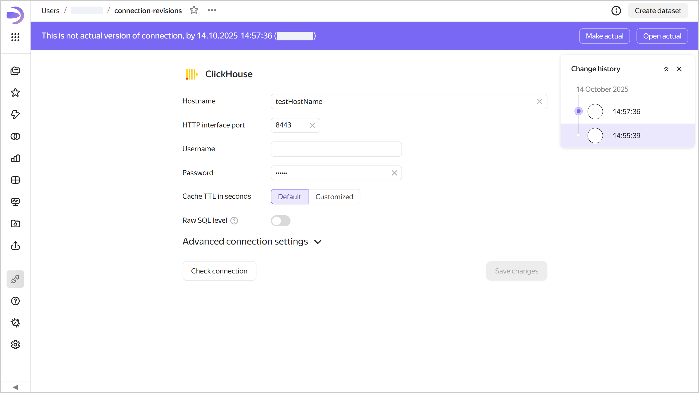
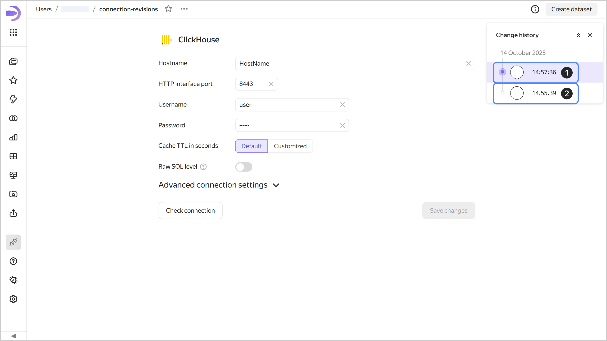

# Versioning

Connection versioning means storing the history of connection configuration changes through versions. A list of versions is available to users with the minimum edit permission for the connection.

To go to the list of versions, click  at the top of the screen and select  **Change history**.

To select a version from the list, click it. The version number will be displayed in the `revId` parameter in the connection address string. Click a link with the version number in the `revId` parameter to open the relevant version of the connection.

## Version types {#version-types}

All versions fall into the following types:

1. **Current**: This is the most recently saved version of a connection. It is displayed for all users that open the connection for viewing in the workbook or from the navigation panel. A connection can only have one current version.
1. **Outdated**: This version is no longer current.  
   When you open an outdated version, a panel appears at the top indicating the version type, creation date and time, and login of the version author. There are buttons in the right-hand panel:

   * **Make current**: Turns an outdated version into the current one. The version current at the time will become outdated.
   * **Open current**: Opens the current version.
   
   

   

   

## Creating a new version {#version-create}

A new version is automatically created when you click **Save** in connection edit mode. Any connection configuration changes available in the edit interface automatically create a new version.

## Editing versions {#version-edit}

You can edit any version of a connection.

### Editing an outdated version {#current-version-edit}

To edit an outdated version, select it from the list of versions. To save your changes to an outdated version, click **Save** at the top right. This will create a new current version, and all others will become outdated.

## Limitations {#restrictions}

* Versioning is not available for the following connections: [Files](../../operations/connection/create-file.md), [Yandex Documents](../../operations/connection/create-yadocs.md), and [Google Sheets](../../operations/connection/create-google-sheets.md).
* Sensitive connection data, such as passwords and tokens, is not versioned.
* You can only switch to versions created on or after December 1, 2024. Currently, if you edit a connection created before this date, saving your changes will delete the previous version.
* You can only get change history for the last three months.
* The change history only contains a list of connection versions and indicates the version type, save date and time, and user who made the change.
* Connection versions do not include:

  * Access permission changes (this operation is performed separately from connection edits).
  * Changes to the source data (rows added, updated, or deleted in the data source).

* Versions do not display a list of changes. You can only view the saved status of the connection configuration.