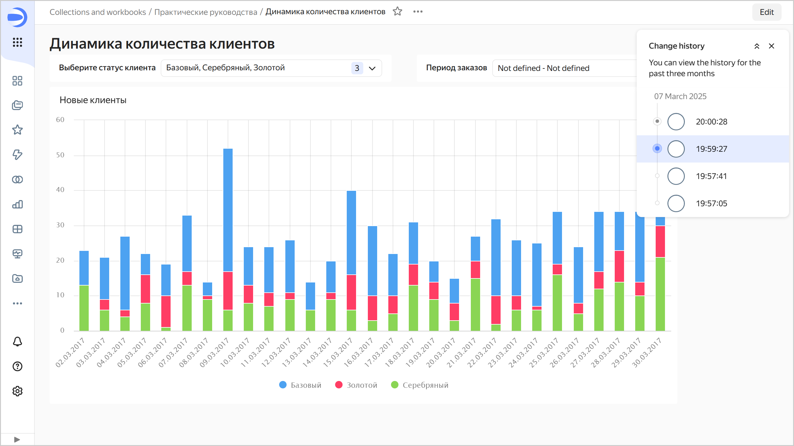
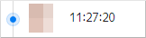
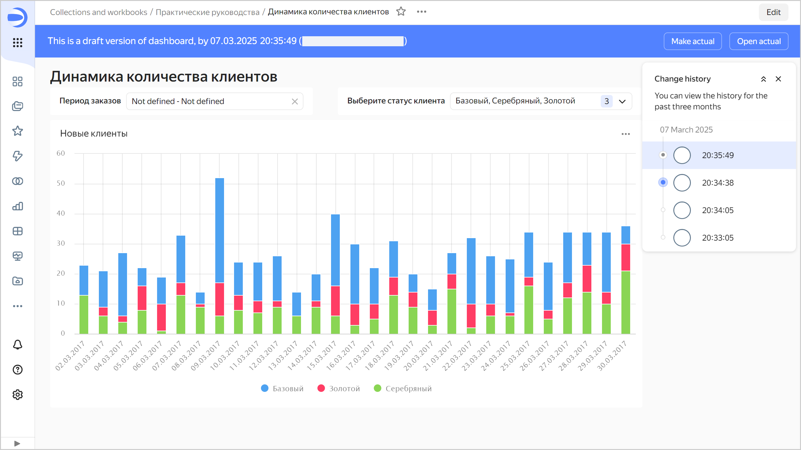
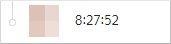

# {{ datalens-full-name }} dashboards

_Dashboards_ are pages or sets of pages that contain widgets. They let you group charts in one place and add explanatory text and titles.
You can create new dashboard pages using the **tab** element.



## Display modes {#display-modes}

{{ datalens-short-name }} lets you display the dashboard in full-screen mode. This mode hides part of the interface elements and expands the widget area on the screen.

By default, on the mobile version of the dashboard, {{ datalens-short-name }} displays the charts one after another using the following sorting rule: left-to-right, top-to-bottom. In the tab settings, you can change the order of displaying charts and selectors in the mobile version or mailing lists. For more information, see [{#T}](../operations/dashboard/display-modes.md).





## Versioning {#versioning}

Dashboard versioning is the ability to store the history of dashboard configuration changes using versions. A list of versions is available to users with the lowest level of access to the dashboard: **View**.

To go to the list of versions, click the  icon at the top of the screen and select **Change history**.

To select a version from the list, click it. The version number will be displayed as the value of the `revId` parameter in the dashboard address string. Clicking on a link with the version number in the `revId` parameter will open the relevant version of the dashboard directly.

### Version types {#version-types}

The following distinct versions are available:

* **Actual**. The most recent saved version of a dashboard. It is displayed for all users that open the dashboard for viewing from the navigation bar. Only one version of a dashboard can be current.

   

* **Draft**. A version with unsaved dashboard changes. The main users do not see changes being made to a draft. This enables you to hide dashboard edits until a version update. A dashboard can only have one draft.

   

* **Not actual**. A version that is neither actual nor a draft.

   

### Creating a new version {#version-create}

A new version is automatically created when you click **Save** in dashboard edit mode. Dashboard configuration changes that result in a new version:

* Changing dashboard settings that can be accessed by clicking  at the top of the screen.
* Adding, renaming, or deleting dashboard tabs.
* Editing links.
* Adding and removing widgets.
* Editing widgets, such as [Title](#title) and [Text](#text).
* Editing widget tabs.
* Editing selector settings.

### Limitations {#restrictions}

* The change history only contains a list of dashboard versions and includes: version type, save date and time, and the author of the edits.
* Dashboard versions do not include:

   * Access permission changes (this operation is separate from editing the dashboard itself).
   * Chart setting changes, that is, changes made from the Wizard, QL Chart, or Editor.
   * Changes to dataset settings made from the dataset interface.
   * Changes to connection settings made using the interface for editing connection parameters.
   * Data changes to the source (rows added, updated, or deleted in the data source).

* Versions do not display a list of changes. You can only view the saved status of the dashboard configuration.
* Mailing lists are available for the current dashboard version only.



## Widgets {#widget}

_Widgets_ are dashboard elements. You can create links between selectors and chart widgets.

{{ datalens-full-name }} offers the following types of widgets:

* [Chart](#chart)
* [Selector](#selector)
* [Text](#text)
* [Title](#title)

### Chart {#chart}

Visualization as a table or chart.
You can place charts anywhere on a dashboard and change their size.
Charts can be linked to selectors.

For more information about charts, see [{#T}](chart/index.md).

### Selector {#selector}

A filter that affects query results on its linked widgets. To add a selector to a dashboard, go to [{#T}](../operations/dashboard/add-selector.md).
A selector can be linked to a chart or another selector.
 For more information, see [Link](#link).
A selector works within a single dashboard tab.

### Text {#text}

A widget represented as text. It lets you place things like a set of links or explanatory captions on a dashboard. The [Markdown markup language](https://ru.wikipedia.org/wiki/Markdown) is supported.
For more information about Markdown, see [{#T}](markdown.md).

### Title {#title}

A widget represented as a heading. It lets you differentiate charts by meaning and divide them into groups within a single dashboard page.

## Link {#link}

Links determine how a selector affects one or more charts or other selectors. By default, selectors are linked with charts created within a single dataset. Selectors and charts based on different datasets can also be linked manually using [aliases](#alias).

You can choose an existing dataset field as the link or create your own field where you manually set the selector values. You can specify the fields to be associated through a link in the [alias](#alias) configuration window.

You can use links to filter the values of selectors and charts. For example, if you select a country in the first selector on the dashboard, the second selector limits the list of cities (and vice versa).

The field used by the selector to filter on must be included in the dataset used to construct a chart. Otherwise, the link will not work. For more information, see [{#T}](data-join.md).

The link type determines how values in selectors and charts are filtered. The type is set in the links window in the dashboard edit mode.  
You can use the following types of links for a pair of widgets:

* **Link**, for widgets that mutually affect each other.
* **Incoming link**, when a widget is affected by a widget.
* **Outgoing link**, when a widget affects another widget.
* **Ignore**, for widgets that mutually ignore each other.
* **No link**, for widgets from different datasets or widgets that can't be linked.



You can't create a link with [{#T}](#text) and [{#T}](#title) widgets.



Some widgets can't affect other widgets. Possible types of links between widgets are shown in the table:

| Affects/Affected | Selector | Charts |
----- | ----- | -----
| **Selector** | Link Incoming link Outgoing link Ignore | Outgoing link Ignore |
| **Chart** | Incoming link Ignore | — |

## An alias {#alias}

An alias is a link between fields of different datasets, which determines how widgets impact each other when you link them.

Aliases let you link widgets that are based on different datasets. For example, if you create an alias using the `[Region]` and `[Country]` fields from different datasets, a selector by the `[Region]` field from one dataset will filter data in a chart with the `[Country]` field of another dataset. For widgets based on the same dataset, aliases are created automatically. Creating aliases is required when you need to:

* Establish links between selectors that are based on different datasets, so that the values of one selector filter the list of available values of another selector.

* Establish links between a selector of the **Based on dataset** type from one dataset and charts from another dataset, so that the selector values filter the values in the charts.

* Establish links between a selector of the **Manual input** type and other selectors, so that the values of one selector filter the list of available values of another selector.

You can specify an alias for a pair of linked widgets. In this case:

* Multiple aliases can be set for a single pair of widgets.
* An alias set for one pair of widgets is applied to all linked widgets that are based on the same datasets (which use the fields specified in the alias).
* An alias works within a single dashboard tab.
* To limit the use of aliases, set **Ignore** as your link type for the link between your widgets on the selected field. In this case, the widgets for the selected field will have no effect on the dashboard tab.

For more information about how to create aliases, see [{#T}](../operations/dashboard/create-alias.md).

You can delete links from an alias where more than two fields are linked. Delete a field from the alias if its associated link between datasets or widgets is not required on a dashboard tab. For more information, see [{#T}](../operations/dashboard/edit-alias.md).





## Publishing dashboards {#public-access}

You can grant any internet user access to a dashboard using [{{ datalens-public }}](datalens-public.md). This dashboard becomes public and any user can view it without authorization.



To share a dashboard containing Yandex Metrica or AppMetrica data, use one of the following methods:









## Using parameters and limitations {#parameters}

Parameters in {{ datalens-short-name }} let you use visualization features more flexibly and adapt the use of the same charts and widgets for different purposes.

You can set parameters for the entire [dashboard](#params-dash) or an [individual chart](#params-chart) on the dashboard. Dashboard parameters apply to all of its charts, while chart parameters to an individual widget.

It may be helpful to use parameters in cases such as:

* You want to post a link to a dashboard with a filter applied: in another dashboard's table, on a Wiki page, or somewhere else.
* You want to post the same chart with different filters on the same dashboard tab.

### Dashboard parameters {#params-dash}

In the dashboard settings section, you can set the [parameters](../operations/dashboard/add-parameters.md) to use. For each parameter, specify a key and value. The saved dashboard parameters are inserted into all widgets (including charts and selectors) once they are uploaded. When opening this dashboard, its data will be filtered based on the specified parameter values.

A parameter name must be the same as the name of the dataset field by which data is filtered.



If the field name is specified in Russian or consists of two words, use the field ID as the parameter name (see the [instructions](../operations/chart/add-guid.md)).



You can also specify parameter values in dashboard links. In this case, clicking a link will open the dashboard with a filter applied.

The first address string parameter is separated from the dashboard path using `?` and the remaining parameters using `&`. For instance, `https://datalens.yandex-team.ru/test-dashboard?tab=test&OrderID=123456789` contains values for the `tab` and `OrderID` parameters.

The parameter values specified in the link will take priority. For example, if the dashboard settings have the `region` parameter set to `RU` and the dashboard link indicates `?region=KZ`, the `KZ` value is inserted into widgets.



### Chart parameters {#params-chart}

You can also set [chart parameter](../operations/chart/add-parameters.md) values in its settings on a dashboard. This lets you display the same chart with different filters on the same dashboard tab.

You can pass a parameter value to a wizard chart using a field's ID ([see the instructions](../operations/chart/add-guid.md)).



### Parameter limitations {#params-restrictions}

The following limitations apply when using parameters:

* You can't use the following reserved keys:

   * `tab`
   * `state`
   * `mode`
   * `focus`
   * `grid`
   * `scale`
   * `tz`
   * `timezone`
   * `date`
   * `datetime`

   Parameters with these keys are ignored and not saved.

* Links can only use parameters that are set in the dashboard settings. Otherwise, they are ignored. For example, if a link contains `?product=Furniture`, but the dashboard settings have no `product` parameter (not even with a null value), this parameter is ignored.
* Dashboard parameters are applied to widgets anyway. This may lead to errors in data requests.
* Parameters can't be used when creating links. To create a link, you can add a manual selector with the appropriate parameter key, set links using this selector by the desired parameters, and then delete it. The ability to configure links between dashboard parameters and charts will be implemented in this [issue](https://st.yandex-team.ru/CHARTS-3118).
* Charts used in wizards can also accept and apply parameters in the form of a heading: both as `region` and `6c13d915-32f4-4a51-adef-1dc39bcac36d`. This behavior is considered incorrect and is not currently handled on the dashboard side (in particular in links). It may change in the future.





## Access management {#access-management}

You can configure dashboard permissions.  For more information, see [{#T}](../security/index.md). 





## Auto-update {#auto-update}

You can set up [automatic updates](../operations/dashboard/auto-update.md) of dashboard data. The update interval is specified in seconds and the minimum value is 30 seconds. The setting is global: after saving the dashboard, auto-update will work for all users that open it. Auto-update also works in the mobile version.

The following limitations apply to auto-update:

* Data is updated only for the tab opened in the browser.
* The data is updated only for the current active tab, however:

   * If the tab isn't selected as the current tab, it's not considered active and the data is not updated.
   * If the tab is selected as the current tab, but the browser is running in the background, the tab is considered active and the data is updated.





## Diagnostics {#diagnostics}

If a dashboard includes many charts that take a long time to load and process data, this may slow down the performance of the entire dashboard. You can analyze a chart's performance with an inspector.

A chart Inspector is a {{ datalens-short-name }} tool that helps you troubleshoot data loading and browser rendering issues. You can use it to determine why a chart is slow or optimize data fetching and chart rendering.

To open the chart inspector, click  in the top-right corner of the chart and select **Inspector**.





At the top of the inspector window, there is information on the speed of basic operations:

* **Config resolving**: Chart configuration load time.
* **Data fetching**: Time it takes to load data from the source.
* **Execution**: Time to process data received from the source.
* **Rendering**: Time to render data on a chart.

Values above the optimal level are highlighted (in orange or red). To get recommendations for optimizing a metric, hover over the question mark next to its name.

For some chart types, additional metrics are displayed:

* **Lines / Points**: Number of lines and points on a chart (for [QL charts](chart/index.md#sql-charts) of the **Prometheus** and **Monitoring** type).

* **Columns / Rows**: Number of table columns and rows (for **Table** and **Pivot table** charts).
* **Yandex Maps API**: Time to load modules required by Yandex Maps (for **Map** charts).

The inspector also displays source Request IDs and request traces (Trace IDs).

The **Data sources** section displays information about the sources used in a chart:

* Source name.
* Link to source.
* Request body in JSON format.
* SQL query text sent to source (only if the SQL query is successful and its results are rendered in the chart).


