# Joining {{ datalens-full-name }} data

{{ datalens-full-name }} uses a [connection](connection.md) to retrieve data from a source (DB, CSV, Yandex Metrica, and so on). You can create datasets, charts, and selectors from the connection data. If the source has multiple tables, you can join them to build the required set of data. You can link data from different datasets at the chart level or through selector links.

## Data joining methods {#data-join}

You can use different data joining methods:

* [{#T}](#dataset-join)

  * [{#T}](#ui-join)
  * [{#T}](#sql-join)

* [{#T}](#chart-join)

  * [{#T}](#sql-chart)
  * [{#T}](#datasets-chart)

* [{#T}](#selector-join)

### Dataset level {#dataset-join}

To join data at the dataset level, you can [add tables](#ui-join) to the workspace or write an [SQL query](#sql-join).



You cannot join data from different sources at a single dataset level.



#### Adding tables {#ui-join}

You can [join data](../operations/dataset/join-data.md) through the dataset creation interface by dragging tables to the workspace and configuring links between them using the [JOIN](dataset/data-model.md#source) operator. [This use case](../../tutorials/datalens/data-from-ch-visualization.md#step2) gives an example of joining data by adding tables.



#### SQL query {#sql-join}

In a dataset, you can add an [ad-hoc SQL query](dataset/settings.md#sql-request-in-datatset) to the data source. When accessing a data source, the query code is run as a subquery. You can use the query output as the final dataset or join it with other source tables via the interface.

### Chart level {#chart-join}

{{ datalens-short-name }} enables you to join data at the chart level. To join data at the chart level, you can use an [SQL chart](#sql-chart) or [multi-dataset charts](#datasets-chart).

#### QL chart {#sql-chart}

[QL charts](chart/index.md#sql-charts) are charts created from a connection if there is a database at the other end of the connection. Running a SQL query does not create a separate dataset object; instead, it generates one on the fly and displays it in the preview panel. For more information, see [{#T}](../operations/chart/create-sql-chart.md).

#### Multi-dataset charts {#datasets-chart}

[Multi-dataset charts](chart/index.md#multi-dataset-charts) are charts visualizing data from different datasets. Queries for each dataset are processed independently of each other. For more information, see [{#T}](../operations/chart/create-multidataset-chart.md).

### Selector link level {#selector-join}

You can add a selector to a dashboard to modify query output in its associated widgets:

* On the dashboard, selectors and charts built from a single dataset get linked automatically.
* Selectors and charts built from different datasets can be linked manually using aliases.

Before creating a link, make sure the field used by the selector as a filter is included in the dataset the chart is built from. Otherwise, the link will not work. For more information, see [{#T}](../operations/dashboard/create-alias.md).

## Optimizing data when joining tables {#join-optimization}

In some charts based on a dataset with [joined tables](#ui-join), you can only use fields from a single table. In this case, {{ datalens-short-name }} optimizes a query to a source. The `JOIN` operator is not used, and the query returns data only from one table without filtering data based on others. This allows reducing the amount of requested data and the query execution time. However, data returned by an optimized query may differ from that you expect.

Optimization is used under the following conditions:

* The **Optimize link** option is enabled in the [table link settings](../operations/dataset/join-data.md).
* A chart only uses fields of one of the joined tables.
* There are no fields from the other tables in any of the chart sections.
* Fields from the other tables are not used in the chart's calculated fields.



Optimization will not work if a dataset is described using an [SQL query to the source](../operations/dataset/add-data.md).



Let's look at examples of query optimization using different datasets for a source with tables:



| id | name     | department_id |
|----|----------|---------------|
| 1  | Ivanov   | 2             |
| 2  | Petrov   | 4             |
| 3  | Sidorov  | 1             |
| 4  | Stepanov | 1             |
| 5  | Sokolov  |               |
| 6  | Orlova   | 3             |
| 7  | Shishkina  | 3             |
| 8  | Semyonov  |               |
| 9  | Antonova | 3             |
| 10 | Sergeev  | 4             |





| id | name        |
|----|-------------|
| 1  | Logistics   |
| 2  | IT          |
| 3  | Accounting |
| 4  | Security          |





| employee_id | bonus  |
|-------------|--------|
| 1           | 35,000 |
| 2           | 40,000 |
| 5           | 28,000 |
| 7           | 30,000 |
| 9           | 50,000 |





| employee_id | category    |
|-------------|-------------|
| 2           | Category 1 |
| 4           | Category 1 |
| 5           | Category 2 |
| 6           | Category 3 |
| 7           | Category 3 |
| 8           | Category 2 |
| 10          | Category 1 |



### Examples {#examples}



A dataset is based on the `Employees` and `Departments` tables joined with [INNER JOIN](https://en.wikipedia.org/wiki/Join_(SQL)#Inner_join).

As a result of the Join, the dataset only contains rows that are common for the two tables. Let's create a chart containing fields from the two tables.

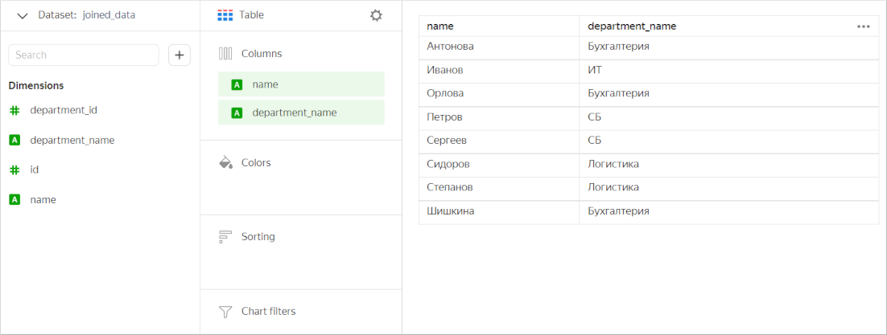

Now let's create a chart that will only contain fields from the `Employees` table. In this case, {{ datalens-short-name }} does not use `JOIN` and only works with this table. The chart displays all values from the `Employees` table, not just those overlapping with the `Departments` table.

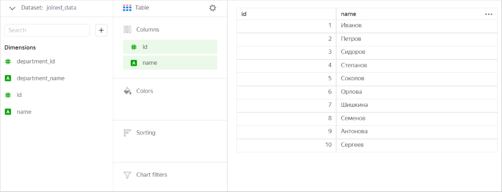





A dataset is based on the `Bonuses` and `Employees` tables joined with [LEFT JOIN](https://en.wikipedia.org/wiki/Join_(SQL)#Left_outer_join). The `Bonuses` table is used in full, while only those values which are present in the `Bonuses` table are selected from the `Employees` table.

Let's create a chart containing fields from the two tables.

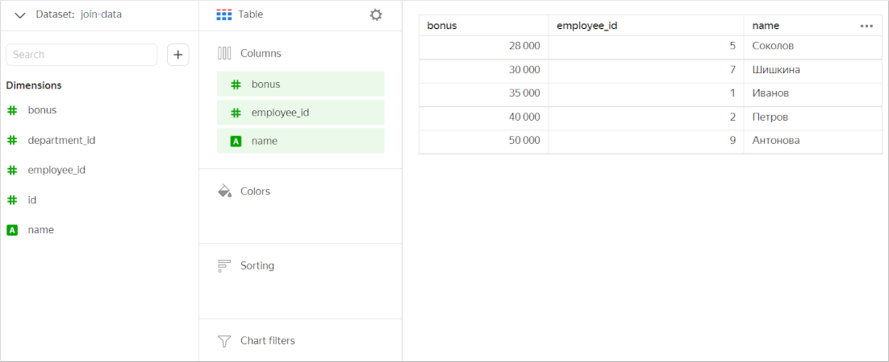

Next, let's only leave the `Employees` table fields in the chart. In this case, the chart will include all values from this table (without filtering data by the `Bonuses` table).

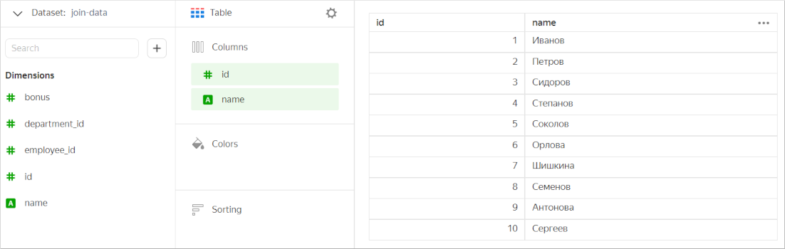

Optimization for RIGHT JOIN(https://en.wikipedia.org/wiki/Join_(SQL)#Right_outer_join) works the same way.





A dataset is based on three tables:

* The first table (`Departments`) is joined with the second table (`Employees`) using `INNER JOIN`.
* The second table (`Employees`) is joined with the third table (`Bonuses`) using `INNER JOIN`.

Let's create a chart containing fields from all the tables.

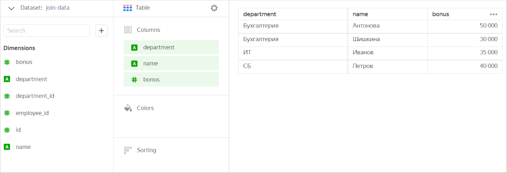

Next, let's only leave the `Employees` table fields in the chart. In this case, the chart will include all values from this table (without filtering data by the `Bonuses` and `Departments` tables).

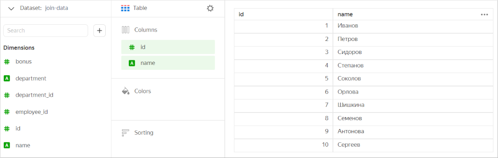

Let's add to the chart only the fields from the first (`Departments`) and third (`Bonuses`) tables. These tables are not linked explicitly. However, each of them is linked to the `Employees` table. Therefore, {{ datalens-short-name }} does not optimize a query to the source. In this case, the chart will include values from all the three tables based on filtering results.

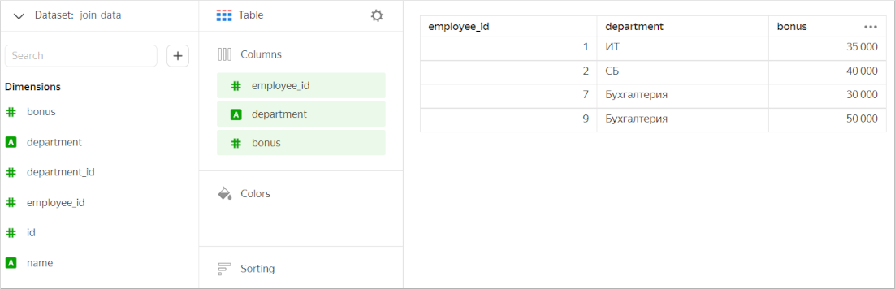





A dataset is based on three tables:

* The first table (`Employees`) is joined with the second table (`Departments`) using `INNER JOIN`.
* The second table (`Employees`) is joined with the third table (`Bonuses`) using `INNER JOIN`.

Let's create a chart containing fields from all the tables.

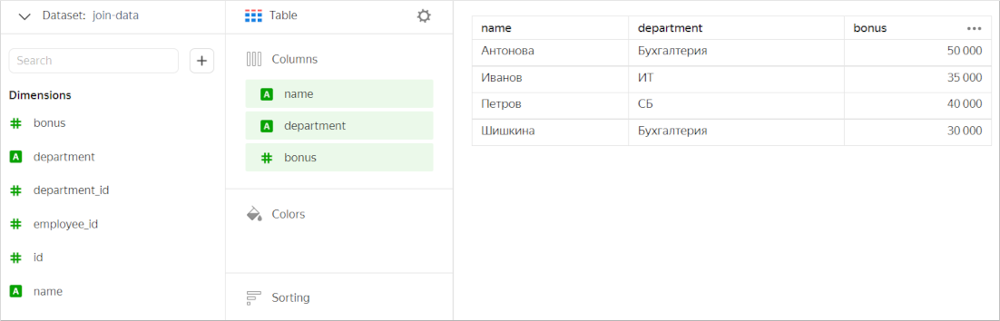

Next, let's only leave the `Employees` table fields in the chart. In this case, the chart will include all values from this table (without filtering data by the `Departments` and `Bonuses` tables).

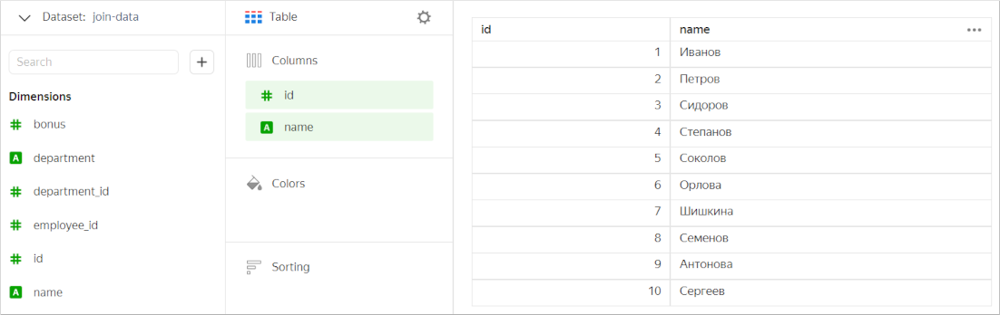

Let's add to the chart only the fields from the first (`Employees`) and third (`Bonuses`) tables. In this case, the chart will feature values that are common for these tables (without filtering data by the `Departments` table).

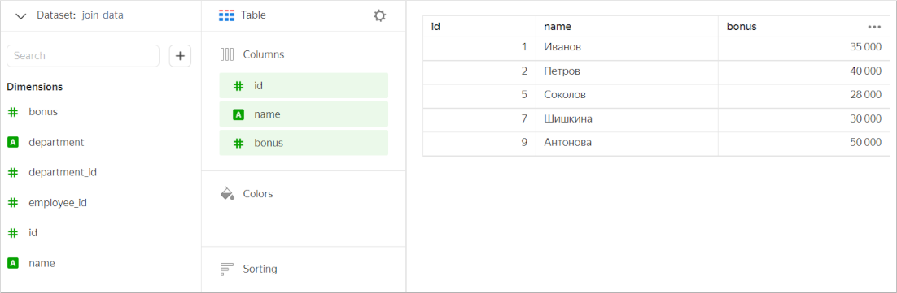





A dataset is based on four tables:

* The first table (`Qualification`) is joined with the second table (`Bonuses`) using `INNER JOIN`.
* The first table (`Qualification`) is joined with the third table (`Employees`) using `INNER JOIN`.
* The third table (`Employees`) is joined with the fourth table (`Departments`) using `INNER JOIN`.

Let's create a chart containing fields from all the tables.

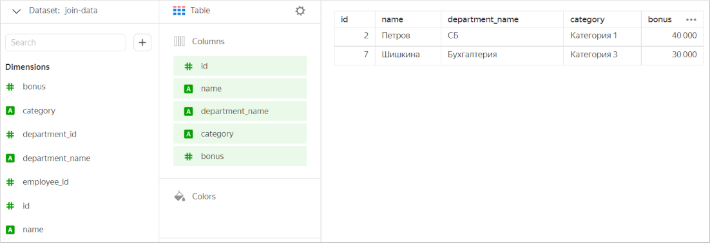

Next, let's only leave the `Qualification` table fields in the chart. In this case, the chart will include all values from this table (without filtering data by the other tables).

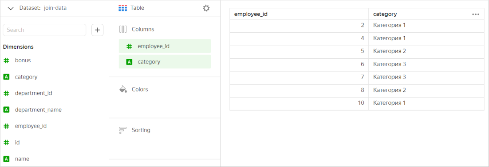

If we only use a pair of joined tables (the first and the second one, the first and the third, or the third and the fourth) in the chart, it will show common values from these tables (without filtering data by other tables). For example, let's add to the chart only the fields from the first (`Qualification`) and second (`Bonuses`) tables.

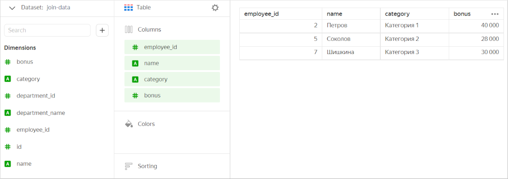



