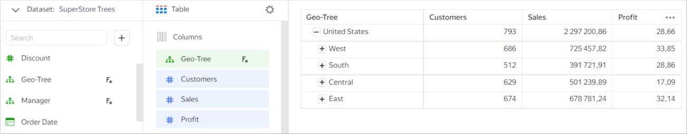

# Data types {{ datalens-full-name }}

{{ datalens-short-name }} uses multiple data sources whose fields may take different data types.

To streamline the data operations, {{ datalens-short-name }} converts the source data types to its own ones.
This optimizes data operations. For more information, see [{#T}](../dataset/types-lookup-table.md).

You can change the field data type both in the dataset interface and in the wizard.




When you upload a CSV file as a [data source](../operations/connection/create-file.md), {{ datalens-short-name }} will try to automatically detect the types of data in its fields.
If DataLens is unable to identify the data type, it will set the `String` type for the field.

You can use the dataset interface or the wizard to change the field data type.




## Geopoint {#geopoint}

A _geopoint_ is a coordinate point defined by latitude and longitude. In {{ datalens-short-name }}, you can set it using the [GEOPOINT](../function-ref/GEOPOINT.md) function.

At input, the function accepts the `String` and `Geopoint` data types, or two values of the `Fractional number` or `String` type.
If a single string is input, it must contain a list of two numbers in JSON format.

If the source data comes as a string in `[55.75222,37.61556]` format, you can use the dataset interface or wizard to change the field data type without any formula.







#### Examples {#geopoint-example}

```sql
GEOPOINT("[55.7912,37.6872]")
```

```sql
GEOPOINT("55.7912","37.6872")
```

```sql
GEOPOINT(55.7912, 37.6872)
```

## Geopolygon {#geopolygon}

These are multiple coordinate points defining the polygon on the map. In {{ datalens-short-name }}, you create a geopolygon using the [GEOPOLYGON](../function-ref/GEOPOLYGON.md) function.
To fill in the polygon, {{ datalens-name }} uses the [Even-Odd](https://en.wikipedia.org/wiki/Even–odd_rule) algorithm. This way you can create polygons with holes.

At input, the function accepts strings in `[[[v1,v1], [v2,v2]], ..., [[vN-1,vN-1], [vN,vN]]]` format. If the source data is in this format, you can use the dataset interface or wizard to change the field data type without any formula.







#### Example notation {#geopolygon-example}

```sql
/* Polygon without a hole */
GEOPOLYGON("[[[55.79421,37.65046],[55.79594,37.6513],[55.79642,37.65133],[55.7969, 37.65114],[55.79783, 37.65098],[55.78871,37.75101]]]")

/* Polygons with a hole */
GEOPOLYGON("[[[55.75,37.52],[55.75,37.68],[55.65,37.60]],[[55.79,37.60],[55.76,37.57],[55.76,37.63]]]")
GEOPOLYGON("[[[55.75,37.50],[55.80,37.60],[55.75,37.70],[55.70,37.70],[55.70,37.50]],[[55.75,37.52],[55.75,37.68],[55.65,37.60]],[[55.79,37.60],[55.76,37.57],[55.76,37.63]]]")
```

## Date {#date}

This means a date without specified time.

When using a date in formulas, make sure to put a `#` (hash) before and after it, e.g., `DATETRUNC(#2018-07-12#, "year", 5)`.

You can convert the source data type to `Date` using the [DATE](../function-ref/DATE.md) and [DATE_PARSE](../function-ref/DATE_PARSE.md) functions.

#### Example notation {#date-example}

```sql
#2018-01-18#
#2015-01-01#
DATETRUNC(#2018-07-12#, "year", 5)
DATEADD(#2018-01-12#, "day", 6)
```


## Date and time (deprecated) {#datetime-old}

This type means a date with a specified time (the value is converted to [UTC](https://en.wikipedia.org/wiki/Coordinated_Universal_Time)).

When using date and time in formulas, make sure to put a `#` (hash) before and after the value, e.g., `DATEADD(#2018-01-12 01:02:03#, "second", 6`).

You can convert the source data type to `Date and time (deprecated)` using the [DATETIME](../function-ref/DATETIME.md) and [DATETIME_PARSE](../function-ref/DATETIME_PARSE.md) functions.

#### Example notation {#datetime-old-example}

```sql
#2018-01-12 01:08:03#
#2018-05-01T#
DATEADD(#2018-01-12 01:02:03#, "second", 6)
DATETRUNC(#2018-07-12 11:07:13#, "month", 4)
```

#### Discontinuing the _date and time (deprecated)_ type {#datetime-deprecation}

* Starting September 6, 2022, you can use the new [Date and time](#datetime) type, without conversion to UTC.

* October 12, 2022:

   * In all datasets, the fields of the `Date and time (deprecated)` type will be replaced with fields of the `Date and time` type.
   * Using a `#` (hash) will no longer convert constant values to UTC.
   * The [DATETIME](../function-ref/DATETIME.md) and [DATETIME_PARSE](../function-ref/DATETIME_PARSE.md) functions will no longer convert expressions to UTC.


## Date and time {#datetime}

This type means a date with a specified time (the value is not converted to [UTC](https://en.wikipedia.org/wiki/Coordinated_Universal_Time)).



Field selectors with this type are always in line with the time zone of the data source regardless of the field time zone.



When using date and time in formulas, make sure to put `##` (double hash) before and after the value, e.g., `DATEADD(#2018-01-12 01:02:03#, "second", 6)`.

You can convert the source data type to `Date and time` using the [DATETIME](../function-ref/DATETIME.md) and [DATETIME_PARSE](../function-ref/DATETIME_PARSE.md) functions.

#### Example notation {#datetime-example-tmp}

```sql
##2018-01-12 01:08:03##
##2018-05-01T##
DATEADD(##2018-01-12 01:02:03##, "second", 6)
DATETRUNC(##2018-07-12 11:07:13##, "month", 4)
```

## Floating-point number {#float}

This is a decimal number, with a period as a separator.

You can convert the source data type to `Floating-point number` using the [FLOAT](../function-ref/FLOAT.md) function.



When you convert the `decimal` type to `Floating-point number`, you may lose precision.



#### Example notation {#float-example}

```sql
1.47113
0.62024
FLOAT("34.567")
```

## Boolean {#boolean}

The boolean type can take one of two possible values: `TRUE` or `FALSE`.

You can convert the source data type to `Boolean` using the [BOOL](../function-ref/BOOL.md) function.

#### Example notation {#boolean-example}

```sql
FALSE
```

## String {#string}

This is a string containing text, enclosed in single or double quotes.
If you enclose your string in one type of quotes, you can use the second quote type inside the string without escaping,
e.g., `'Double quoted "example" and one " double quote.'`

You can use the following characters inside strings:

* `\n`: Line feed (LF)
* `\r`: Carriage return (CR)
* `\t`: Tab
* `\"`: Double quote
* `\'`: Single quote
* `\\`: Backslash

You can convert the source data type to `String` by using the [STR](../function-ref/STR.md) function.

#### Example notation {#string-example}

```sql
"String"
'String with a "substring"'
```

## Integer {#integer}

This is a number without any fractional part.

You can convert the source data type to `Integer` by using the [INT](../function-ref/INT.md) function.

#### Example notation {#integer-example}

```sql
42
157
```

## Array {#array}

An array is a structure made up of a series of elements of the same type.

{{ datalens-short-name }} supports processing columns in one-dimensional arrays for {{ CH }} and {{ PG }}. Array elements can have the following types:

* `Integer`
* `Floating-point number`
* `String`

You can define an array in {{ datalens-short-name }} using the [ARRAY](../../datalens/function-ref/ARRAY.md) function.

#### Example notation {#array-example}

```sql
[1, 2, 3]
[1.1, 1.2, 1.3]
["Cheese", "Bread"]
```

## Tree of strings {#tree-hierarchy}

{{ datalens-short-name }} allows you to create tree hierarchies. To do this, use the **Tree of strings** field type. The data is stored as an [array](#array) with a full path for each node. The sequence of array values determines the order the tree is expanded.



A tree can only be used in a **Table** chart.



### Creating a tree {#how-to-create-tree}

To create a tree, add a [calculated field](../operations/dataset/create-calculated-field.md) at the dataset or chart level using the following formula: `TREE(ARRAY([lev_1],[lev_2],[lev_3],[lev_n]))`, where `[lev_1]`,`[lev_2]`,`[lev_3]`, and `[lev_n]` are dataset fields that determine the tree hierarchy.



1. Prepare data in the source:

   1. Create a table with columns containing hierarchy values.

      

      ```sql
      CREATE TABLE table_without_tree (
         id serial primary key,
         country text,
         region text,
         city text
      );
      ```

      

   1. Add data with a full path for each tree node to the table.

      

      ```sql
      INSERT INTO table_without_tree (country, region, city)
      VALUES('Russia', 'Altay', 'Barnaul');

      INSERT INTO table_without_tree (country, region, city)
      VALUES('Russia', 'Altay', 'Biysk');

      INSERT INTO table_without_tree (country, region, city)
      VALUES('Russia', 'Altay', 'Aleisk');
      ```

      

1. In a dataset, create:

   * **Array of strings** calculable field that describes the tree, e.g., the `position` field with the `ARRAY([country], [region], [city])` formula.
   * **Tree of strings** calculated field, e.g., the `hierarchy` field with the `TREE([position])` formula, where `position` is a field of the **Tree of strings** type describing the tree.

      

      You can create an array and tree of strings in one field with the `TREE(ARRAY([country], [region], [city]))` formula.

      





1. Prepare data in the source:

   1. Create a table with an array of strings.

      

      ```sql
      CREATE TABLE table_with_tree (
        id serial primary key,
        position text[]
      );
      ```

      

   1. Add data as an array with a full path for each tree node to the table.

      

      ```sql
      INSERT INTO table_with_tree (position)
      VALUES('{"Russia","Altay","Barnaul"}');

      INSERT INTO table_with_tree (position)
      VALUES('{"Russia","Altay","Biysk"}');

      INSERT INTO table_with_tree (position)
      VALUES('{"Russia","Altay","Aleisk"}');
      ```

      

1. In a dataset, create a **Tree of strings** calculable field, e.g., the `hierarchy` field with the `TREE([position])` formula, where `position` is a field of the **Tree of strings** type describing the tree.



### Using trees in charts {#how-to-use-tree}

You can use the prepared source data to create a tree in a **Table** chart:

1. [Create](../visualization-ref/table-chart.md#create-diagram) a **Table** chart.
1. Drag a dimension with the **Tree of strings** type to the **Columns** section. You will see a tree hierarchy in the visualization area. Expand or collapse the tree using **+** or **-**, respectively.

   

   You can only use tree dimensions in the chart.

   

1. Add the required measures to the **Columns** section.

   

### Limitations {#tree-restrictions}

Currently, tree hierarchies have the following limitations:

* You can use one tree or hierarchy per chart.
* You cannot use the **Pagination** option and **Total** row in a tree table.
* The tree expansion state is not remembered.
* Selectors do not support trees.
* The source should store intermediate tree nodes, even those with no data available.

