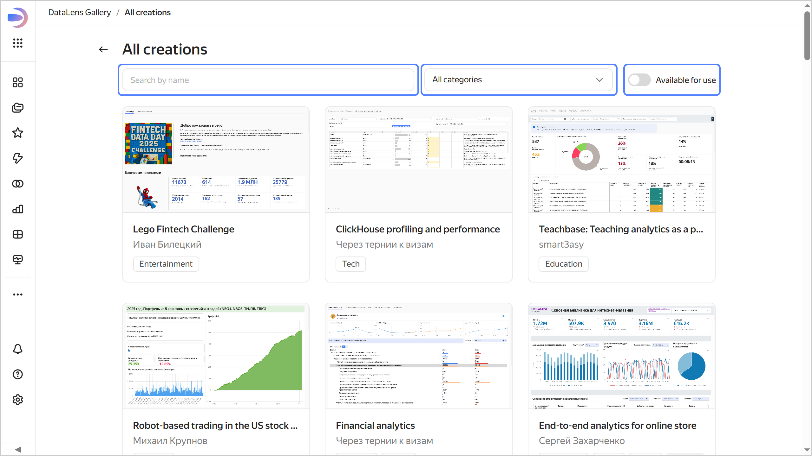
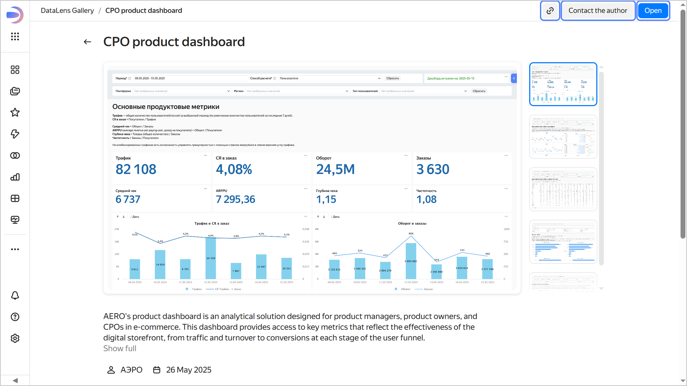
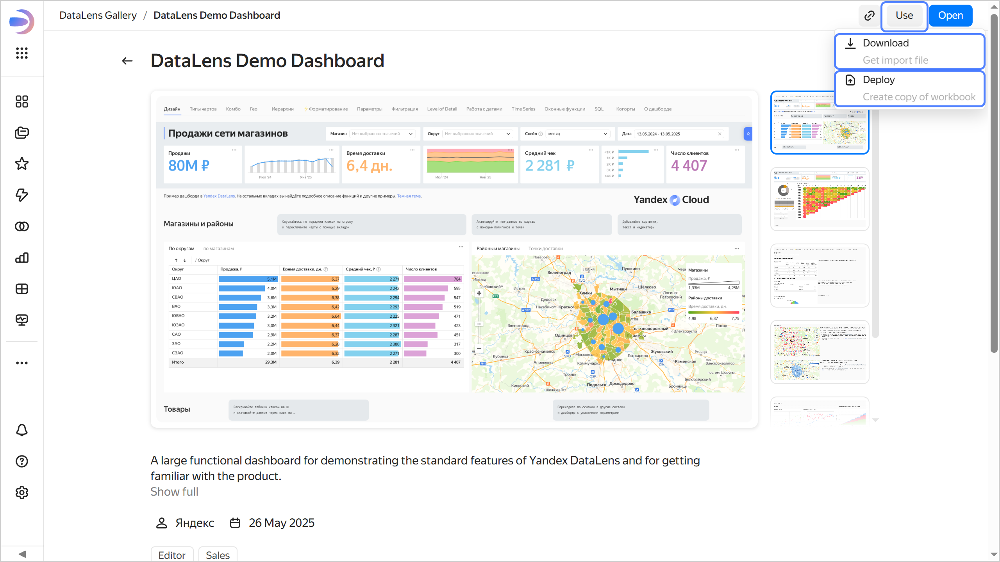
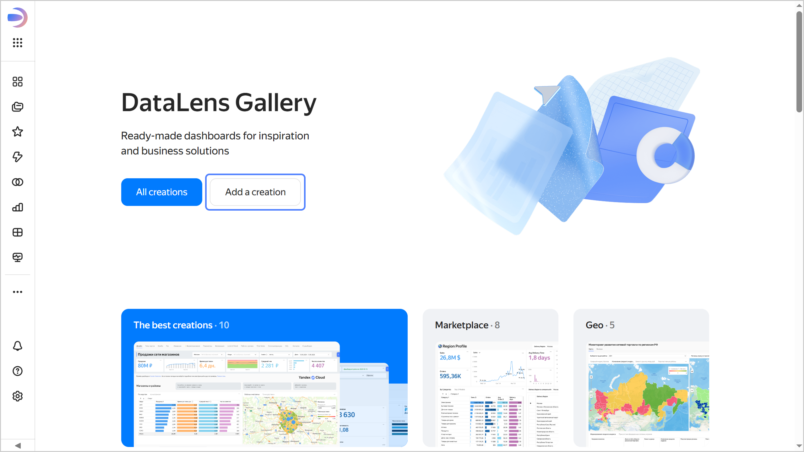

# {{ datalens-short-name }} Gallery

[{{ datalens-short-name }} Gallery](https://datalens.ru/gallery) is a collection of ready-made dashboards for your inspiration and business needs.

The DataLens Gallery creations are contributed not only by the {{ datalens-full-name }} team but also the users. Browse the gallery for insights into diverse experiences of other analysts which can benefit your projects.

Things you can do with dashboards as a DataLens Gallery user:

* [Search](#search).
* [View](#review).
* [Use](#deploy) (not all dashboards) by deploying in your instance or exporting to other {{ datalens-name }} environments.
* [Add](#suggest).

## Search {#search}

The [home page](https://datalens.ru/gallery) brings to you the **Creation of the month**, the best dashboards, and dashboards by popular category.

All user dashboards are sorted into categories the list of which keeps growing:
* Industry: `Healthcare`, `Education`, `Entertainment`.
* Scope: `Product management`, `Marketing`, `Production`.
* Feature set: `Editor`, `Geoanalytics`, `English` (for dashboards with data in English).

On the [page that lists all the user dashboards](https://datalens.ru/gallery/all), you can search for them by name or filter them by category or availability.





## Viewing a dashboard{#review}

To view a dashboard:

1. Click the dashboard card.
1. In the top-right corner, click **Open**. This will open a fully functional {{ datalens-name }} dashboard. You can apply its selectors, switch between tabs, etc., depending on the features built into it by its author.

In some cases, you can contact the author directly using the **Contact the author** button in the top-right corner.

To share a dashboard, copy its link using the  button.





## Using a dashboard {#deploy}

Some creators have made their works freely available. Search through them using the **Available for use** filter on the [full list page](https://datalens.ru/gallery/all).

There are two ways you can use dashboards from the Gallery:
* Deploy them in your {{ datalens-name }} instance: this will create a copy of the workbook with all its objects.
* Download a JSON export file and import it to a third-party {{ datalens-name }} environment: {{ datalens-name }} Open Source or {{ datalens-name }} On-premises.



You can deploy a dashboard in your {{ datalens-name }} instance if you have [workbooks and collections](../workbooks-collections/index.md#enable-workbooks) on.



To deploy a dashboard in your {{ datalens-name }} instance:
1. Click the dashboard card.
1. Click **Use** → **Deploy**.
1. Choose where to save the workbook: workbook and collection root, existing collection, or new collection. Navigate to the saving destination and click **Deploy**. The workbook name must be unique, so edit the name if you need to.
1. Click **Create**.

To download the export file:
1. Click the dashboard card.
1. Click **Use** → **Download**. The workbook will be downloaded as a JSON file.
   Import the workbook using [this guide](../workbooks-collections/export-and-import.md#import-workbook).





## Adding a dashboard {#suggest}

To contribute to the Gallery, click **Add creation** on the [Gallery home page](https://datalens.ru/gallery) and fill out the form:

* Contact details. If you are a [{{ yandex-cloud }}]({{ link-cloud-partners-landing }}) partner program participant and provide the email you use to authenticate in it, your dashboard will feature the **Contact the author** button for users to contact you directly.
* Name, description, and category of your dashboard.
* Link to the dashboard with [public access](./datalens-public.md) configured.
* [Exported workbook](../workbooks-collections/export-and-import.md#export-workbook) file.
* Dashboard screenshots for the card. Screenshot requirements:
   * Dashboard only, no irrelevant UI or browser elements.
   * Use the `_embedded=1` parameter in the URL for light (`_theme=light`) or dark (`_theme=dark`) theme. Link example: `https://datalens.yandex/9fms9uae7ip02?_embedded=1&_theme=light`.
   * Size: 1920×1080 pixels.
   * Format: PNG.




