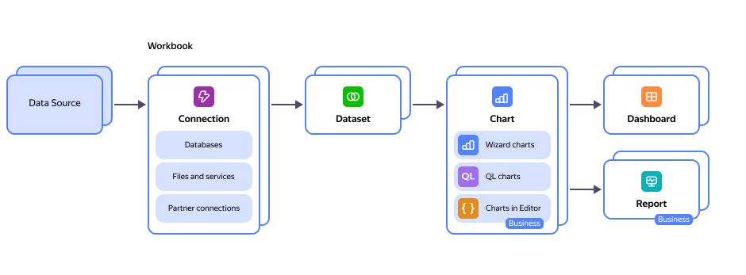

# {{ datalens-name }} overview

{{ datalens-full-name }} is a business analytics service. It lets you connect to various data sources, visualize data, create dashboards, and share the results.
With {{ datalens-full-name }}, you can track your product and business metrics directly from data sources to make data-based decisions.



The number of {{ datalens-short-name }} instances in one [cloud {{ yandex-cloud }}](../../resource-manager/concepts/resources-hierarchy.md#cloud): 1.



## Relationship between entities {#component-interrelation}

{{ datalens-short-name }} consists of multiple entities that ensure the full data cycle.

{{ datalens-short-name }} includes the following entities:
- **Connection**: A set of parameters for accessing a data source.
- **Dataset**: A description of a dataset from a source.
- **Chart**: Data from a data source or a dataset visualized as tables, diagrams, or maps.
- **Dashboard**: A set of charts, selectors for filtering data, and text blocks.

 You can create the entity objects yourself or use ready-made solutions from the [{{ datalens-short-name }} Marketplace](marketplace.md). 

