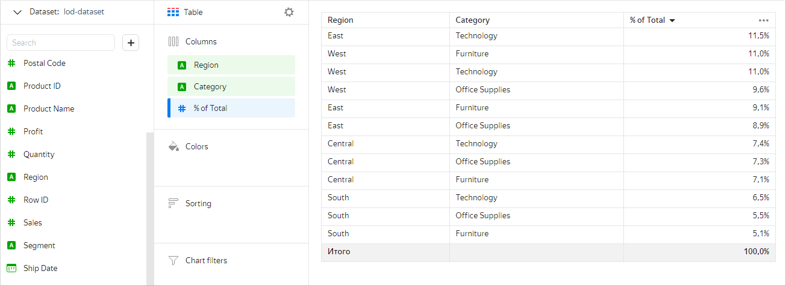
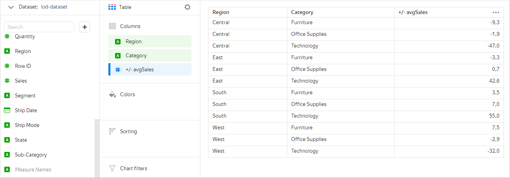
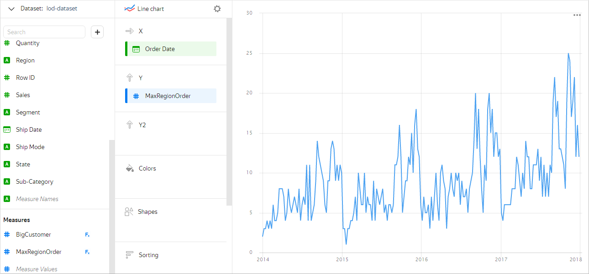
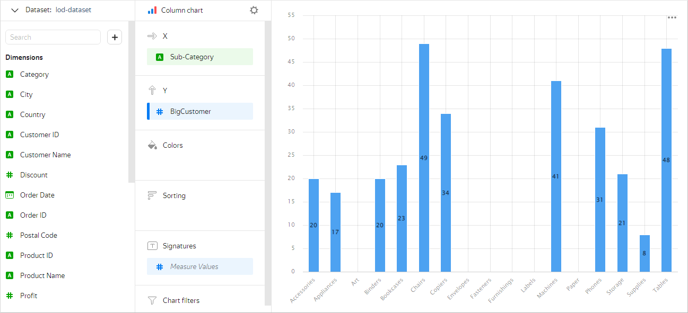
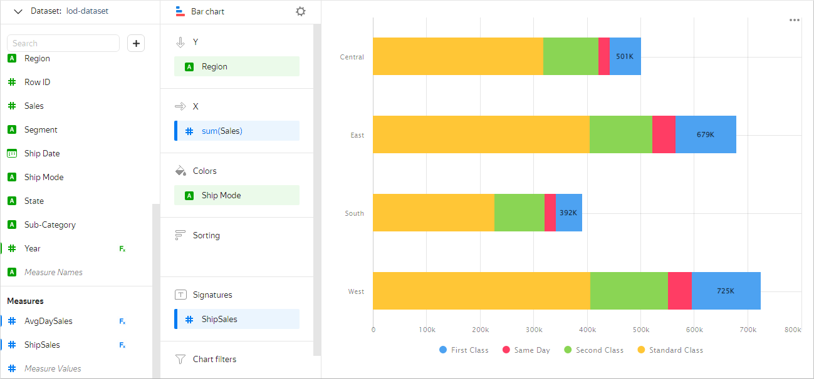
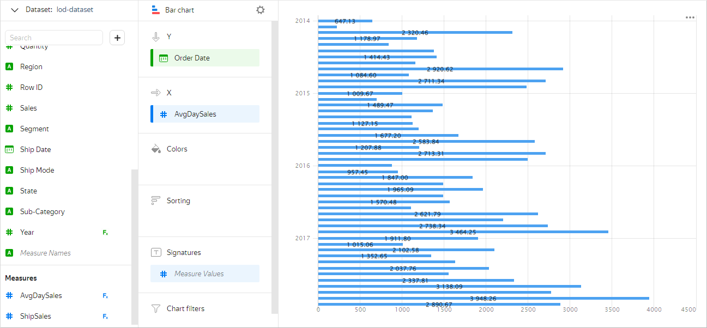
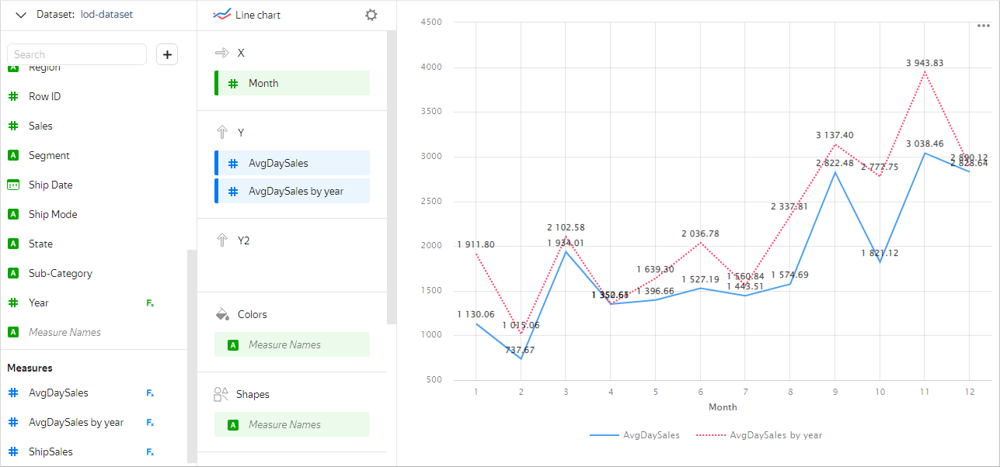

# LOD expressions and filtering in aggregate functions

By default, in {{ datalens-short-name }}, [aggregate functions](../function-ref/aggregation-functions.md) are calculated with grouping by dimensions involved in the building of the chart (that is, located in one of its sections). You can change the grouping for an aggregate function if you specify the [level of detail](../function-ref/aggregation-functions.md#syntax-lod). By managing the level of detail, you can add or exclude dimensions from grouping and use nested aggregations. For more detail on data aggregate and grouping in {{ datalens-short-name }}, please review [{#T}](aggregation-tutorial.md).

As a data source in our examples, we'll use a direct [connection](../tutorials/data-from-ch-to-sql-chart.md#create-connection) to a demo database (the dataset is based on the `SampleSuperstore` table).

## Grouping in LOD expressions {#lod-grouping}

The level of detail in LOD expressions is specified using keywords (see [{#T}](../function-ref/aggregation-functions.md#syntax)):

* [FIXED](#fixed)
* [INCLUDE](#include)
* [EXCLUDE](#exclude)

Keywords override the grouping set in the chart when calculating a specific aggregate function.

### FIXED {#fixed}

The `FIXED` keyword allows grouping by explicitly listed dimensions, regardless of whether they are used in any section of the chart or not.

**Example 1**

In a chart grouped by the `Region` and `Category` dimensions, you need to calculate the share of each category in the region from the total sales amount (`% of Total`).

Let's create the `SUM([Sales]) / SUM([Sales] FIXED)` measure, where:

* `SUM([Sales])`: Sales amount per category in the city (calculated with the default grouping in the chart).
* `SUM([Sales] FIXED)`: Total sales amount (calculated with grouping without dimensions).

For example, for the **Table** [chart](https://datalens.yandex/gf5ebn0y1stw8), the result looks like this:



**Example 2**

For each category in the same chart, we'll calculate the deviation of the average sales amount in the region from that in all regions (`+/- avgSales`).

Let's create the `AVG([Sales]) - AVG([Sales] FIXED [Category])`measure, where:

* `AVG([Sales])`: Average sales amount by category in the region (calculated with the default grouping in the chart — by the `[Region]` and `[Category]` dimensions).
* `AVG([Sales] FIXED [Category])`: Average sales amount by category in all regions (calculated with a grouping by the `[Category]` dimension).

For example, for the **Table** [chart](https://datalens.yandex/557blwtzfahmx), the result looks like this:



### INCLUDE {#include}

The `INCLUDE` keyword allows adding specified dimensions to the chart grouping. As a result, the level of detail is greater when calculating the aggregate function.
Expressions with `INCLUDE` can be useful if you need to calculate a measure with a high level of detail and display it at a coarser level in the chart. For example, you can calculate the sales amount of sales per day and then average it.

`INCLUDE` with an empty list of dimensions is equivalent to the same grouping as in the chart.

**Example 1**

Calculate the maximum number of orders by region per date. Here we use nested aggregation: first, let's count the number of orders per date and then select the maximum value. The formula for the measure: `MAX(COUNTD([Order ID] INCLUDE [Region]))`.

For example, in the **Line chart** [chart](https://datalens.yandex/a9z7yym0388c2), the result looks like this:



Only one dimension is used in the chart — `[Order Date]`. In this case, the number of orders is calculated with a grouping by date and region, because the `[Region]` dimension is added to the grouping for the [COUNTD](../function-ref/COUNTD.md) function.

**Example 2**

Let's calculate how many customers with an average purchase amount over 1000 account for each subcategory of goods. To do this, we'll create a measure using the [COUNTD_IF](../function-ref/COUNTD_IF.md) function. The formula for the measure: `COUNTD_IF(ANY([Customer ID] INCLUDE [Customer ID]), AVG([Sales] INCLUDE [Customer ID]) > 1000)`, where:

* `ANY([Customer ID] INCLUDE [Customer ID])`: `[Customer ID`] dimension is converted into the measure using the [ANY](../function-ref/ANY.md) function.
* `AVG([Sales] INCLUDE [Customer ID]) > 1000`: Average purchase amount is compared with the specified value.

For example, in the **Column chart** [chart](https://datalens.yandex/eglffno164y86), the result looks like this:



Any aggregation with `INCLUDE` can be replaced by aggregation with `FIXED`. For example, in a chart grouped by the `Region` and `Category` dimensions, the `SUM(SUM([Sales] INCLUDE [City]))` measure will be similar to the `SUM(SUM([Sales] FIXED [Region],[Category],[City]))` measure.

### EXCLUDE {#exclude}

The `EXCLUDE` keyword allows excluding the specified dimensions from the chart grouping. As a result, the value of the aggregate function is calculated with grouping by all dimensions of the chart, except those listed.

Expressions with `EXCLUDE` can be used, for example, to calculate the percentage of the total number or the difference from the total average.

`EXCLUDE` with an empty list is equivalent to the same grouping as in the chart.

**Example 1**

Let's calculate the sales amount in the regions broken down by delivery type. To do this, we'll set the chart grouping by the `[Region]` and `[Ship Mode]` dimensions. To show the total amount for all delivery types, we'll add the following measure to the **Signatures** section: `IF([Ship Mode]="First Class", SUM([Sales] EXCLUDE [Ship Mode]), NULL)`. With `EXCLUDE`, the `[Ship Mode]` dimension is excluded from the grouping when calculating this measure, so the total amount for all delivery types is calculated.

For example, in the **Bar chart** [chart](https://datalens.yandex/99442nvf20j61), the result looks like this:



**Example 2**

Let's calculate the average daily sales amount broken down by month. To do this, we'll add a grouping by month to the chart: for the `[Order Date]` field in the **Grouping** setting, let's choose **Rounding** ⟶ **Month** (for more information, [{#T}](chart/settings.md#field-settings)). Let's create the measure with the `AVG(SUM([Sales] FIXED [Order Date]) EXCLUDE [Order Date])` formula, where:

* `SUM([Sales] FIXED [Order Date])`: Total sales of all orders per day.
* `AVG(SUM([Sales] FIXED [Order Date]) EXCLUDE [Order Date])`: The `[Order Date]` measure is excluded from the grouping so that the average daily sales amount is calculated with a grouping by month (set in the chart).

For example, in the **Bar chart** [chart](https://datalens.yandex/jjlq55imiocib), the result looks like this:



Any aggregation with `EXCLUDE` can be replaced by aggregation with `FIXED`. For example, in a chart grouped by the `Region` and `Category` dimensions, the `SUM([Sales] EXCLUDE [Category]) `measure will be similar to the `SUM(SUM([Sales] FIXED [Region])` measure.

## Filtering {#before-filter-by}

The [BEFORE FILTER BY](window-function-tutorial.md#before-filter-by) section in LOD expressions has the same meaning as in window functions: the aggregate function is calculated before filtering by the specified fields.

**Example**

Let's compare the measures of average daily sales per month for a given year with those for the entire period. We'll add two new dimensions to the chart — the month and the year of the order:

* Month: `MONTH([Order Date])`
* Year: `YEAR([Order Date])`

To calculate the sales amount, we'll create two measures:

* AvgDaySales: `AVG(SUM([Sales] FIXED [Order Date]) EXCLUDE [Order Date] BEFORE FILTER BY [Year])`.
* AvgDaySales by year — `AVG(SUM([Sales] FIXED [Order Date]) EXCLUDE [Order Date])`

Let's add the `Year` dimension to the **Filters** section and specify, for example, the value `2017`. As a result, the `AvgDaySales` measure is calculated before filtering by year is applied to the chart and we get the average daily sales amount per month for the entire period. The `AvgDaySales` by year measure will be calculated after applying filtering by year and we obtain the average daily sales amount per month for a given year (`2017`).

For example, in the **Line** [chart](https://datalens.yandex/iii5q2y6fkvka), the result looks like this:



## Common features with window functions {#lod-and-window}

In some cases, LOD expressions can be used as an alternative to [window functions](../function-ref/window-functions.md).

For example, the expression with `FIXED` with a list of dimensions can be used similarly to the window function with the [WITHIN](window-function-tutorial.md#within) grouping, and the expression with `EXCLUDE` — window function with the [AMONG](window-function-tutorial.md#among) grouping.

**Example 1**

Let's have a look at the [chart](https://datalens.yandex/rrtri6pgceqaj) with calculation of the share of each goods category from the total sales amount per city. The` % Total by city window` and `% Total by city lod` measures give the same result:

* % Total by city lod: `SUM([Sales]) / SUM([Sales] FIXED [City])`
* % Total by city window: `SUM([Sales]) / SUM(SUM([Sales]) WITHIN [City])`

`FIXED` with an empty list of dimensions, in some cases, is similar to using a window function with the [TOTAL](window-function-tutorial.md#one-window-grouping) grouping (which, in turn, is synonymous with `WITHIN` with an empty list).

**Example 2**

Let's have a look at the [chart](https://datalens.yandex/rrtri6pgceqaj) with calculation of the share of each goods category from the total sales amount in all cities. The `% Total window` and `% Total lod` measures give the same result:

* % Total lod: `SUM([Sales]) / SUM([Sales] FIXED)`
* % Total window: `SUM([Sales]) / SUM(SUM([Sales]) TOTAL)`

For `INCLUDE`, there is no equivalent in window functions, so you can't add new dimensions there.

## Limitations {#restrictions}

The level of detail in LOD expressions can be used with some limitations:

1. Top-level aggregations cannot contain dimensions that are not used in the chart. Thus, aggregations with non-empty `INCLUDE` or with `FIXED` containing dimensions that are not used in the chart are impossible at the top level.

   **Example**

   In a chart grouped by `[Region]` and `[Category]` dimensions, let's create a measure to calculate the average sales amount per city:

   

   - Correct

     ```
     AVG(AVG([Sales] INCLUDE [City]))
     ```

     In this case, the nested aggregation will be grouped by dimensions [inherited](../function-ref/aggregation-functions.md#syntax-lod-inheritance) from top-level aggregation (`[Region]` and `[Category]`) and the `[City]` dimension added to the grouping using `INCLUDE`. As a result, at the top level, aggregation will be calculated with grouping by the `[Region]` and `[Category]` chart dimensions, and nested aggregation — by the `[Region]`,`[Category]`, and `[City]` dimensions.

   - Incorrect

     ```
     AVG([Sales] INCLUDE [City])
     ```

     When calculating this indicator, grouping at the top level is performed by dimensions `[Region]`,`[Category]` and `[City]`. The error in this case occurs because the `[City]` measurement (added to the grouping using `INCLUDE`) is not used in the chart.

   

1. Aggregations that are at the same nesting level can't have different sets of dimensions. At least one of the nested aggregations must contain all the dimensions that are in the other nested aggregations.

   **Example**

   In a chart grouped by `[Region]` and `[Category]` dimensions, let's create an indicator to calculate the city with the maximum average daily sales amount:

   

   - Correct

     ```
     ARG_MAX(
          ANY([City] INCLUDE [City]),
          AVG([Sales] INCLUDE [City],[Order Date])
     )
     ```

     The `ANY([City] INCLUDE [City])` and `AVG([Sales] INCLUDE [City],[Order Date])` aggregations are at the same nesting level (inside `ARG_MAX`). The second aggregation contains all the dimensions by which the first aggregation is grouped.

   - Incorrect

     ```
     ARG_MAX(
          ANY([City] INCLUDE [City]),
          AVG([Sales] INCLUDE [Order Date])
     )
     ```

     The `ANY([City] INCLUDE [City])` and `AVG([Sales] INCLUDE [Order Date])` aggregations are at the same nesting level (inside `ARG_MAX`). The first aggregation has the `[City]` dimension, the second — `[Order Date]`. At the same time, there is no other aggregation with both of these dimensions.

   

1. You can't use aggregations with a given level of detail and the [AGO](../function-ref/AGO.md) and [AT_DATE](../function-ref/AT_DATE.md) functions in the same query (in the same chart or in the dataset preview), even if they are in different fields.
