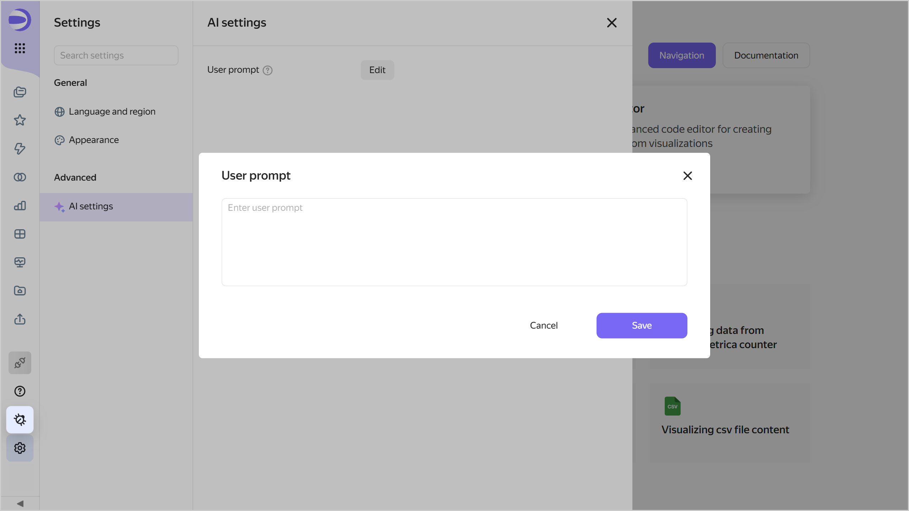

# Neuroanalyst in {{ datalens-full-name }}

{{ datalens-full-name }} Neuroanalyst is a group of AI assistants that help you with project analysis, suggest improvements and edits, and streamline creating and editing visualizations.

* [Neuroanalyst for calculated fields](../concepts/calculations/formulas-helper.md): Helps you to create calculated fields.
* [Neuroanalyst on your dashboard](../dashboard/insights.md): Neuroanalytics for the entire dashboard and individual charts. [Neuroanalyst 2.0](../dashboard/insights.md#neuroanalyst-2) is now available, which is a full-value {{ datalens-name }} AI agent which, to answer a question, can pick a similar chart or build a new one based directly on the dataset.
* [Neuroanalyst in Editor](../charts/editor/code-helper.md): Helps you to write code and search for answers to your questions.
* [Neuroanalyst in report](../reports/insights.md): Neuroanalytics in your report.

## Data security and processing {#security}

* Neuroanalyst is powered by the cloud service called [{{ ai-studio-full-name }}]({{ link-docs-ai }}).

* Your data and queries stay within the {{ yandex-cloud }} infrastructure.
* Your data and queries are not logged, nor used for model tuning.
* The admin can [disable generation of insights for your users](#prohibit) at the dashboard or report level.

See also [Neuroanalyst limits](./limits.md#datalens-ai-limits).

## Ban on Neuroanalyst {#prohibit}

{{ datalens-name }} users are able to use Neuroanalyst by default. However, the user with the `{{ roles-datalens-admin }}` role may disable this option at the {{ datalens-short-name }} instance level or for individual dashboards or reports:



- {{ datalens-short-name }} instance

  1. In the left-hand panel, select  **Service settings**.
  1. Select the **Security** tab.
  1. Disable **Neuroanalyst** (on by default). As soon as you do it, the AI assistants will disappear from the {{ datalens-name }} interface for the instance users.

- Dashboard

  

- Report

  



## Setting up a custom prompt {#user-promt}

In {{ datalens-short-name }}, you can set up a custom prompt for AI. To do this, follow these steps:

1. Click  **Settings** in the left part of the navigation panel to open the settings.
1. Go to the **AI settings** tab.
   
   

   

   

1. Click **Edit**.
1. Enter a prompt in the text field and click **Save**.

With each request to the AI, the custom prompt will be added to the {{ datalens-short-name }} system prompt.

