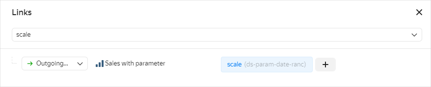

# Parameters in {{ datalens-full-name }}

A parameter is a variable that can substitute constant values in calculated fields. You can create parameters both at the [dataset level](../operations/dataset/add-parameter-dataset.md) and at the [chart level](../operations/chart/add-parameter-chart.md).

Dataset parameters are available in all charts created based on this dataset, while chart parameters are only available in the chart they are created in. The default value for a dataset parameter can be [overridden](../operations/chart/add-parameter-chart.md#change-value) at the chart level.

## Using parameters {#using-params}

With dataset or chart parameters, you can manage formulas and change visualization in a chart.
The saved dataset parameters are propagated to all charts based on this dataset when they are uploaded.

You can edit parameter values on dashboards using selectors with manual input. However, you cannot do the following:

* Use the **Multiple choice** option.
* Choose an operation in a selector (leave a dash in the selection field of the **Operation** drop-down list).
* When using a selector based on a dataset parameter, you must unlink the selector from any others on the dashboard tab (set **Ignore** as your [link](../dashboard/link.md) type).

You can also specify parameter values in chart links. To do this, add `?` at the end of a URL, write the parameter name without spaces after the URL, put `=`, and specify the parameter value without spaces. You can list multiple parameters in a URL using `&` as a separator. 

To use a chart with a parameter:

1. Add a parameter to a [dataset](../operations/dataset/add-parameter-dataset.md) or [chart](../operations/chart/add-parameter-chart.md).
1. [Place your chart](../operations/dashboard/add-chart.md) on a dashboard.
1. [Add a selector](../operations/dashboard/add-selector.md) to the dashboard to manage the chart parameter:
   
   * Select **Manual input**.
   * In the **Field or parameter name** field, enter the name of the parameter from the chart.
   * Leave a dash in the selection field of the **Operation** drop-down list.
   * In the **Default value** field, specify the value to propagate in the chart parameter.
   * Enter the selector **Name** to display on the dashboard.

   By changing selector values, you can customize visualization in the chart through the parameter.

## Examples {#examples}

Let's look at some examples of how to use parameters to manage visualization in a chart. We will build a dataset from a [connection](../tutorials/data-from-ch-to-sql-chart.md#create-connection) to the demo DB (the `samples.MS_SalesFullTable` table) and use it as our data source.

**Example 1**

Set up visualization of a sales chart on a dashboard by changing the detail level with a selector:

1. [Add to the dataset a parameter](../operations/dataset/add-parameter-dataset.md) named `scale` with `String` for type and `year` for default value. The parameter will be available in all charts created based on this dataset.
1. Create a [Column chart](../visualization-ref/column-chart.md#create-diagram) based on the created dataset:
   
   * [Add to the chart a field](../concepts/calculations/index.md#how-to-create-calculated-field) named `period` with the `DATETRUNC([OrderDatetime], [scale])` formula and drag it to the **X** section.
   * Drag the `Sales` dimension to the **Y** section. The `Sales` dimension will be automatically converted to the `SUM[Sales]` measure.
   
1. [Place your chart](../operations/dashboard/add-chart.md) on a dashboard.
1. [Add a selector](../operations/dashboard/add-selector.md) to manage the chart parameter:
   
   * Select **Manual input**.
   * In the **Field or parameter name** field, specify `scale`.
   * Leave a dash in the selection field of the **Operation** drop-down list.
   * In the **Possible values** window, add: `year`, `month`, `week`.
   * In the **Default value** field, specify `year` to round dates to a year in the chart by default.
   * In the **Name** field, enter the selector name to display on the dashboard.

1. Make sure a link between the selector and the chart on the dashboard is set up properly:

   1. In dashboard edit mode, click **Links**.
   1. Select the added selector from the list. Check that it has an outgoing link to the appropriate chart by the `scale` field.
   1. [Add a link](../operations/dashboard/create-alias.md) between widgets if needed.

      

   Now, by choosing selector values, you can change the way dates are rounded in the chart, e.g., by year or by month.

**Example 2**

Enable selecting a dimension with a selector to display it in your chart on a dashboard:

1. Create a [Column chart](../visualization-ref/column-chart.md#create-diagram):
   
   * [Add to the chart a parameter](../operations/chart/add-parameter-chart.md) named `dimension_control` with `String` for type and `by shop` for default value. The parameter will only be available in this chart.
   * [Add to the chart a field](../concepts/calculations/index.md#how-to-create-calculated-field) named `shop_product_cat` with the `CASE([dimension_control], "by shop", [ShopName], "by product category",[ProductCategory], "by product subcategory", [ProductSubcategory], '')` formula and drag it to the **X** section.
   * Drag the `Sales` dimension to the **Y** section. The `Sales` dimension will be automatically converted to the `SUM[Sales]` measure.

1. [Place your chart](../operations/dashboard/add-chart.md) on a dashboard.
1. [Add a selector](../operations/dashboard/add-selector.md) to manage the chart parameter:
   
   * Select **Manual input**.
   * In the **Field or parameter name** field, specify `dimension_control`.
   * Leave a dash in the selection field of the **Operation** drop-down list.
   * In the **Possible values** window, add: `by shop`, `by product category`, `by product subcategory`.
   * In the **Default value** field, specify `by shop` to display sales amounts by shop by default.
   * In the **Name** field, enter the selector name to display on the dashboard.

   Now, by choosing selector values, you can change the dimension displayed on the chart.

**Example 3**

Use a selector to enable selecting a dimension to color in your chart:

1. Create a [Pie chart](../visualization-ref/pie-chart.md#create-diagram):
   
   * [Add to the chart a parameter](../operations/chart/add-parameter-chart.md) named `colors` with `String` for type and `categories` for default value. The parameter will only be available in this chart.
   * [Add to the chart a field](../concepts/calculations/index.md#how-to-create-calculated-field) named `dimension_colors` with the `IF([colors]="categories", [ProductCategory], [ProductSubcategory])` formula and drag it to the **Color** section.
   * Drag the `Sales` dimension to the **Measures** section. The `Sales` dimension will be automatically converted to the `SUM[Sales]` measure.

1. [Place your chart](../operations/dashboard/add-chart.md) on a dashboard.
1. [Add a selector](../operations/dashboard/add-selector.md) to manage the chart parameter:
   
   * Select **Manual input**.
   * In the **Field or parameter name** field, specify `colors`.
   * Leave a dash in the selection field of the **Operation** drop-down list.
   * In the **Possible values** window, add: `categories` and `subcategories`.
   * In the **Default value** field, specify `categories` to color sales amounts by product category by default.
   * In the **Name** field, enter the selector name to display on the dashboard.

   Now, by choosing selector values, you can change the dimension to color in your chart.

## Limitations {#restrictions-params}

When using parameters, keep in mind the following parameter naming restrictions:

* Valid characters include Latin letters (both uppercase and lowercase), digits, hyphen (`-`), and underscore (`_`).
* The name must not be longer than 36 characters.
* It must not start with an underscore, e.g., `_name`.
* You cannot use these reserved parameter names: `tab`, `state`, `mode`, `focus`, `grid`, `tz`, `from`, `to`.
* Parameter names are case-sensitive, which means `Test` and `test` are two different parameters.
* Parameter names cannot be the same as dataset field names.
* After adding a parameter to a dataset, make sure to save charts in the wizard again.
* If a dataset and a chart have parameters with the same name, the parameter from the chart is ignored.

#### See also {#see-also}

* [{#T}](../operations/dataset/add-parameter-dataset.md)
* [{#T}](../operations/chart/add-parameter-chart.md)
