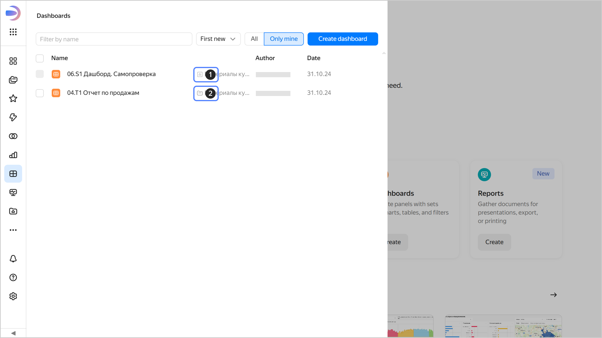

# Publishing and embedding in {{ datalens-full-name }}

In {{ datalens-short-name }}, you can share charts and dashboards or embed them into a website or application using the following methods:

* [Publishing objects](./datalens-public.md): You can make charts and dashboards public so that any internet user can open them via a direct link without signing in. However, no user can view the chart's settings, connections, dataset, or run an SQL query.
* [Public embedding](../security/embedded-objects.md): You can embed [published](../concepts/datalens-public.md) dashboards and charts into a website or app using `iframe`.
* [Sharing an object within an organization](./datalens-sharing.md): You can share a dashboard, connection, dataset, chart, or report with users authenticated in your organization.
* [Embedding via a JWT](../security/private-embedded-objects.md): You can securely embed private [charts](../concepts/chart/index.md) or [dashboards](../concepts/dashboard.md) into a website or app using secure [JWT](https://en.wikipedia.org/wiki/JSON_Web_Token) links.

## Checking object location {#object-location}

The way you share, embed, or publish an object depends on whether it is stored in a [workbook](../workbooks-collections/index.md#enable-workbooks) or a folder.

To check where your object is stored, click  **Dashboards** or  **Charts** in the left-hand panel. Optionally, use the filter by name to find the object you need. The object row shows its location:

1. : Object stored in a workbook.
1. : Object stored in a folder.




