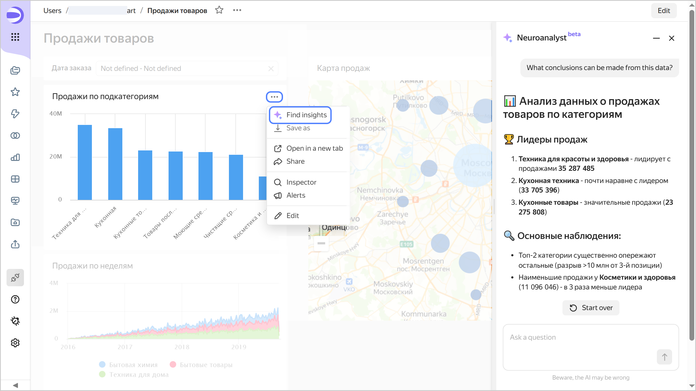

# Neuroanalyst on your dashboard



This feature is at the Beta testing stage.





Neuroanalyst on your dashboard is a tool that analyzes the selected dashboard chart, generates findings based on its data, and allows you to ask follow-up questions. This data is complemented by the dashboard description and dashboard chart title. For all charts, the chart description and tooltip will also be added, if any.

To enable Neuroanalyst, click  → **Find insights** in the top right corner of the dashboard chart.





All your queries to Neuroanalyst are private: logs are neither stored nor used for further fine-tuning or research.

## Limitations {#restrictions}

* So far the tool can only analyze data from a particular chart.
* The analysis can take quite a while.
* Chart description and tooltip are not added for tables.