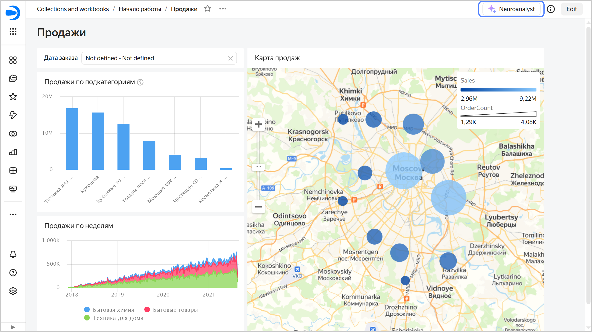
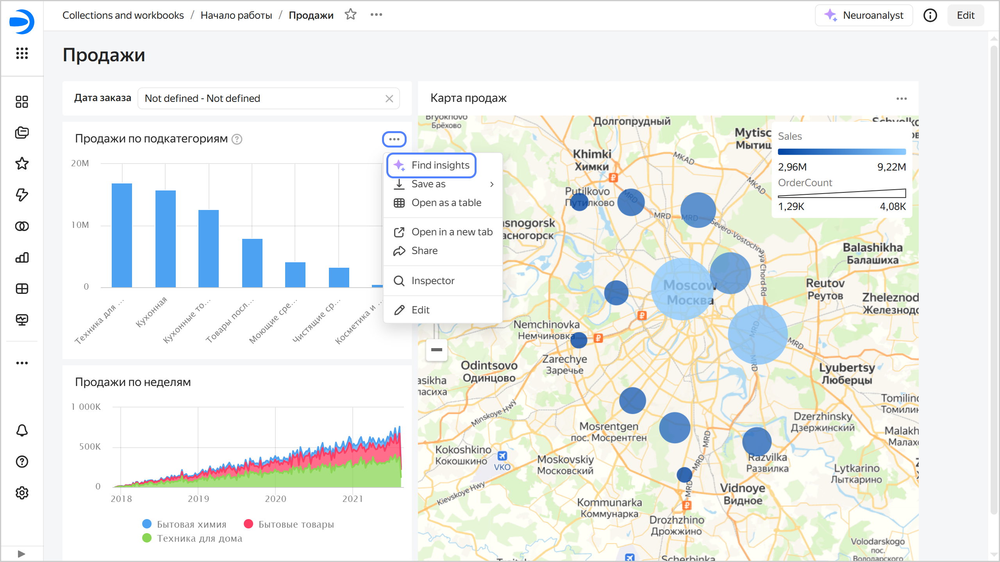
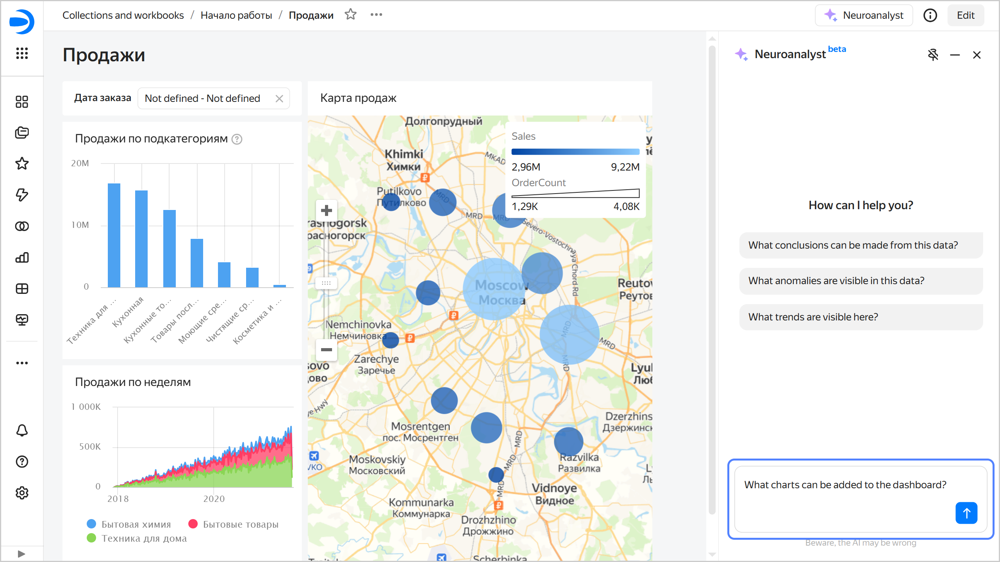
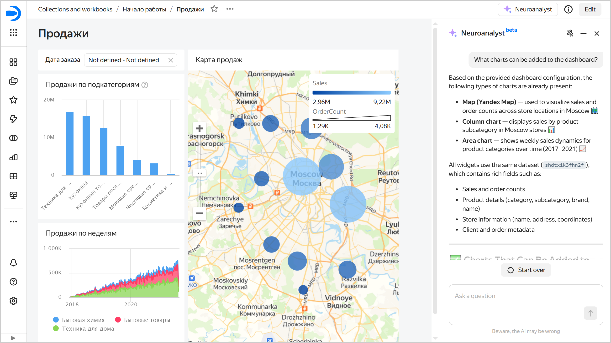

# Neuroanalyst on your dashboard in {{ datalens-full-name }}



This feature is at the Beta testing stage.



[Neuroanalyst](../concepts/neuroanalyst.md) on your dashboard is a tool that analyzes dashboard charts, generates findings based on their data, and allows you to ask follow-up questions. It also considers the following for context:
* [Dashboard information](../operations/dashboard/add-description.md).
* Dashboard chart header.
* [Chart information](../operations/chart/add-description.md).
* Dashboard chart [description and tooltip](../operations/dashboard/add-chart.md) (other than tables).

You can use Neuroanalyst for the entire dashboard or individual charts on the dashboard. To use Neuroanalyst on your dashboard:

1. Open the Neuroanalyst tab.

   

   - For entire dashboard

     Click **Neuroanalyst** at the top of the dashboard to open the **Neuroanalyst** tab on the right.

     

     

     

   - For individual chart on the dashboard

     In the top right corner of the chart on the dashboard, click  → **Find insights** to open the **Neuroanalyst** tab on the right.

     

     

     

   

1. Select a question or ask your own one, e.g., "What charts can I add to the dashboard?"

   

   

   

   Neuroanalyst will give a detailed answer and suggest possible solutions and recommendations.

   

   

   

You can pin the chat with Neuroanalyst on top or along the side (default) of the dashboard. To change the chat position, click:
  
  * : Chat on the top of the dashboard.
  * : Chat along the side of the dashboard.

All your queries to Neuroanalyst are private: logs are neither stored nor used for further fine-tuning or research.

You can [ban](../operations/dashboard/dashboard-neuroanalyst-off.md) the use of Neuroanalyst on a dashboard.

## Limitations {#restrictions}

* The analysis can take quite a while.
* Chart description and tooltip are not added for tables.
* Neuroanalyst can only use the data you upload to the page. If the data volume is too large, it may exceed the context available for processing.
