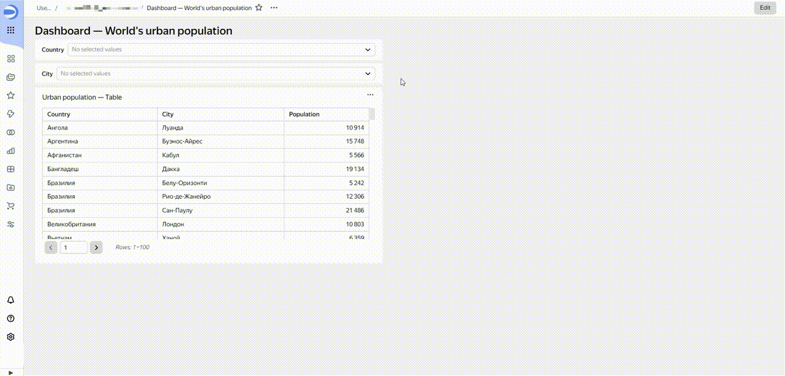

# Link

A link determines how a selector influences one or more charts or other selectors. By default, there is a link between selectors and charts built from a single dataset. Selectors and charts based on different datasets can be linked manually using [aliases](#alias).

You can choose an existing dataset field as a link or create your own field and manually set the selector values there. The fields used to establish a link are set in the alias configuration window.

You can use links to filter the values of selectors and charts. For example, if you select a country in the first selector on the dashboard, the second selector limits the list of cities (and vice versa).





The field used by the selector to filter on must be included in the dataset used to construct a chart. Otherwise, the link will not work. For more information, see [{#T}](../concepts/data-join.md).

The link type determines how values in selectors and charts are filtered. The type is set in the links window in dashboard edit mode.
You can use the following types of links for a widget pair:

* **Two-way**: Widgets influence each other both ways.
* **Incoming**: Incoming influence.
* **Outgoing**: Outgoing influence.
* **Not linked**: Widgets are not linked and have no influence on each other.



You cannot create a link with [{#T}](./widget.md#text) and [{#T}](./widget.md#title) widgets.



Some widgets cannot influence other widgets. The table below shows possible types of links between widgets:

| Affects/Affected | Selector | Charts |
----- | ----- | -----
| **Selector** | Two-way Incoming Outgoing Not linked | Outgoing Not linked |
| **Chart** | Incoming Not linked | — |

## Alias {#alias}

An alias is a link between fields of different datasets defining how widgets influence each other when linked.

Aliases allow you to link widgets that are based on different datasets. For example, if you create an alias using the `[Region]` and `[Country]` fields from different datasets, a selector by the `[Region]` field from one dataset will filter data in a chart with the `[Country]` field of another dataset.



Please note that you cannot create aliases for fields from the same dataset or fields with the same IDs from different datasets.



Creating aliases is required when you need to:

* Establish links between selectors that are based on different datasets, so that the values of one selector filter the list of available values of another selector.

* Establish links between a selector of the **Based on dataset** type from one dataset and charts from another dataset, so that the selector values filter the values in the charts.

* Establish links between a selector of the **Manual input** type and other selectors, so that the values of one selector filter the list of available values of another selector.

You can specify an alias for a pair of linked widgets. In this case:

* Multiple aliases can be set for a single pair of widgets.
* An alias set for one pair of widgets is applied to all linked widgets that are based on the same datasets (which use the fields specified in the alias).
* An alias works within a single dashboard tab.
* To limit the use of aliases, set the link type between widgets to **Not linked** by the selected field. In this case, the widgets will have no influence for the selected field within the dashboard tab.



If the links window already shows a link between the widgets, adding an alias for them is optional.



For more information about how to create aliases, see [{#T}](../operations/dashboard/create-alias.md).

You can delete links from an alias where more than two fields are linked. Delete a field from the alias if its associated link between datasets or widgets is not required on a dashboard tab. For more information, see [{#T}](../operations/dashboard/edit-alias.md).

