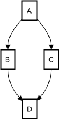

# Markdown

{{ datalens-short-name }} lets you use the Markdown markup language in the [{#T}](./widget.md#text) widget on the dashboard.
You can insert explanatory text, links, tables, images, or use formatting to highlight key points.

In text widgets, you can use the following elements:

* [Headers](#headings)
* [Highlighting text](#emphasizing)
* [Text color](#text-color)
* [Lists](#lists)
  * [Simple unordered list](#unordered-list)
  * [Nested unordered list](#unordered-sublist)
  * [Simple ordered list](#ordered-list)
  * [Nested ordered list](#ordered-sublist)
* [Tables](#tables)
* [Cuts](#cuts)
* [Tabs](#tabs)
* [Links](#links)
* [Code formatting](#code)
  * [Inline code snippet](#inline-code)
  * [Code block](#codeblock)
* [Image](#image)
* [Emoji](#emoji)
* [Mermaid diagrams](#mermaid)

## Headers {#headings}

You can use four levels of headings in the widget.
Use `#` to mark up headings.

Syntax example:

```markdown
# Level 1 heading
## Level 2 heading
### Level 3 heading
#### Level 4 heading
```

## Highlighting text {#emphasizing}

Use formatting to highlight the key points in your text:

* Use `**` on both sides for **bold**:

  ```markdown
  This text is **bold**.
  ```

* Use `_` on both sides for _italics_:

  ```markdown
  This text is _italic_.
  ```

* For _**bold and italics**_ together, use `**_` or `_**` on both sides:

  ```markdown
  This text is _**bold and italic**_.
  This text is **_bold and italic_**.
  ```

* To <u>underline</u> text, add `++` on both sides:

  ```markdown
  This text is ++underlined++.
  ```

* To ~~strikethrough~~ text, add `~~` on both sides:

  ```markdown
  This text is ~~strikethrough~~.
  ```

* Subscript

  For <sub>subscript</sub>, add `~` on both sides:

  ```markdown
  This text is in ~subscript~.
  ```

* Superscript

  For ^superscript^, add `^` on both sides:

  ```markdown
  This text is in ^superscript^.
  ```

* For <samp>monospaced</samp> text, add `##` on both sides:

  ```markdown
  This text is ##monospaced##.
  ```

* For a <mark>highlight</mark>, add `==` on both sides:

  ```markdown
  This text is ==highlighted==.
  ```

## Text color {#text-color}

You can set the text color this way: `{color}(text)`. The following colors are supported:

* gray
* yellow
* orange
* red
* green
* blue
* violet

For example, the following markup:

```markdown
This text is {green}green.
```

will be displayed as:

This text is <font color=green>green</font>.

## Lists {#lists}

You can use multiple list types to arrange the data on the dashboard.

### Simple unordered list {#unordered-list}

To make an unordered bulleted list, use `*`, `-`, or `+`.

For example, the following markup:

```markdown
* Item 1
* Item 2
* Item 3
```

will be displayed as:

* Item 1
* Item 2
* Item 3

### Nested unordered list {#unordered-sublist}

To make a nested unordered list, add an indent for the lines with the nested list items. The indent can be from two to five spaces.

For example, the following markup:

```markdown
- Item 1
   - Item A
   - Item B
- Item 2
```

will be displayed as:

* Item 1
   * Item A
   * Item B
* Item 2

### Simple ordered list {#ordered-list}

To make an ordered list, use numbers with a `.` or `)`.

For example, the following markup:

```markdown
1. First item
1. Second item
1. Third item
```

will be displayed as:

1. First item
1. Second item
1. Third item

### Nested ordered list {#ordered-sublist}

To make a nested ordered list, add an indent for the lines with the nested list items. The indent can be from three to six spaces.

For example, the following markup:

```markdown
1. First item
   1. Nested item
   1. Nested item
1. Second item
```

will be displayed as:

1. First item

   1.1. Nested item<br>
   1.2. Nested item
1. Second item

## Tables {#tables}

A table consists of a single row with headers, a separator row, and rows with data.

Each table row consists of cells that are separated from each other by `.|`.

In the separator row cells, only `-` and `:` can be used. The colon (`:`) is used at the beginning, end, or on both sides of the separator row cell content to indicate left, right, or center alignment of text in the column, respectively.

A table should be separated from the surrounding text with empty lines.

For example, the following markup:

```markdown
Left-aligned | Right-aligned | Centered
:--- | ---: | :---:
Text | Text | Text
```

will be displayed as:

Left-aligned | Right-aligned | Centered
:--- | ---: | :---:
Text | Text | Text

To add a line break or a more complex element (such as a list or code block) to a table cell, use an alternative markup:

```
#|
|| **Header_1** | **Header_2** ||
|| Text | Text ||
|#
```

Sample markup with line breaks and a list:

```
#|
||Text
in two lines
|
- Item 1
- Item 2
- Item 3
- Item 4||
|#
```

For more information, see the [YFM documentation](https://ydocs.tech/ru/syntax/tables/multiline).

## Cuts {#cuts}

Use `cuts` to hide content, e.g., additional information or long blocks of code.

For example, the following markup:

```markdown



Content displayed on click.



```

will be displayed as:



Content displayed on click.



## Tabs {#tabs}

Use tabs for mutually exclusive sections. For example, to separate instructions for different operating systems.

For example, the following markup:

```markdown



- Tab 1 name

  Tab 1 text

  * You can use lists.
  * And **other** markup.

- Tab 2 name

  Tab 2 text



```

will be displayed as:



- Tab 1 name

  Tab 1 text

  * You can use lists.
  * And **other** markup.

- Tab 2 name

  Tab 2 text



If you want an element to be expanded by default, add the `{selected}` attribute to it.

For example, the following markup:

```markdown



- Tab 1 name

  Tab 1 text

- Tab 2 name {selected}

  The item will be expanded by default.

- Tab 3 name

  Tab 3 text



```

will be displayed as:



- Tab 1 name

  Tab 1 text

- Tab 2 name {selected}

  The item will be expanded by default.

- Tab 3 name

  Tab 3 text




## Links {#links}

You can use links to enter information related to the dashboard or charts.
For example, you can add links to other dashboards and specify data sources.

A link consists of two parts:

* `[text]`: Link text.
* `(link)`: URL or path to the referenced file.

For example, the following markup:


```markdown
[link to yandex.ru](https://yandex.ru).
```


will be displayed as:


[link to yandex.ru](https://yandex.ru).


## Code formatting {#code}

You can use inline code snippets or code blocks.

### Inline code snippet {#inline-code}

Use <code>`</code> to format an inline code snippet.

For example, the following markup:

```markdown
A sentence with a `code snippet`.
```

will be displayed as:

A sentence with a `code snippet`.

### Code block {#codeblock}

Use triple <code>`</code> and the appropriate programming language name to format your snippet as a code block.

For example, the following markup:

```markdown
    ```kotlin
    val a: Int = 1
    ```
```

will be displayed as a highlighted Kotlin code snippet:

```kotlin
val a: Int = 1
```

## Image {#image}


You can add images from the [{{ objstorage-full-name }}](../../storage/quickstart.md) storage to the widget. To learn more about the service pricing plans, see [{#T}](../../storage/pricing.md). Images from external sources are not supported.


You can add images of any format using [object links](../../storage/concepts/object.md#object-url) in `https://{{ s3-storage-host }}/<bucket>/<key>` format.


To upload an image from **{{ objstorage-short-name }}** to a widget:

1. Open the [management console]({{ link-console-main }}).
1. In the top-left corner, click  and select **{{ objstorage-short-name }}**.
1. [Create a bucket](../../storage/operations/buckets/create.md).
1. [Upload the image](../../storage/operations/objects/upload.md) to the bucket.
1. Go to the object you got and click **Get link**.
1. Specify link lifetime and copy the link.

   

   When the specified lifetime expires, the image will become unavailable (30 days maximum).

   

1. Open the dashboard in {{ datalens-name }} and [create](../operations/dashboard/add-text.md) a **Text** widget.
1. Paste the following code in the widget:

   ```markdown
   
   ```



For the uploaded image to be permanently available, open access to it via an [ACL](../../storage/concepts/acl.md) object.



Public access to the file is granted to an unlimited number of anonymous users. For more information about methods of access management in {{ objstorage-name }}, see the [relevant documentation](../../storage/security/overview.md).



1. Open the [management console]({{ link-console-main }}).
1. In the top-left corner, click  and select **{{ objstorage-short-name }}**.
1. [Create a bucket](../../storage/operations/buckets/create.md). When selecting a bucket name, use these [recommendations](../../storage/concepts/bucket.md#naming).
1. [Upload the image](../../storage/operations/objects/upload.md) to the bucket.
1. Configure an ACL for the object you created:

   1. Click  to the right of the object name and select **{{ ui-key.yacloud.storage.bucket.button_action-permissions }}**.
   1. Grant the `READ` permission to the `allUsers` group.

1. Make a link to the object in the bucket in `https://{{ s3-storage-host }}/<bucket>/<key>` format, where:

   * `<bucket>`: Bucket name.
   * `<key>`: Object [key](../../storage/concepts/object.md#key) (file path).

1. Open the dashboard in {{ datalens-name }} and [create](../operations/dashboard/add-text.md) a **Text** widget.
1. Paste the following code in the widget:

   ```markdown
   
   ```




## Emoji {#emoji}

To add an emoji, enter a keyword and add `:` on both sides. You can see the list of available keywords in the visual editor.

For example, the following markup:

```markdown
Emoji :smiley:.
```

will be displayed as:

Emoji 😀.

## Mermaid diagrams {#mermaid}

Mermaid is a library for creating diagrams and flowcharts in a browser using an easy-to-use markup language. It allows you to create diagrams using a syntax similar to Markdown.

Mermaid has many built-in templates and functions for creating various types of diagrams, such as flowcharts, graphs, trees, Gantt charts, mind maps, and C4 diagrams.

Using text definitions, you can set a description of the structure, which is then converted into a diagram. For example, the following markup:

<pre><code>

</code></pre>

will be displayed as:



See the [Mermaid documentation](https://mermaid.js.org/intro/) for details.



When using Mermaid, keep the following limitations in mind:

* There is no HTML support.
* You cannot use the `class` attribute to style diagrams.
* You cannot use CSS variables for colors.
* Markdown inside diagram sections is only supported in part (for instance, links do not work).



