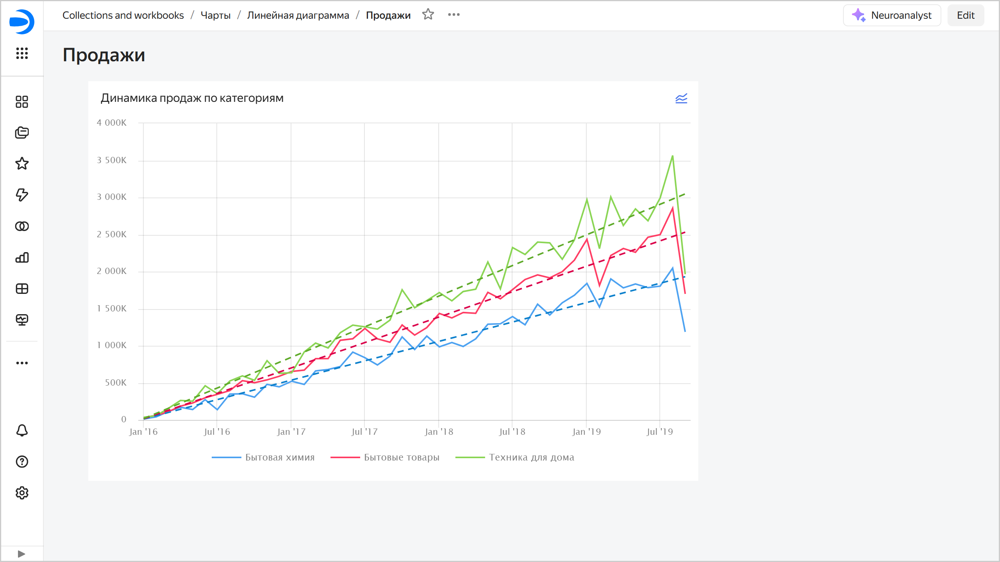
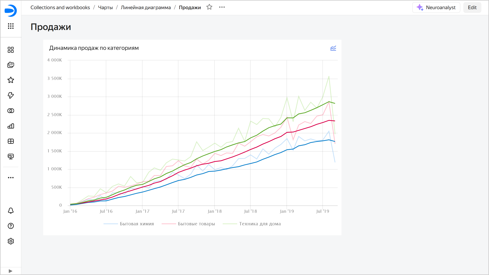
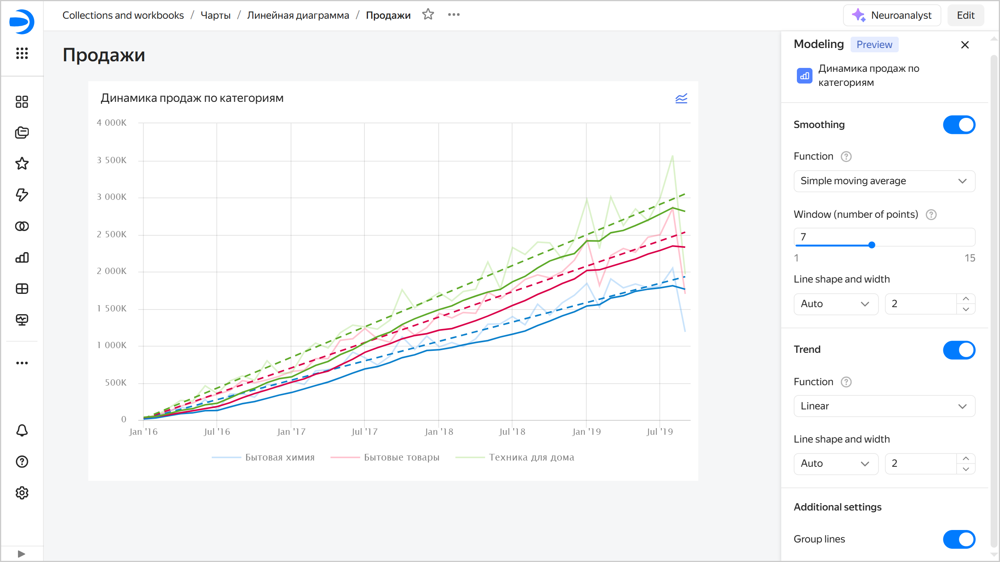

# Trends and smoothings in {{ datalens-full-name }} charts

In {{ datalens-short-name }}, you can apply a smoothing or add a trend line to a chart on a dashboard:

* **Smoothing**: Adds a line with a simple moving average for better visualization of fluctuant data.
* **Trend line**: Adds a trend line to highlight the overall data change trend.

Allows you to temporarily change the visualization without saving the changes in the original chart.

For every chart on the dashboard, you can:

* [Add or remove a trend](#trend).
* [Add or remove a smoothing](#smoothing).
* [Configure trend lines and smoothings](#settings).

The feature is at the Preview stage. Before using it, learn about its [limitations](#restrictions).



Trend and smoothing settings are applied to the current dashboard view only and not saved after the page is refreshed.



When a smoothing or trend line is on,  will appear in the top right corner of the dashboard chart. Clicking it opens the [settings](#settings) window.

## Add or remove a trend {#trend}

To add a trend line, click  →  **Modeling** → **Add trend** in the top right corner of the dashboard chart or enable **Trend** in the [settings](#settings) window. Every chart line will now be accompanied by a trend line representing the overall data change trend.

To remove a trend line, click  →  **Modeling** → **Remove trend** in the top right corner of the dashboard chart or disable **Trend** in the [settings](#settings) window.

## Add or remove a smoothing {#smoothing}

To add a trend line, click  →  **Modeling** → **Add smoothing** in the top right corner of the dashboard chart or enable **Smoothing** in the [settings](#settings) window. Every chart line will now be accompanied by a smoothing line.

To remove a trend line, click  →  **Modeling** → **Remove smoothing** in the top right corner of the dashboard chart or disable **Smoothing** in the [settings](#settings) window.

## Configure trend lines and smoothings {#settings}

To configure trend lines and smoothings, click  →  **Modeling** → **Configure** in the top right corner of the dashboard chart. On the right, in the **Modeling** window:

* Enable **Smoothing** and select:
  
  * **Function**: You can use the `Simple moving average` value, which represents an arithmetic mean in point `t` over the time interval set in the **Window** field. The window includes points preceding `t` and the `t` point itself.
  * **Window (number of points)**: Interval or number of points for arithmetic mean calculation, including the `t` point itself. The possible values range from `1` to `15`.
  * **Line form and density**: Smoothing line properties.

* Enable **Trend** and select:

  * **Function**: Chart line smoothing function:

    * **Linear**: Linear regression, which is a straight line that gives you a general idea of increase or decline over the selected interval. The regression model is $y = a * x + b$, where $a$ and $b$ are selected so that you get a straight line most accurately reflecting the relationship between the source line data.
    * **Quadratic**: Use if there is an obvious non-linear dependency in the source data. The regression model is $y = a * x^{2} + b * x + c$, where $a$, $b$, and $c$ are selected so that you get a parabola line most accurately reflecting the relationship between the source line data.
    * **Cubic**: Use if there is clearly more than one bend in the source data. The regression model is $y = a * x^{3} + b * x^{2} + c * x + d$, where $a$, $b$, $c, and $d$ are selected so that you get a cubic parabola line most accurately reflecting the relationship between the source line data.

    Use the quadratic and cubic functions with caution.

  * **Line form and density**: Trend line properties.

* Additional settings:

  * Enable **Group lines** to hide smoothing and trend lines from the chart legend.

The changes made to the trend line and smoothing settings will appear directly on the chart.

## Limitations {#restrictions}

* Available only for linear charts (Wizard, QL charts, or Editor charts).
* Available only from dashboards.
* Not available for linear charts with the `X` axis in discrete mode.
* The settings are not retained.
* Not available on public and embedded dashboards for now.
