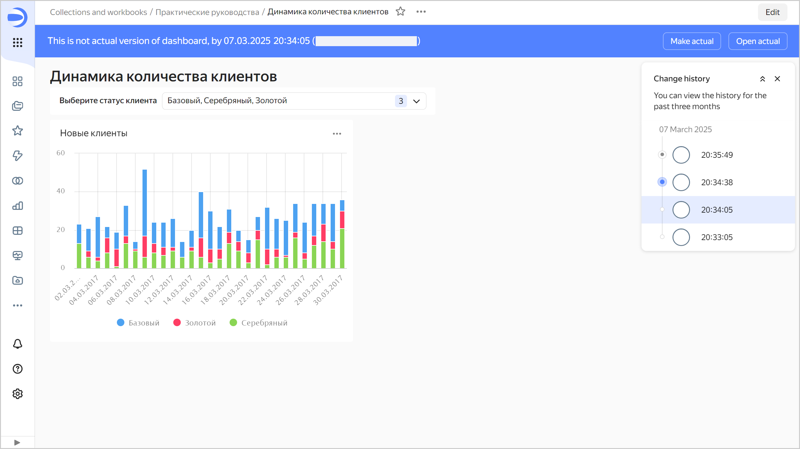
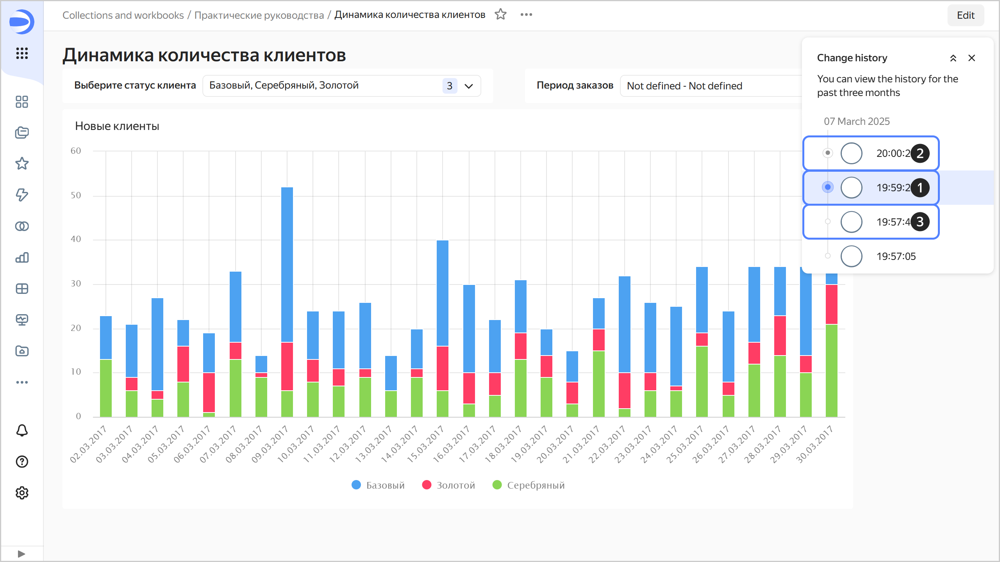
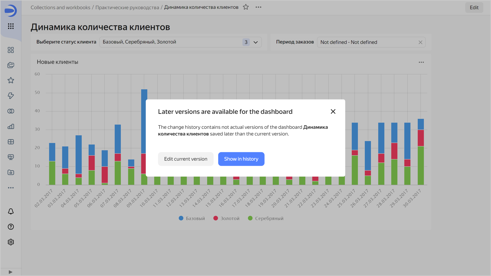

# Versioning

Dashboard versioning is the ability to store the history of dashboard configuration changes using versions. The list of versions is available to users with the lowest editing role for the dashboard.

To go to the list of versions, click  at the top of the screen and select  **Change history**.

To select a version from the list, click it. The version number will be displayed in the `revId` parameter in the dashboard address string. Click a link with the version number in the `revId` parameter to open the relevant version of the dashboard.

## Version types {#version-types}

All versions fall into the following types:

1. **Current**: The most recent saved version of a dashboard. It is displayed for all users that open the dashboard for viewing in the workbook or from the navigation panel. Only one version of a dashboard can be current.
1. **Draft**: A version with unsaved dashboard changes. Common users do not see changes being made to a draft. This enables you to hide dashboard edits until a version update. A dashboard can only have one draft.   
   When you open a draft, a panel appears at the top indicating the version type, creation date and time, and login of the version author. There are buttons in the right-hand panel:

   * **Make current**: Turns the draft into the current version. The version current at the time will become outdated.
   * **Open current**: Opens the current version.

   
   
   

   

1. **Outdated**: This is a version that is neither current nor a draft.  
   When you open an outdated version, a panel appears at the top indicating the version type, creation date and time, and login of the version author. There are buttons in the right-hand panel:

   * **Make current**: Turns the currently outdated version into the current one. The current version and the draft (if any) will become outdated.
   * **Open current**: Opens the current version.
   
   

   

   

## Creating a new version {#version-create}

A new version is automatically created when you click **Save** in dashboard edit mode. Dashboard configuration changes that result in a new version:

* Changing dashboard settings accessible by clicking  at the top of the screen.
* Adding, renaming, or deleting dashboard tabs.
* Editing links.
* Adding and removing widgets.
* Editing widgets, such as [Title](#title) and [Text](#text).
* Editing widget tabs.
* Editing selector settings.

## Editing versions {#version-edit}

You can edit any version of the dashboard.

### Editing a current version {#version-edit}

If there is a draft in the dashboard, a message will appear indicating that there are outdated versions in the change history saved after the current one when you proceed to edit the current version.

Click:

* **Edit current version**: To continue editing. Once saved, a new current version will be created and all others, including the draft, will become outdated.
* **Show in history**: To display a list of versions.

### Editing a draft {#irrelevant-version-edit}

To edit a draft, select it in the version list. To save your draft edits, at the top right, click:

* **Save as draft**: New draft will be created. The current draft will become the outdated version.
*  → **Save and make current**: New current version will be created and all others will become outdated.
*  → **Save as new dashboard**: New dashboard will be created.

### Editing an outdated version {#current-version-edit}

To edit an outdated version, select it from the list of versions. To save edits to an outdated version, at the top right, click:

* **Save as draft**: Draft will be created from the edited version. If there is a current draft, it will become the outdated version.
*  → **Save and make current**: New current version will be created and all others, including the draft, will become outdated.
*  → **Save as new dashboard**: New dashboard will be created.

## Limitations {#restrictions}

* The change history only contains a list of dashboard versions and includes: version type, save date and time, and the author of the edits.
* Dashboard versions do not include:

  * Access permission changes (this operation is separate from editing the dashboard itself).
  * Chart setting changes, that is, changes made from the Wizard, QL Chart, or Editor.
  * Changes to dataset settings made from the dataset interface.
  * Changes to connection settings made using the interface for editing connection parameters.
  * Data changes to the source (rows added, updated, or deleted in the data source).

* Versions do not display a list of changes. You can only view the saved status of the dashboard configuration.
