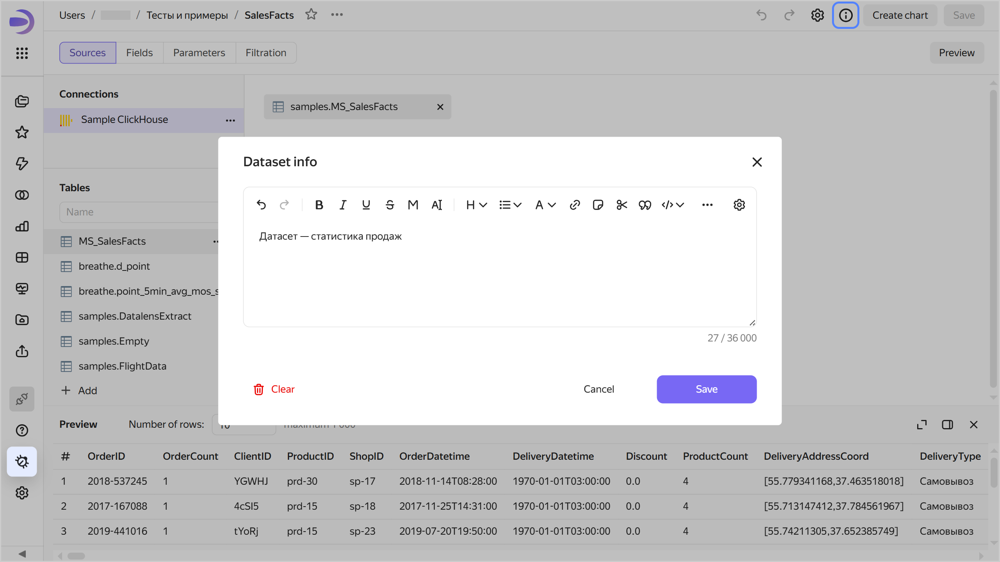
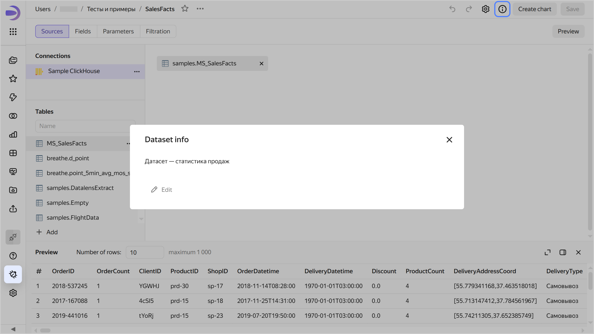

# Adding dataset info in {{ datalens-full-name }}

To add dataset info, do the following:

1. Open the dataset to add info for.
1. Click  at the top of the screen.
1. Enter the information and click **Save**.

   

   

   

1. In the top-right corner, click **Save**.

Now all users will see the  icon in the top-right corner of the dataset. Clicking it will open the **Dataset info** window with the information.





To remove dataset info, save an empty field in the **Dataset info** window. Users will no longer see the  icon.
