# Working with datasets

In this section, you will learn how to work with a dataset:

* [Creating a dataset](#create)
* [Adding data](#add-data)
* [Configuring links](#links)
* [Creating fields](#create-fields)
* [Configuring fields](#setup-fields)
* [Adding parameters](#add-parameters)
* [Adding filters](#add-filters)
* [Configuring access](#access)

## Creating a dataset {#create}

You can create a new dataset using one of the following methods:



- Home page

  1. Go to the {{ datalens-short-name }} [home page]({{ link-datalens-main }}).

  1. Click **Create dataset**.

- Workbook

  1. Go to the [page with workbooks and collections]({{ link-datalens-main }}/collections).
  1. Open the [workbook](../workbooks-collections/index.md) to create a dataset in.
  1. In the top-right corner, click **Create** and select **Dataset**.

- Navigation bar

  In the left-hand panel, select  **Datasets** and click **Create dataset**.



## Adding data {#add-data}

You can add data to a dataset from tables available in the source or run an SQL query against the source.



You can use SQL queries for database sources only.



1. In the dataset, go to the **Sources** tab.
1. In the connection panel, click  **Add**.

   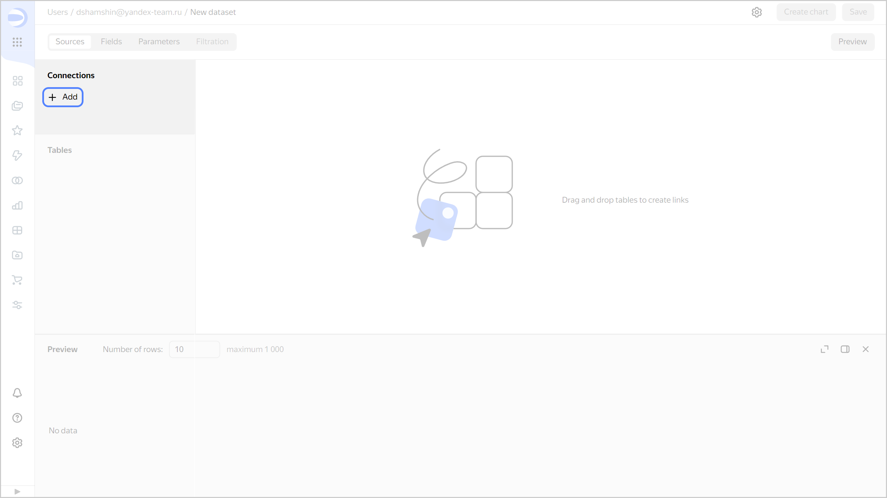

1. Select a data source [connection](../concepts/connection.md).
1. Add data from the data source:

   

   - Table

     Drag the tables you need from the table panel to the workspace. The system will automatically link these tables together based on the first matching field name and data type.

     

     * The maximum number of tables in a single dataset is 32.
     * The maximum number of fields in a single dataset is 1,200.

     

   - SQL query

     

     * To use subqueries as a source, in the connection settings, enable **SQL query access level** → **Allow subqueries in datasets** when creating or editing a [connection](../concepts/connection.md).
     * Describing a dataset via a SQL query does not support parameters. However, you can use [parameterized queries](../operations/chart/create-sql-chart.md#selector-parameters) in [QL charts](../concepts/chart/ql-charts.md).

     

     1. In the table panel, click  **Add**.

        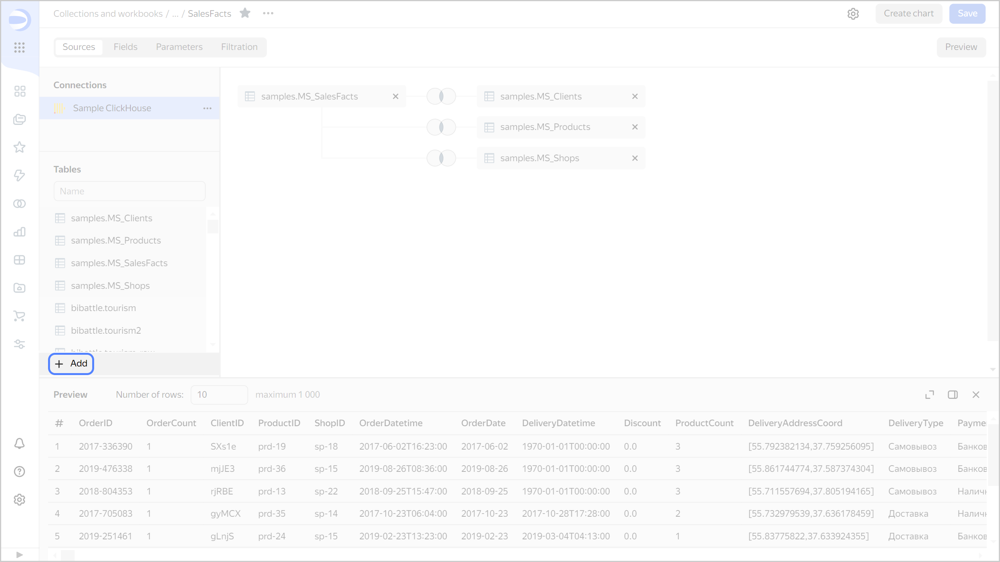

     1. Enter a **Source name** and enter the SQL code in the **Subquery** field.
     1. Click **Create**.

        

        

        

   

### Replacing a connection {#replace-connection}

To replace a connection in a dataset:

1. In the dataset, go to the **Sources** tab.
1. Delete all the tables from the workspace.
1. In the connection panel, click  next to the connection and select **Replace connection**.

   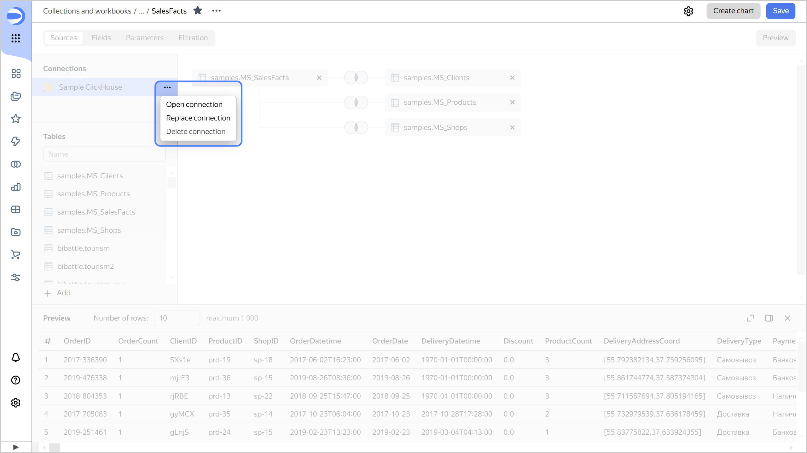

1. Select another connection.
1. Drag the tables to be used as a data source for the dataset to the workspace.
1. Edit or delete the [calculated fields](../concepts/calculations/index.md) which use fields not present in the new table.
1. In the top-right corner, click **Save**.



If the data schema in the source changed, [update](#update-fields) the dataset fields.



## Configuring links {#links}

You can join data from source tables.



1. In the dataset, go to the **Sources** tab.
1. Click the table link icon.

   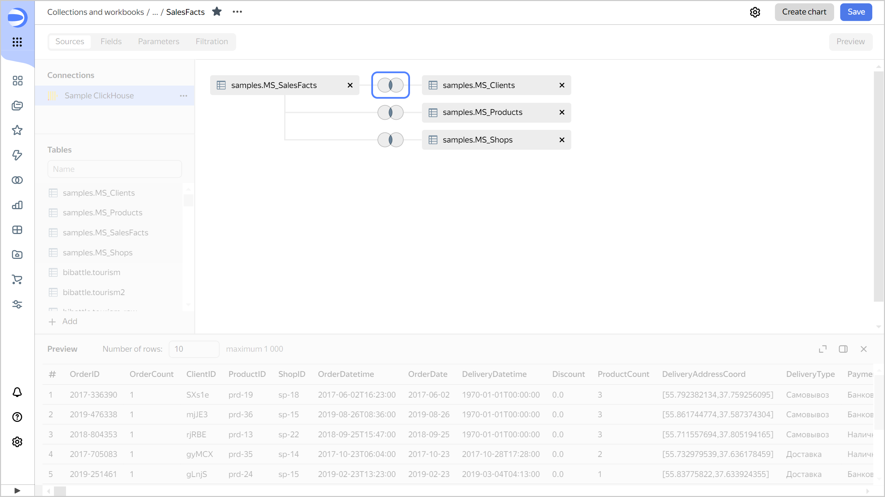

1. Select the link type: `inner`, `left`, `right`, or `full`.

   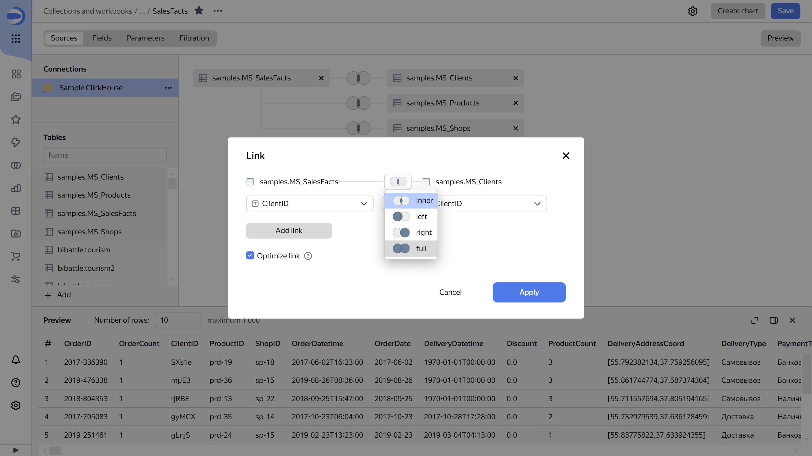

1. Select the fields to join the tables on. You can only link fields with the same [data type](./data-types.md).
1. If required, link other fields in the tables. To do this, click **Add link**.
1. Optionally, you can disable the **Optimize link** option to make the link required. In this case, the `JOIN` operation will be performed even if you select fields from a single table.
1. Click **Apply**.

By default, when you add a new table from a data source to the workspace, it is automatically linked to the first table listed there. If required, you can link a new table to a specific table. To do this, hover the new table over a previously added one and release when you see a gray border around the latter. A new link to the specified table is created.

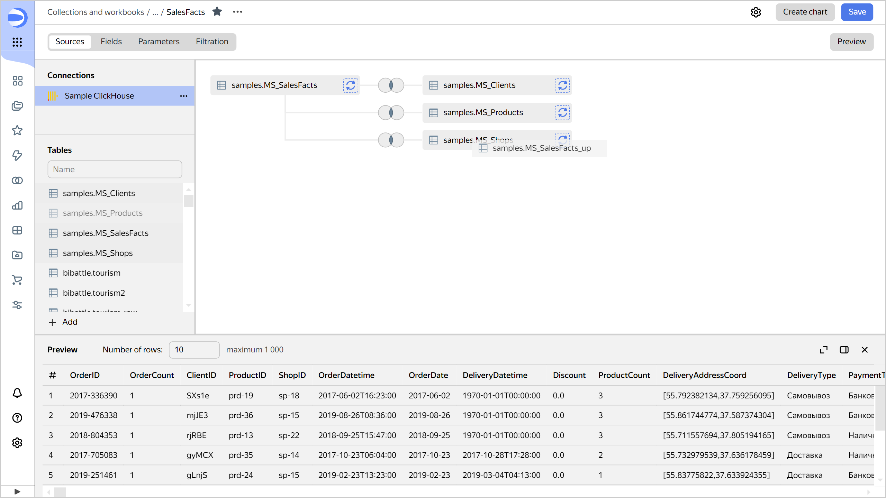

You can replace a previously added table. When dragging a new table, hover it over the icon with circular arrows to the right of the table you are replacing for the icon background to turn blue, then release.

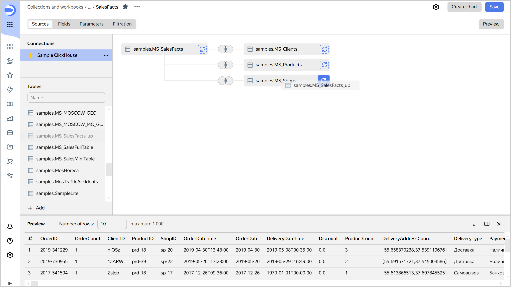



If the updated table retains the same set of fields with the same names, the field IDs in the dataset will not change. In this case, the charts created based on this dataset will not be disturbed. If the updated table's schema has changed, [update](#update-fields) the dataset fields.



## Creating fields {#create-fields}

You can add fields to a dataset from data source tables or create [calculated fields](../concepts/calculations/index.md) using formulas.

1. In the dataset, go to the **Fields** tab.
1. At the top of the screen, click  **Add field**.

   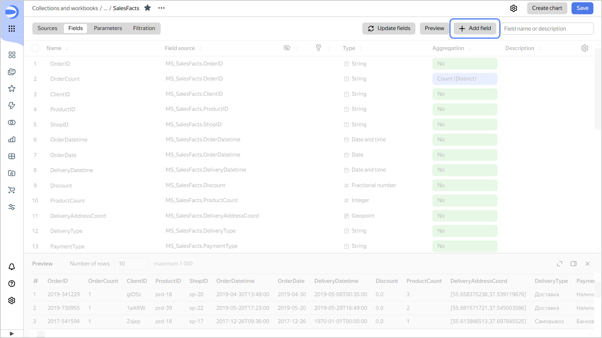

1. Create a field:

   

   - Calculated field

     1. Enter a name for the field.
     1. Enter a formula to calculate the field value using [data source functions](../function-ref/all.md).
     1. Optionally, enable **Don't display in wizard** to hide the field in the wizard when creating a chart.
     1. Click **Create**. The field will appear in the dataset.

        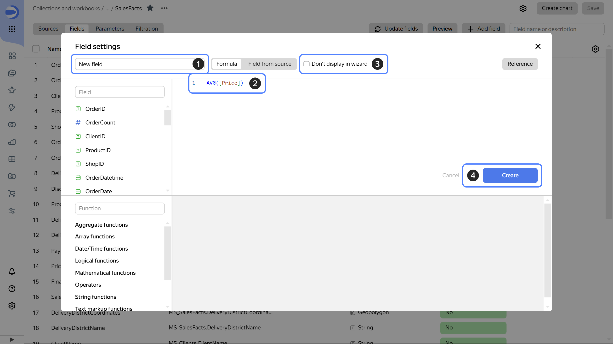

   - Data field

     1. Enter a name for the field.
     1. Go to the **Field from source** tab.
     1. Specify the field parameters:

        * **Field ID**: ID of the field you are creating that is used to provide parameters for filtering by this field on the dashboard or in the chart URL. It may contain lowercase Latin letters, as well as the `_` and `-` characters.
        * **Source**: Table in the data source with the field you need.
        * **Source field**: Field from the selected table in the data source.
        * **Field type**: Field [data type](./data-types.md).
        * **Aggregation**: [Aggregation function](./data-model.md#aggregation) applied to the field.

     1. Optionally, enable **Don't display in wizard** to hide the field in the wizard when creating a chart.
     1. Click **Create**. The field will appear in the dataset.

        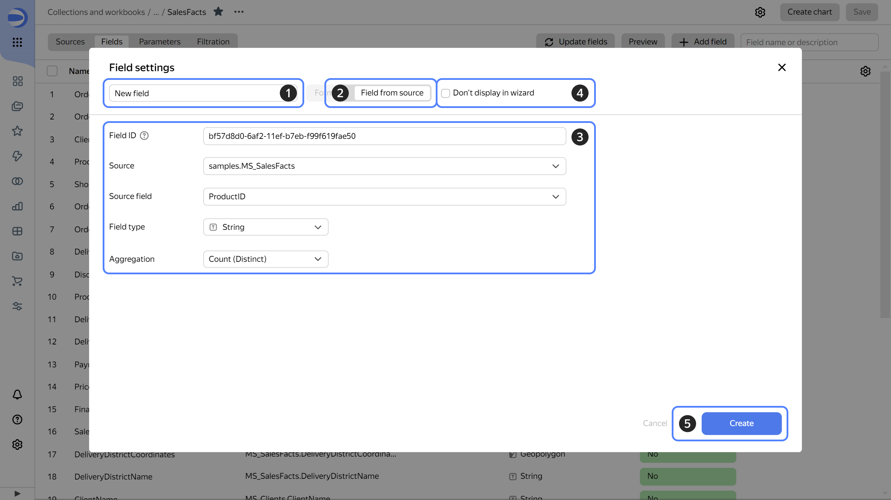

   

## Configuring fields {#setup-fields}

You can perform the following operations on dataset fields:

1. Rename a field: To rename a field, click its current name and enter a new one.
1. Change the source: If the table schema in the source has changed, you can select a new field from the source to match the dataset field.
1. Change the field data type: [Data type](./data-types.md) determines how to process data and which [functions](../function-ref/all.md) can apply to the field. To change the data type, click the current type and select a new one from the list of available types.
1. Select an aggregation type: Aggregation type determines the [aggregation function](./data-model.md#aggregation) to apply to the field. To change the aggregation type, click the current type and select a new one from the list of available aggregation types.
1. Configure access permissions: You can restrict access to field values for different users or user groups. To do this, click  and set the access configuration in `'field_value': user_email` format. For more information, see [{#T}](../security/row-level-security.md).
1. Sort fields: You can sort fields by name, data type, aggregation type, and other parameters. To do this, use the sorting buttons at the top of the **Fields** table.
1. Add a description: You can add a comment to a field in the **Description** column. This can help other users understand what the field is used for or how it is calculated.
1. Hide fields: You can hide fields you do not need at the moment. Other users will not see these fields in the wizard when creating a chart. To do this, click .

   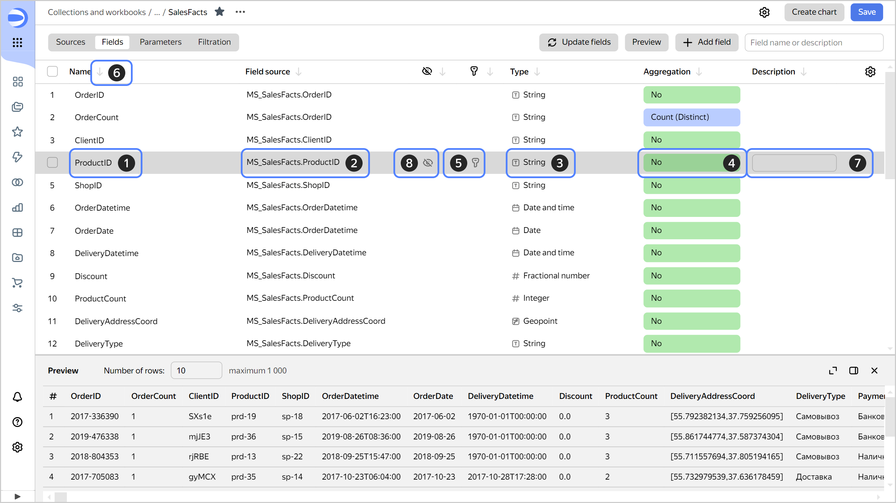

### Updating fields {#update-fields}

You need to update fields if you changed the schema of a table (or tables) in the data source or manually deleted fields from a dataset.

To update fields in a dataset:

1. In the dataset, go to the **Fields** tab.
1. At the top of the screen, click **Update fields**.

   * If a field is missing in the dataset but present in the data source, you will see that field in the list.
   * If a field is present in both the dataset and the data source, the field will be updated, e.g., its type will change.
   * If a field is present in the dataset but missing in the data source, that field will be marked in red. Delete it from the dataset or [replace](#replace-field) it with a different field from the data source.

   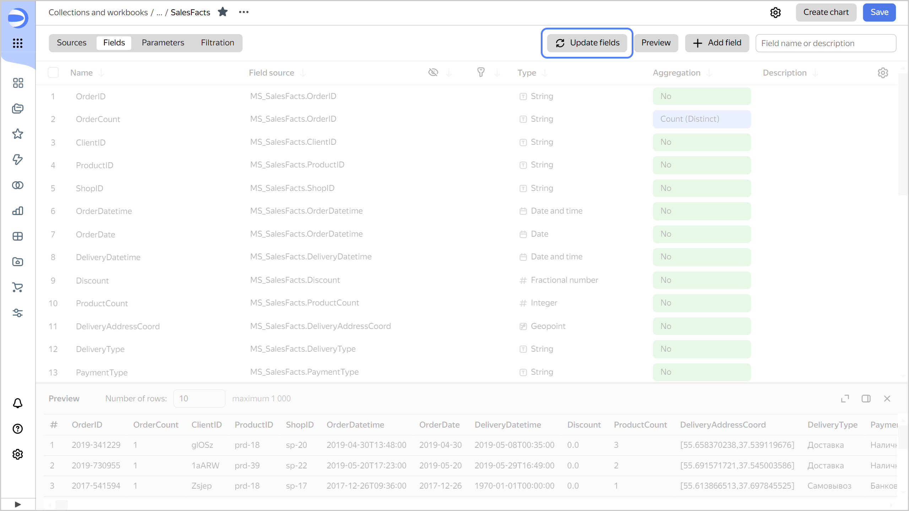

1. In the top-right corner, click **Save**.

### Replacing fields {#replace-field}

If a field has been removed from a data source, it will not be updated when a dataset is updated. Charts featuring this field will show the [`ERR.DS_API.FORMULA.UNKNOWN_SOURCE_COLUMN`](../troubleshooting/errors/ERR-DS_API-FORMULA-UNKNOWN_SOURCE_COLUMN.md) error. You can delete this field from the chart or replace its source in the dataset.

To replace the field source in the dataset:

1. In the left-hand panel, click  **Datasets** and select the dataset you need.
1. In the top-left corner, select the **Fields** tab.
1. In the dataset, select the field you want to replace.
1. Go to the **Field source** column.
1. In the field settings, select the field you wish to replace the deleted field with from the **Field from source** list.

   

1. Click **Save**.

## Adding parameters {#add-parameters}

You can use [parameters](../concepts/parameters.md) in calculated dataset fields.



Parameters added at the dataset level are available in all charts created based on this dataset.



1. In the dataset, go to the **Parameters** tab.
1. Click **Add**.
1. In the **Add parameter** window, specify:

   * **Name**: Sets the parameter name.
   * **Type**: Parameter [data type](./data-types.md).
   * **Default value**: This is a required value. It is used when no parameter value is set in the dashboard, chart URL, or chart settings.

1. Click **Add**.

You can also create parameters at the [chart level](../operations/chart/add-parameter-chart.md).

## Adding filters {#add-filters}

At the dataset level, you can add [default filters](./settings.md#default-filters) that will automatically apply to any new chart created from the current dataset.

1. In the dataset, go to the **Filtering** tab.
1. Click **Add**.
1. Select the field to apply the filter to.
1. Set a filtering rule.
1. In the bottom-right corner, click **Apply filter**.



Default filters are not applied to data in the dataset preview area.



## Configuring access {#access}

The way you configure access to a dataset varies depending on whether it is located in a [workbook](../workbooks-collections/index.md) or a folder.

Before assigning access permissions to a user, [add](../security/add-new-user.md) this user to {{ datalens-short-name }}.



- Workbook

  A dataset inherits all access permissions from a workbook. [Assign the user permissions](../workbooks-collections/security.md#wb-coll-grant) for the appropriate workbook and they will apply to your dataset.

- Directory

  1. On the dataset page, click  in the top menu and select **Permissions**.
  1. In the window that opens, click **Dataset access**.
  1. Enter a username or select the **All** group.

     

  1. (Optional) Write a comment for the user you are granting permissions to.
  1. Specify the appropriate permissions and click **Add**.

     



For more information on object access, see [{#T}](../security/index.md).

#### See also {#see-also}

* [{#T}](./settings.md)
