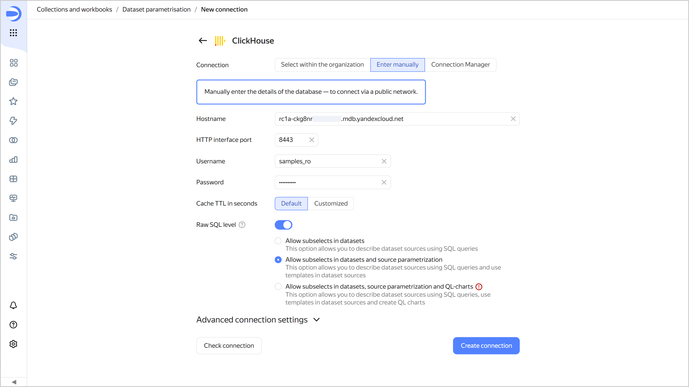
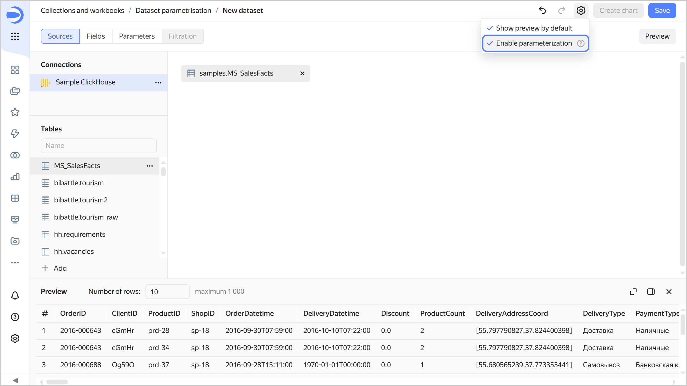

# Parameterization of dataset sources

Parameterization of dataset sources allows you to dynamically substitute parameters from a chart into an SQL query or the name of a table or schema.

To enable source parameterization:

1. Configure a **Raw SQL level** at the connection level. Enable the setting and select the **Allow subqueries in datasets and source parameterization** level.

   

   

   

1. Create a dataset and click **Enable parameterization** in its settings .

   

   

   

1. Follow the [steps](./create-dataset.md#add-parameters) to add the parameter and enable the **Allow use in source setting** option in its settings. Available value types: [Integer](./data-types.md#integer), [fractional number](./data-types.md#float), [string](./data-types.md#string), [date](./data-types.md#date), and [date and time](./data-types.md#datetime).
1. To define a dataset, use the **Insert parameter** button.

For an example of using parameters in a source, see [{#T}](../tutorials/data-from-ch-dataset-parametrization.md).
   
