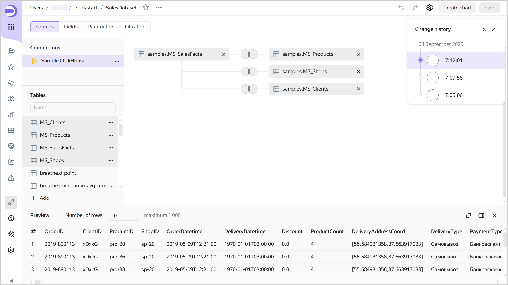
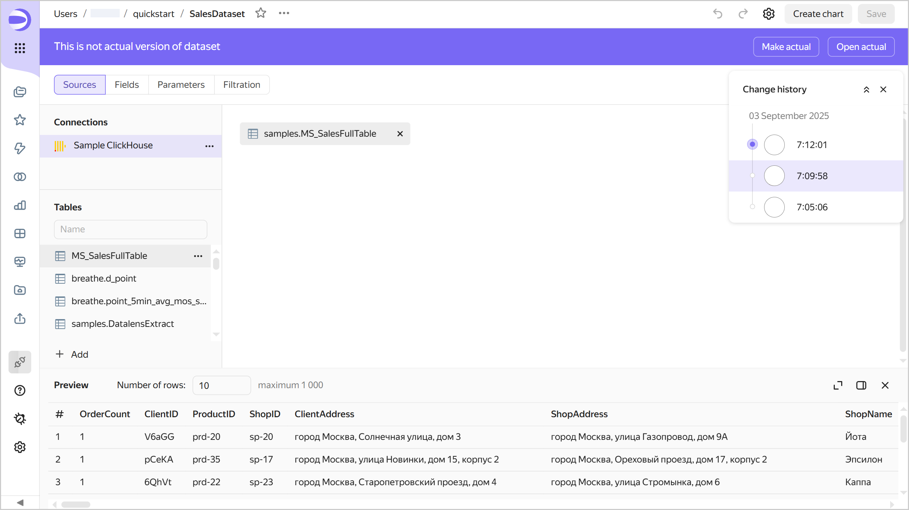
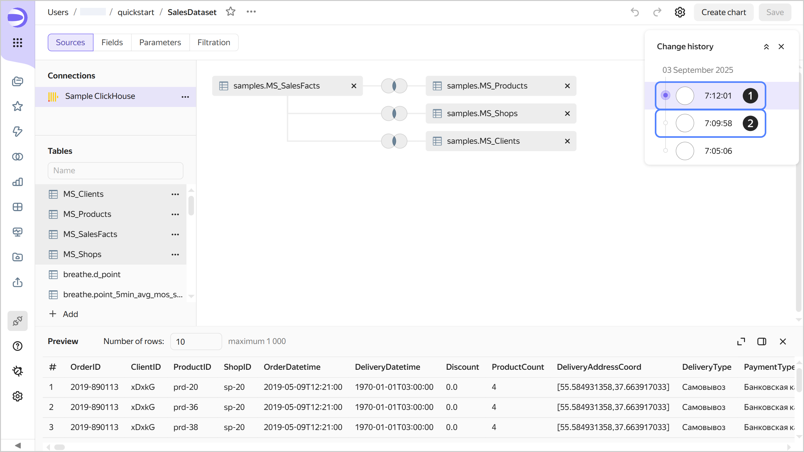

# Versioning

Dataset versioning means storing the history of dataset configuration changes through versions. A list of versions is available to users with the minimum edit permission for the dataset.

To go to the list of versions, click  at the top of the screen and select  **Change history**.

To select a version from the list, click it. The version number will be displayed in the `revId` parameter in the dataset address string. Click a link with the version number in the `revId` parameter to open the relevant version of the dataset.

## Version types {#version-types}

All versions fall into the following types:

1. **Current**: This is the most recently saved version of a dataset. It is displayed for all users that open the dataset for viewing in the workbook or from the navigation panel. A dataset can only have one current version.
1. **Outdated**: This version is no longer current.  
   When you open an outdated version, a panel appears at the top indicating the version type, creation date and time, and login of the version author. There are buttons in the right-hand panel:

   * **Make current**: Turns an outdated version into the current one. The version current at the time will become outdated.
   * **Open current**: Opens the current version.
   
   

   

   

## Creating a new version {#version-create}

A new version is automatically created when you click **Save** in dataset edit mode. Below are dataset configuration changes that create a new version once they are saved:

* Changes on the **Sources** tab:

  * Replacing a [connection](../concepts/connection.md).
  * [Adding data](../dataset/create-dataset.md#add-data) to the workspace from source tables or via an SQL query.
  * [Configuring links](../dataset/create-dataset.md#links).
  * Changing data table settings. To open the settings window, click  → **Change settings** to the right of the table.

* Adding, editing, deleting [fields](../dataset/create-dataset.md#field-operations) on the **Fields** tab.
* Adding, editing, deleting a [parameter](../dataset/create-dataset.md#add-parameters) on the **Parameters** tab.
* Adding, editing, deleting a [filter](../dataset/create-dataset.md#add-filters) on the **Filtering** tab.

## Editing versions {#version-edit}

You can edit any version of a dataset.

### Editing an outdated version {#current-version-edit}

To edit an outdated version, select it from the list of versions. To save your changes to an outdated version, click **Save** at the top right. This will create a new current version, and all others will become outdated.

## Limitations {#restrictions}

* You can only switch to versions created on or after December 1, 2024. Currently, if you edit a dataset created before this date, saving your changes will delete the previous version.
* You can only get change history for the last three months.
* The change history only contains a list of dataset versions and indicates the version type, save date and time, and user who made the change.
* Dataset versions do not include:

  * Access permission changes (this operation is performed separately from dataset edits).
  * Changes to connection settings made using the interface for editing connection parameters.
  * Data changes to the source (rows added, updated, or deleted in the data source).

* Versions do not display a list of changes. You can only view the saved status of the dataset configuration.