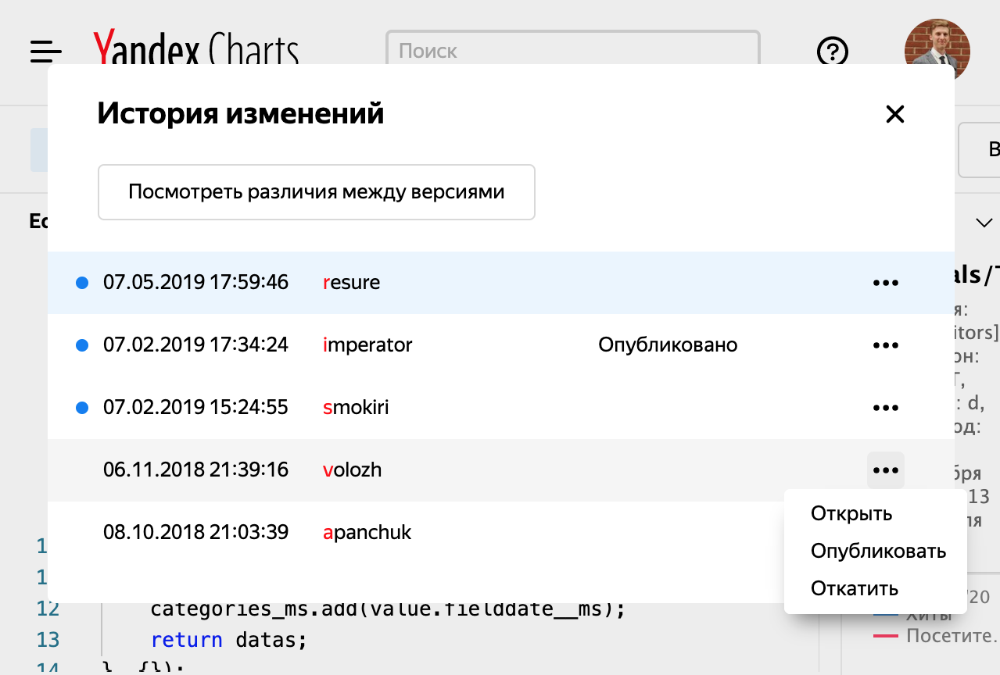

# Versioning

All the changes made in [Editor](https://charts.yandex-team.ru/editor) are versioned.
You can **save** or **publish** your edits.

By default, Editor opens the latest safe version.
Outside the Editor, for example, on [dashboards](https://dash.yandex-team.ru), the published version is used by default.
With such an approach, you can save changes while developing your chart and publish stable versions.
You can also use your saved version explicitly by adding `unreleased=1` to the chart URL.

You can use the "Changelog" dialog to roll back to a previous version (it will become the saved one) or republish it.

Similarly, in charts, you can work with [modules](widgets/module/index.md): the published version is used by default.
Learn more about module versioning in this [section](widgets/module/index.md#versioning).

If a chart doesn't have a published version, this will result in the *"Chart not found"* error.

Charts built in the [Wizard](https://charts.yandex-team.ru/wizard) are always published when saved. It means that they always use the latest version.
At the moment, you can't roll back to a previous version in the Wizard.
