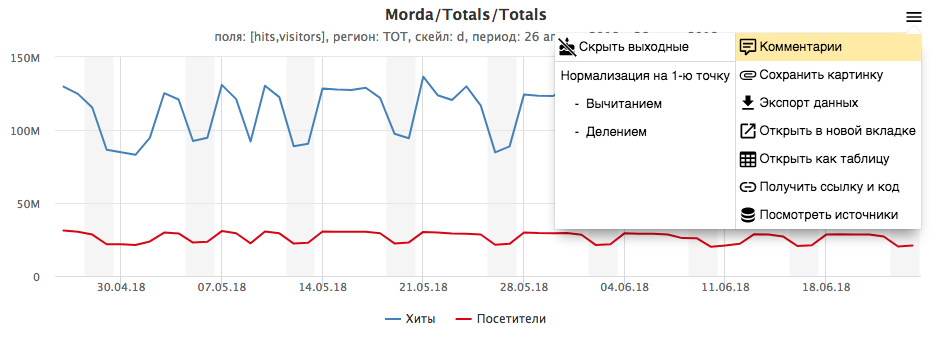
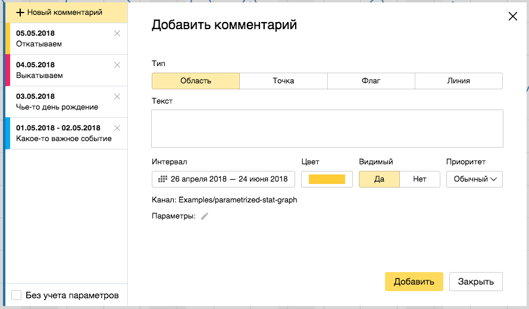
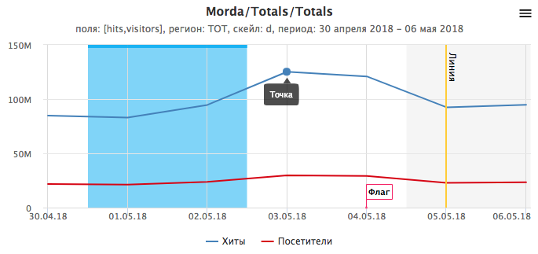
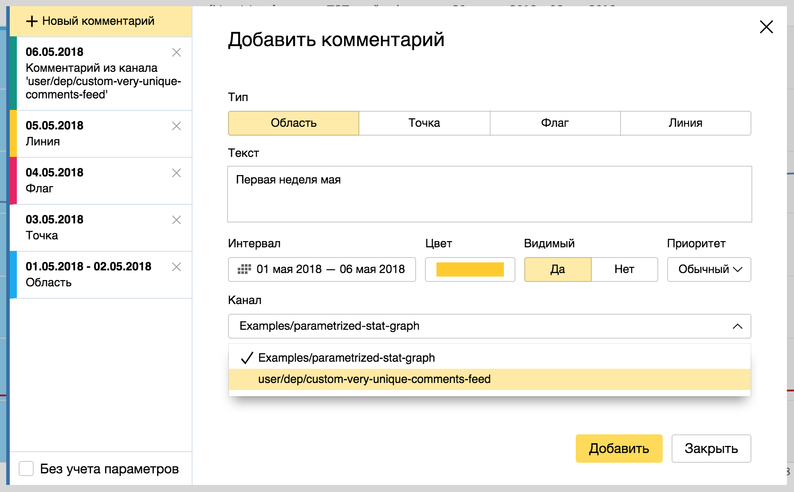
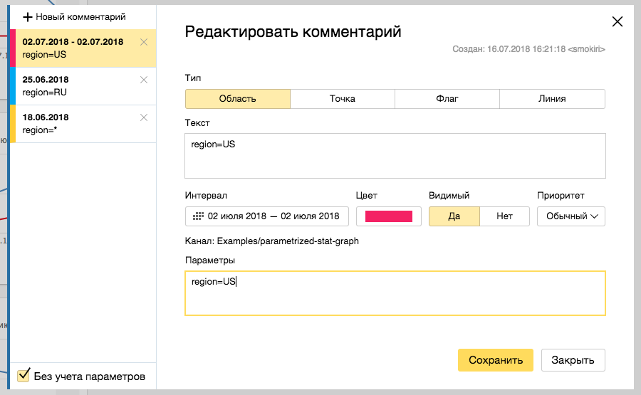
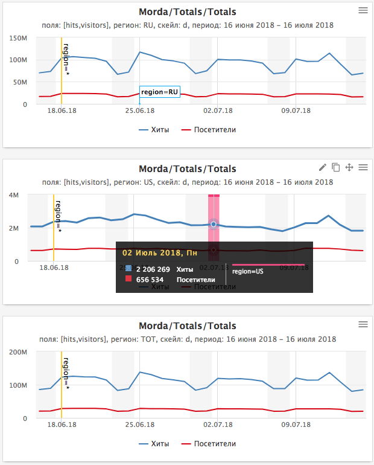

# Comments

* [General information](#common)
* [Channels](#channels)
* [Parameters](#params)

## General information {#common}

Comments are available for **charts** with **time series**.
To go to the comments form, click the Comments menu item:



**Note**: The Comments menu item is available on the **scale** of a **week** or **less**.
*However, if say a comment was created on the first day of the month, it's shown in a chart with a monthly scale.*



You can use the form to create, edit, and delete comments.
There are four types of comments, each having a set of properties: area, point, flag, and line.



## Channels {#channels}

Each comment is assigned to a channel.
The default channel is the script name.

You can list channels for a chart in the `comments.feeds` section [On the Config tab](index.md#config).
For example:

```js
module.exports = {
    comments: {
        feeds: [
            {
                feed: 'user/dep/custom-very-unique-comments-feed'
            }
        ]
    }
};
```

Lists of channels can include both existing comment channels and new ones. 

Then in the list of comments, you'll see the comments from other channels
and be able to specify a channel when creating a chart.



## Parameters {#params}

Each comment can have a set of parameters that constitute a cross-section.

Values of the comment parameters match the values of the [chart parameters](../../params.md).

[In the Config tab](index.md#config), under `comments.matchedParams`, you can list the names of parameters to be matched (and also specifically for each channel).
For example:

```js
module.exports = {
    comments: {
        matchedParams: ['region']
    }
};
```

Now, you can create comments with different values of the `region` parameter:



For a parameter to have an arbitrary value, use `*`.
By default, the list shows the comments having matching parameters, but if you enable "Exclude params", you can
get a list of all parameters for the selected channels.

Depending on the chart parameters, you can see the comments that match the parameters:


