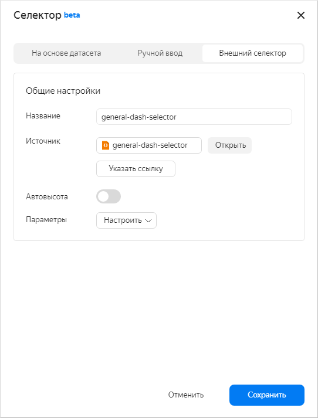
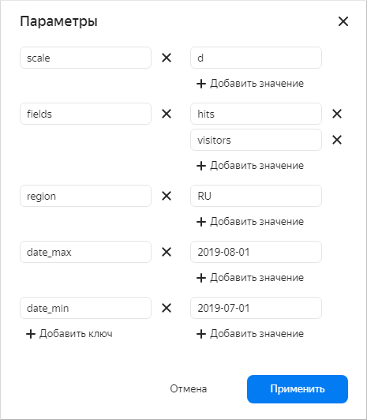
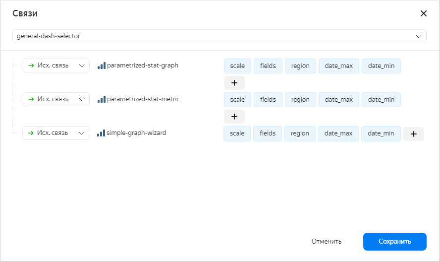

# External selector on the dashboard

## General information {#common-selector}

To add a selector to the dashboard, go to the add selector dialog and select *External selector*.

Then list the selector parameters and their default values.

To make sure that the selector is linked to other elements on the dashboard, go to the *Links* dialog:

## Special parameters {#special-parameters-selector}

To specify a [relative date](../../params.md#relativedate) in the **external selector parameters**, use the `__relative_-7d` format.

## Examples {#examples-selector}

[Dashboard: General](https://dash.yandex-team.ru/osw59jy6s6q2l) +
[Selector: general-dash-selector](https://charts.yandex-team.ru/editor/gkoxrcwbncrad)

[Dashboard: Post update on change](https://dash.yandex-team.ru/10bn4w2h4f4ax) +
[Selector: simple-geo-selector](https://charts.yandex-team.ru/editor/Examples/postUpdateOnChange/simple-geo-selector)

## Note {#note-selector}

Currently, for the system to run correctly, you need to list the **parameters** and their **default values**
**on the selector's Param tab** and **in the settings for the external selector parameters**.
Otherwise, the first loading of the dashboard will be much longer:
it will have to load the tree of dependencies for all elements so that the elements have to wait for each other.
However, to avoid manual syncing for the Params tab and the external selector,
we are going to add a new StaticParams tab or add mode switching on the Params tab: [CHARTS-1666](https://st.yandex-team.ru/CHARTS-1666).
