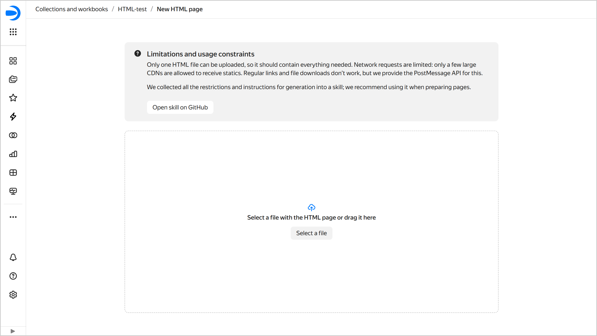

# HTML pages in {{ datalens-name }}

The _HTML page_ feature allows {{ datalens-name }} users to [upload an HTML page](#create-html) to a workbook and [share it](#link-on-html) with other users.

When preparing your HTML pages, use the [GitHub](https://github.com/datalens-tech/datalens-skills) skill that brings together the limitations and generation instructions.

## Uploading an HTML page {#create-html}

You can use one of these methods to upload an HTML page:



- Workbook

  1. Go to the [page with workbooks and collections]({{ link-datalens-main }}/collections).
  1. Open the [workbook](../workbooks-collections/index.md) you want to create an HTML page in.
  1. In the top-right corner, click **Create** and select **HTML page**.
  1. Select an HTML page file or drag and drop it to the page.
  1. In the window that opens, enter a name for the page and click **Create**.

- Navigation panel

  1. Go to the {{ datalens-short-name }} [main page]({{ link-datalens-main-skip-promo }}).
  1. In the left-hand panel, select  **HTML pages** and click **Create HTML page**.
  1. Select the workbook to store your HTML page in and click **Create**.
  1. Select an HTML page file or drag and drop it to the page.
  1. In the window that opens, enter a name for the page and click **Create**.



## Uploading a new version of an HTML page {#html-change}

To update your HTML page:

1. Modify the original HTML page file as needed.
1. In {{ datalens-name }}, open the HTML page to update.
1. At the top right, click **Upload new version**.
1. Select an HTML page file or drag and drop it to the page.

You will now see the new version of your HTML page, while the previous one will be saved to the [version history](./versioning.md).

## Sharing a link to an HTML page {#link-on-html}

To copy a link to an HTML page, click  at the top or click  and select  **Copy link**. You can distribute this link to users with [access](../security/index.md) to the HTML page. 

## Limitations and features {#restrictions}

* You can upload one HTML file only, so it should include everything you need.
* Network requests are limited: you can get static IPs only from a number of large CDNs.
* Common links and file downloads do not work; however, {{ datalens-name }} provides the [postMessage](https://developer.mozilla.org/en-US/docs/Web/API/Window/postMessage) API for this purpose.
