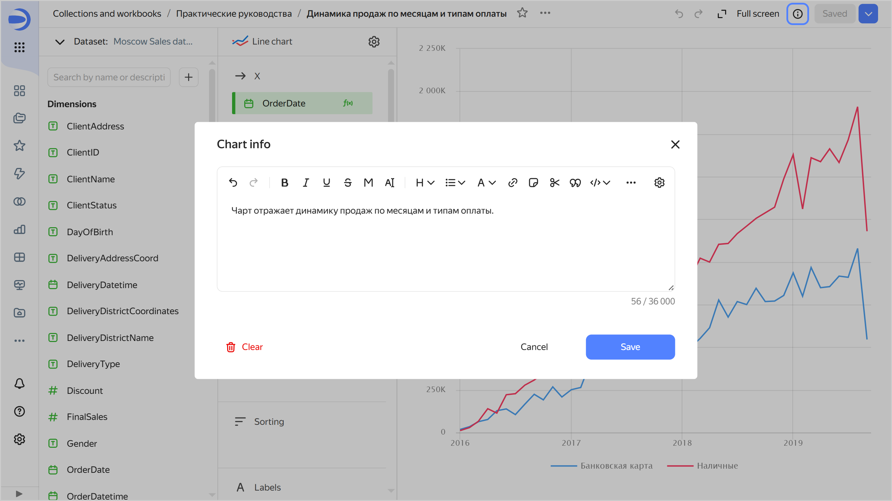
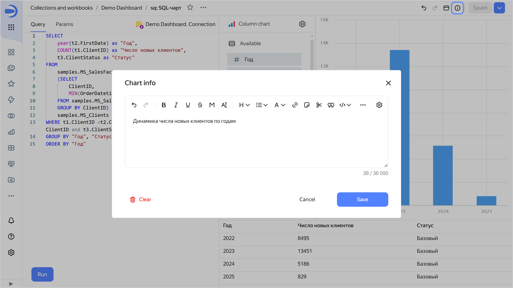
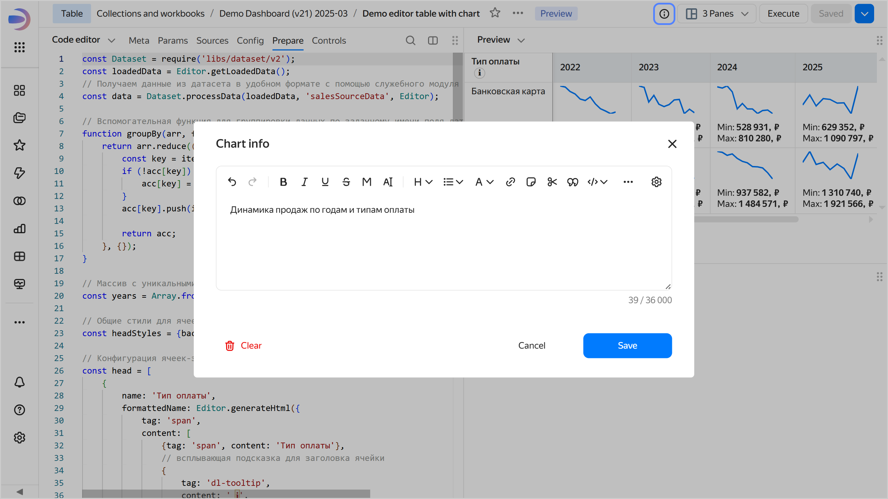
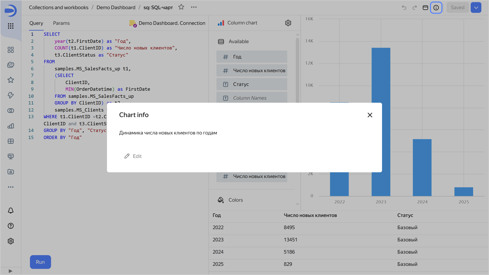
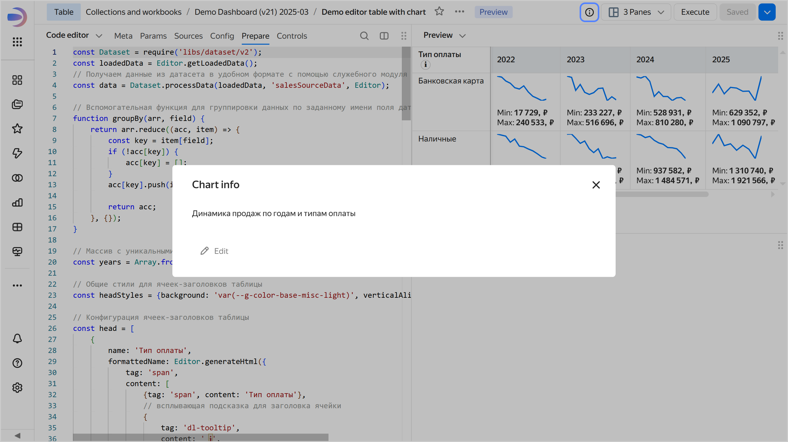

# Adding chart info in {{ datalens-full-name }}

To add chart info, do the following:

1. Open the chart to add info for.
1. Click  at the top of the screen.
1. Enter the information and click **Save**.

   

   

   - Wizard {#wizard}
  
     
 
   - QL chart {#ql}
  
     

   
   - Editor {#editor}
  
     

   

   

1. In the top-right corner, click **Save**.

As a result, all users will see the  icon in the top-right corner of the chart. Clicking it will open the **Chart info** window with the information.





- Wizard {#wizard}

  

- QL chart {#ql}

  

- Editor {#editor}

  





To remove chart info, save an empty field in the **Chart info** window. Users will no longer see the  icon.
