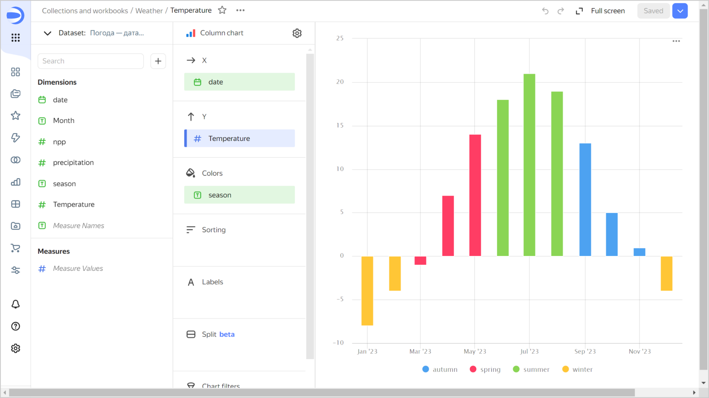
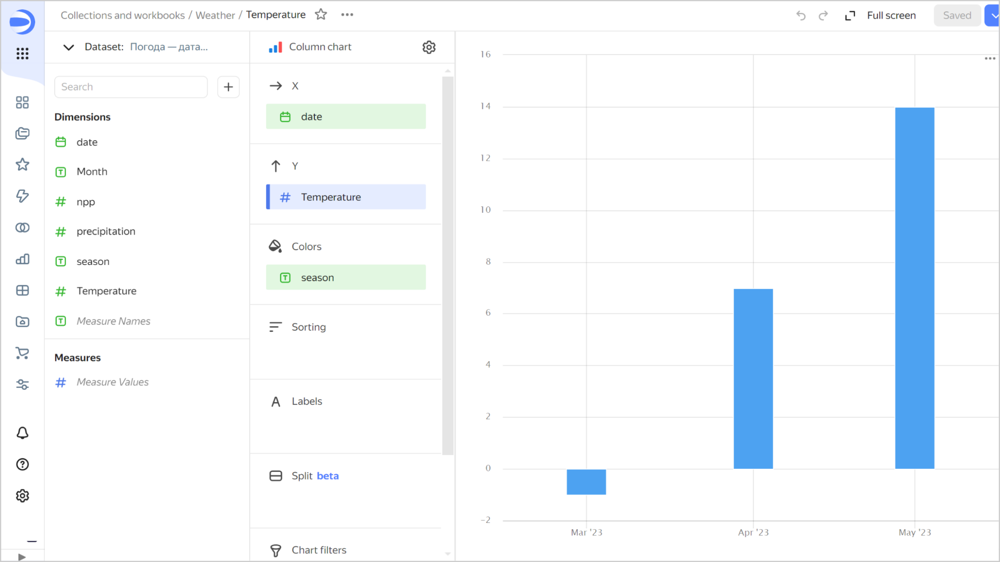

# Adding an ID as a parameter

To pass a filter to a chart as a parameter:



1. In the left-hand panel, click  **Datasets** and select the dataset you need. If you do not have a dataset, [create one](../dataset/create.md).
1. In the top-left corner, select the **Fields** tab.
1. To the right of the field's row, click  and select **Copy ID**.
1. Open the chart you want to add a parameter to, then click  → **Copy link** at the top. You can also copy the chart URL from the browser address bar.
1. Add the field ID to the chart URL as a request parameter. You should get a link in the following format: `{{ link-datalens-wizard }}/yfn1k6yxud7yr-example-chart?17ecb9a1-c8a5-4811-b53e-c8229f88fcba=<value>`, where:

   * `{{ link-datalens-main }}/wizard/yfn1k6yxud7yr-example-chart`: Chart URL.
   * `17ecb9a1-c8a5-4811-b53e-c8229f88fcba`: Field ID.
   * `<value>`: One of the field values used for filtering.

   Clicking this link will open the chart filtered by the specified field.







To filter the chart data, this link was generated:

`{{ link-datalens-main }}/wizard/3v7xz********-temperatura?season_xw29=spring`, where:

* `{{ link-datalens-main }}/wizard/3v7xz********-temperatura`: Chart URL.
* `season_xw29`: Field ID.
* `spring`: Field value used for filtering.

