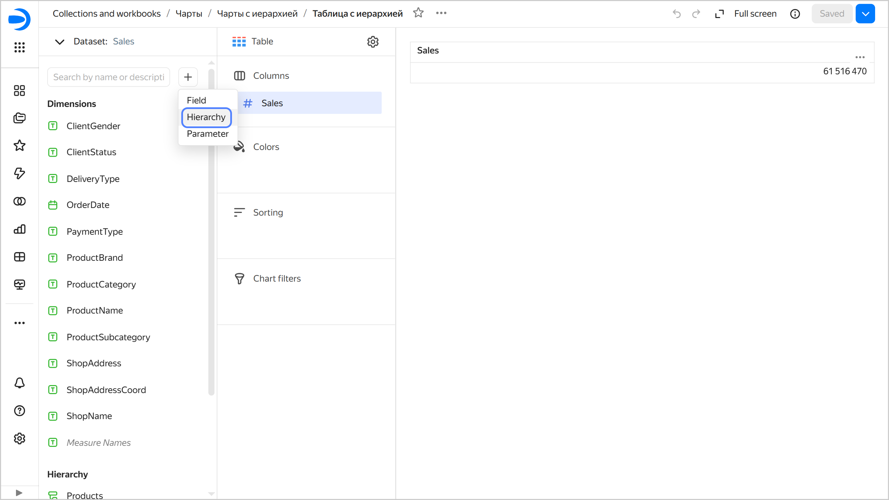
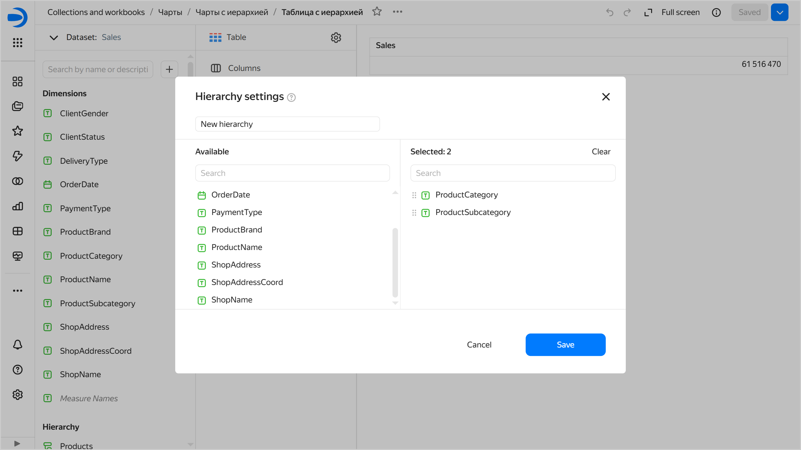
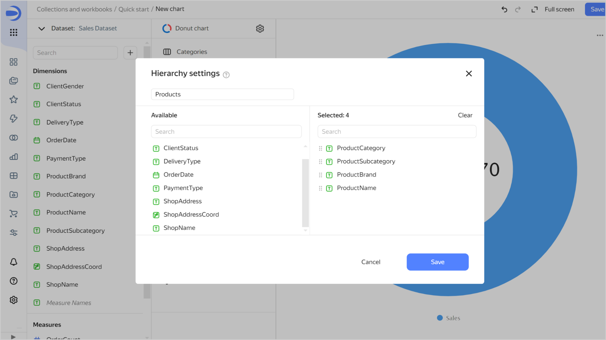

# Adding a hierarchy



* You cannot use hierarchies in **Map**, **Indicator**, and **Pivot table** charts.
* You can only add one hierarchy to a chart.



To add a hierarchy:



1. In the left-hand panel, click  **Charts** and select a chart to which you want to add a hierarchy.

1. On the left side of the screen above the list of dimensions and measures, click  and select **Hierarchy**.

   

1. Enter the hierarchy name, select dimensions, and arrange them as you see fit.

   

1. In the bottom-right corner, click **Save**.
1. Drag the created hierarchy to any available section. For example, for the **Table** chart type, you can use the **Columns** section.
1. Drag other dimensions and measures to the appropriate sections.
1. In the top-right corner, click **Save**.

## Example of adding a hierarchy {#add-hierarchy-example}

We will use a Moscow retail chain's demo {{ CH }} sales database as our data source. For an example of creating a connection and dataset, see [this guide](../../quickstart.md).

1. In the top-right corner of the dataset, click **Create chart**.
1. Select the **Donut chart** visualization type.
1. Add a sales measure to the chart. To do this, drag the **Sales** field from `Measures` to the **Measures** section.
1. On the left side of the screen above the list of dataset fields, click  and select **Hierarchy**.
1. Enter `Products` as the hierarchy name and select the dimensions in the following sequence: `ProductCategory`, `ProductSubcategory`, `ProductBrand`, and `ProductName`.

   

1. In the bottom-right corner, click **Save**.
1. Drag the created hierarchy to the **Color** section.

1. Save the chart:

   1. In the top-right corner, click **Save**.
   1. In the window that opens, enter **Donut chart with hierarchy** as the chart name and click **Save**.

Adding a hierarchy to the chart will allow you to switch between levels of detail: **ProductCategory** → **ProductSubcategory** → **ProductBrand** → **ProductName**.

You can see some examples of charts with a hierarchy on a [ready-made dashboad](https://datalens.yandex/9fms9uae7ip02?tab=MNb).

#### See also {#see-also}

* [{#T}](../../concepts/data-types.md#how-to-create-tree)

