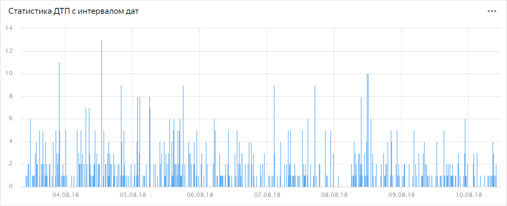
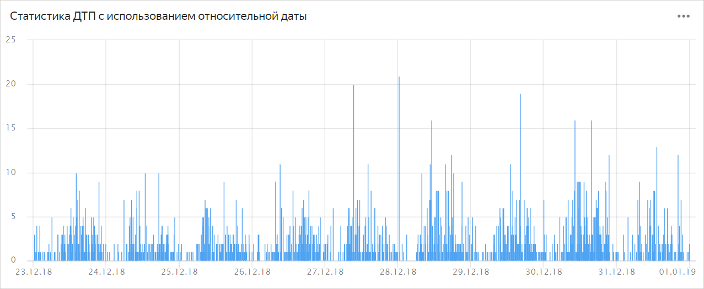

# Adding parameters in dashboard chart settings

To set a parameter:

1. Open the dashboard. If you don't have a dashboard, [create one](../dashboard/create.md).
1. In the upper-right corner, click **Edit**.
1. Select a chart for which you want to set a new parameter.
1. In the upper-right corner of the chart, click .
1. In the resulting window, click **Add parameter**.
1. Set the name (key) of the parameter and its value.
1. Click **Add**.
1. In the tab settings, click **Save**.
1. In the upper-right corner of the dashboard edit window, click **Save**.



The parameter is set in the format `__interval_<start>_<end>`, where `<start>`/`<end>` are [relative dates](#relativedate) or ISO dates.

For example, to set the date and time interval between `03-08-2018 09:00:00` and `10-08-2018 10:00:00`, in the [Road accident statistics with date interval](https://datalens.yandex-team.ru/spfk4rrjmh64k-smertnost-v-dtp?state=24b8f8d656) chart, set the parameter `date_and_time` to `__interval_2018-08-03T09:00:00_2018-08-10T10:00:00`.





The parameter is set in the format `__relative_<sign><number><unit>_<casting type><unit>`, where:

* Sign: `+` or `-`
* units:
   * `y` — a year
   * `Q` — a quarter
   * `M` — a month
   * `w` — a week
   * `d` — a day
   * `h` — a hour
   * `m` — a minute
   * `s` — a second
   * `ms` — a millisecond
* Casting type:
   * `s`: To the start
   * `e`: To the end

For example, to fetch statistics for the chart [Road accident statistics with a relative date](https://datalens.yandex-team.ru/spfk4rrjmh64k-smertnost-v-dtp?state=24b8f8d656) for the period from the beginning of the last week of 2018 until today, set the `date_and_time` parameter to `__interval_2018-12-23___relative_+0d`.

To build relative statistics from the beginning of the year, change `__relative_-0d` to `__relative_-0y_sy`.



Note: If no casting is specified, then for the units of one day and higher, the time is cast to the start of the day, that is, `00:00:00.000`, while casting to the current time is used for smaller time units.



