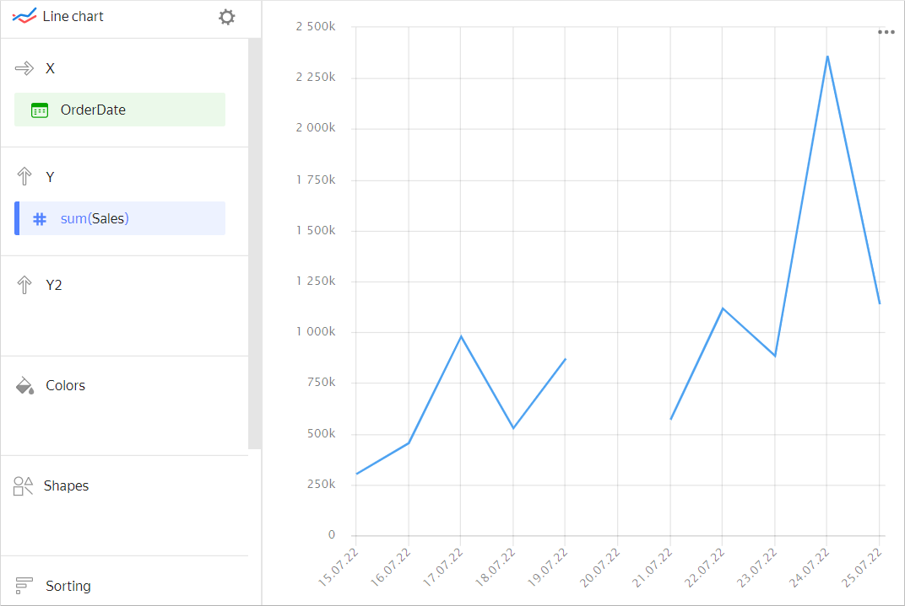
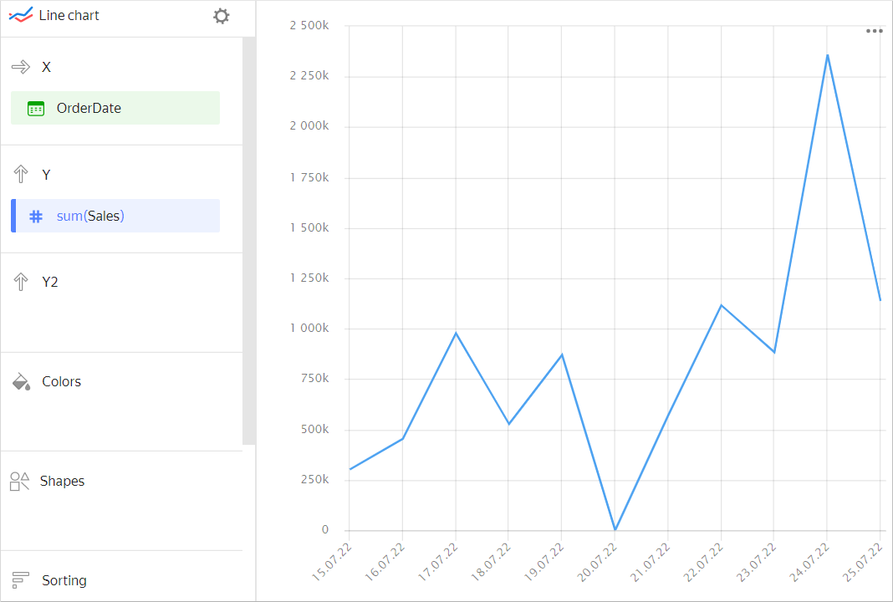
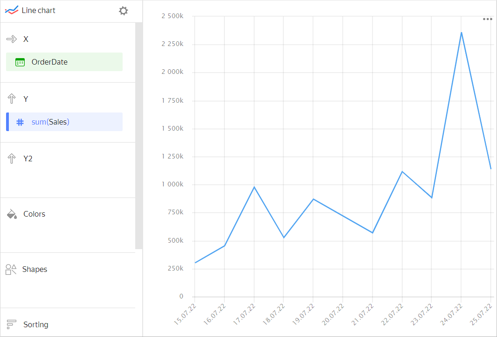

# Configuring the display of null values



The setting is only available for charts that have at least one **X** or **Y** axis:

* Line chart
* Area chart (Stacked and Normalized)
* Column chart (including a Normalized column chart)
* Bar chart (including a Normalized bar chart)
* Scatter chart



If the source data includes a row where the measure value is `null`, the point won't be shown in the chart at default settings (there will be a gap in the line or the column or point will be skipped). For example, if the source includes a row with a date (`20.07.2022`) but the sales amount is missing for it.



| OrderDate | Sales |
| --------- | --------- |
| 15.07.2022 | 301629 |
| 16.07.2022 | 453595 |
| 17.07.2022 | 977583 |
| 18.07.2022 | 527834 |
| 19.07.2022 | 870054 |
| 20.07.2022 | null |
| 21.07.2022 | 569650 |
| 22.07.2022 | 1116034 |
| 23.07.2022 | 883208 |
| 24.07.2022 | 2359483 |
| 25.07.2022 | 1137851 |



You can use settings for chart sections to show null values:

1. In the section with a measure whose values you want to show, in the upper-right corner, click  (the icon appears when you hover over the section).
1. In **Empty values (null)**, select `Display as 0`.
1. Click **Apply**.

Now, `null` values will be replaced by `0` in the chart.

If a row is missing in the source data, the chart section settings won't affect the measure display on the chart. For example, if the source data doesn't have a row with a certain date (`20.07.2022`), nothing will be shown for this date on the chart.



| OrderDate | Sales |
| --------- | --------- |
| 15.07.2022 | 301629 |
| 16.07.2022 | 453595 |
| 17.07.2022 | 977583 |
| 18.07.2022 | 527834 |
| 19.07.2022 | 870054 |
| 21.07.2022 | 569650 |
| 22.07.2022 | 1116034 |
| 23.07.2022 | 883208 |
| 24.07.2022 | 2359483 |
| 25.07.2022 | 1137851 |


