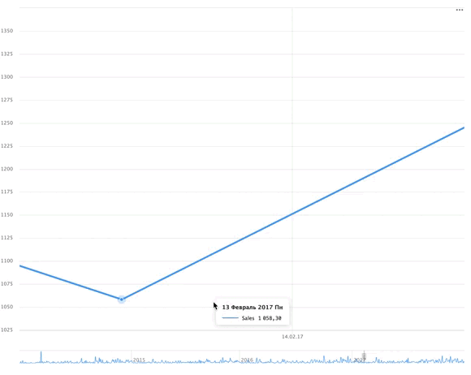

# Configuring a navigator



The navigator is available for those charts from the list that have a field of the `Date` or `Date and time` type in their **X** section:
 
* [Line chart](../../visualization-ref/line-chart.md)
* [Stacked area chart](../../visualization-ref/area-chart.md)
* [Normalized stacked area chart](../../visualization-ref/normalized-area-chart.md)
* [Column chart](../../visualization-ref/column-chart.md)



To configure a navigator:



1. In the left-hand panel, click  **Charts** and select the chart you need to configure a navigator for.
1. On the left side of the screen above the chart, click .
1. In the **Chart settings** window, enable the **Navigator** option.
1. Select the navigator display mode:

   * **All lines** to display all chart lines in the navigator.
   * **Choose lines** to display the chosen lines in the navigator.

1. Specify the **Default period**. Each time you open the chart, the last period will be displayed according to this setting. Put `0` or leave the field empty to display the whole range of values.
1. Click **Apply**. The navigator is displayed at the bottom of the chart.



   .



