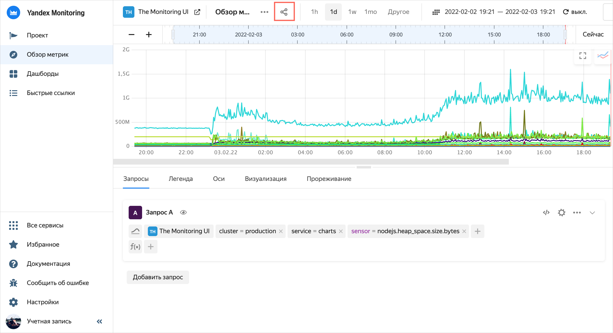
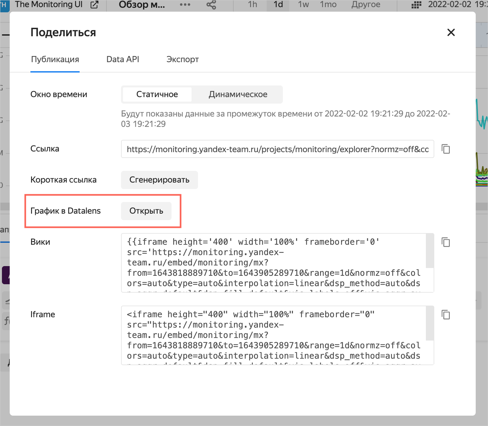

# Exporting a chart from {{ monitoring-full-name }} to {{ datalens-short-name }}



Access rights to QL charts by {{ monitoring-short-name }} data are managed both on the DataLens side and in {{ monitoring-short-name }} .

To view a chart in {{ datalens-short-name }}, the user needs chart access and connection permissions and permissions to read data from a specific project in {{ monitoring-short-name }}.



To export a chart from {{ monitoring-full-name }} to {{ datalens-short-name }}

1. Open the chart in the {{ monitoring-short-name }} and click .

   

   

   

1. In the window that opens, in the **Chart section in the {{ datalens-short-name }}**, click **Open**.

   

   

   

   This opens a new browser tab with a chart built in {{ datalens-short-name }}. You can edit and save this chart, as well as publish it on the dashboard.
