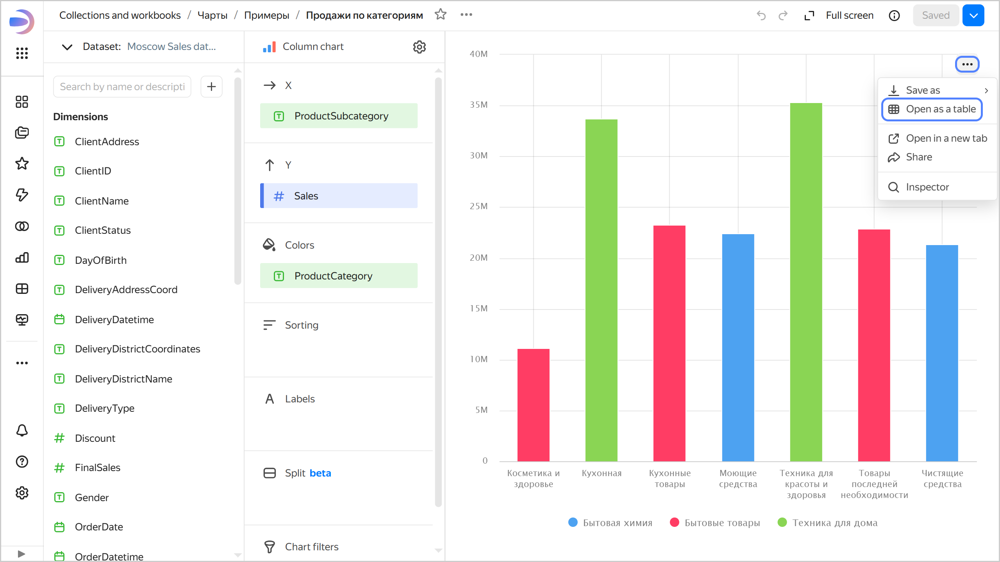
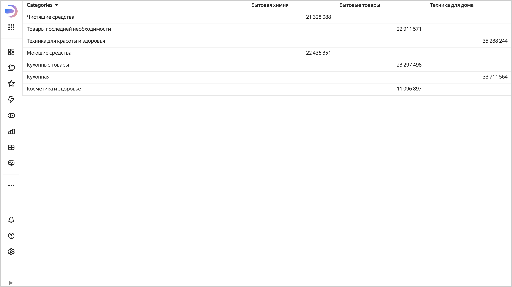

# Opening a chart as a table in {{ datalens-full-name }}

You can display the data used to render a chart as a table.

This feature is not available for the following chart types:

* [{#T}](../../visualization-ref/indicator-chart.md)
* [{#T}](../../visualization-ref/table-chart.md)
* [{#T}](../../visualization-ref/pivot-table-chart.md)
* [{#T}](../../visualization-ref/map-chart.md)

To open a chart as a table, do one of the following:

* Open the chart and click  →  **Open as table** in its top-right corner.
* On the dashboard, find the chart and click  →  **Open as table** in its top-right corner.





The page will display a table with dimensions and measures used to render the chart.



