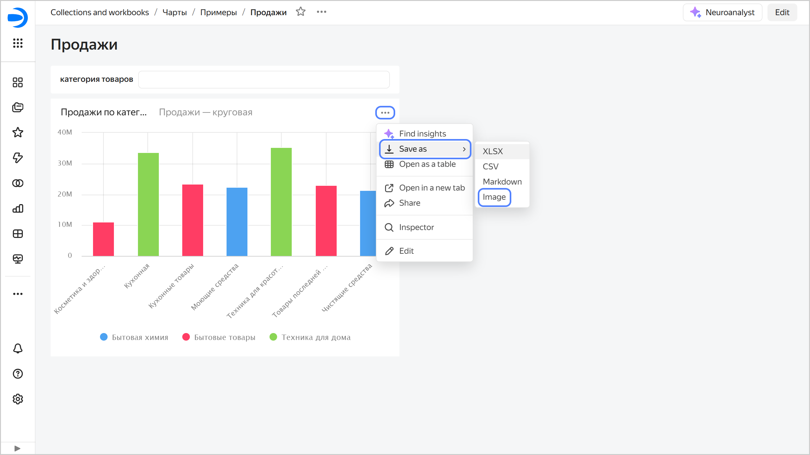

# Saving a chart as an image in {{ datalens-full-name }}

You can save a chart in `PNG` format. Available for [Wizard charts](../../concepts/chart/dataset-based-charts.md), [QL charts](../../concepts/chart/ql-charts.md), and [Editor charts](../../charts/editor/index.md).

To save a chart as an image:

1. Open the chart and click  →  **Save as** → **Image** in its top-right corner.
   Or, on the dashboard, click  →  **Save as** → **Image** in the top-right corner of the chart.

   

   

   

1. Select resolution:

   * Standard, 900x600.
   * Widescreen, 1600x720.
   * Specify manually.
  
1. Optionally, enable **Display interface elements**.
1. Click **Download**.
