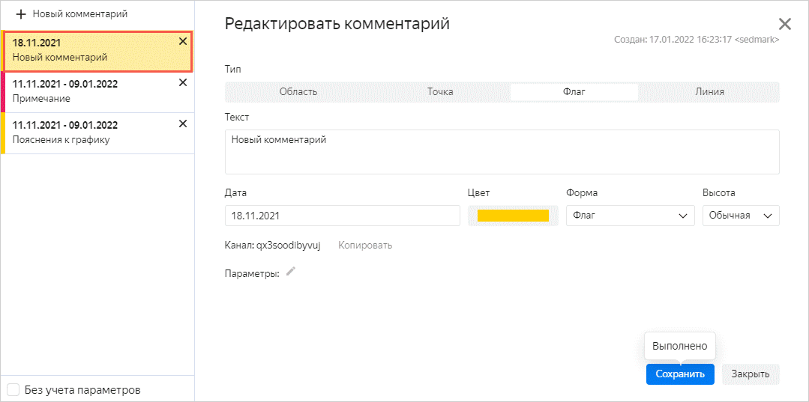

# Adding comments



Comments are available for the following types of charts, provided that in the **X** section (for a bar chart, in the **Y** section) you have a [Date](../../concepts/data-types.md#date) or [Date and time](../../concepts/data-types.md#datetime) field:

* Line chart
* Stacked area chart
* Normalized stacked area chart
* Column chart
* Normalized column chart
* Bar chart
* Normalized bar chart

If the field type mismatches the `Date` or `Date and time` field (for example, the date is stored as a [string](../../concepts/data-types.md#string) in the format `2021-01-01`), then comments aren't available.



To add a comment:

1. Open the chart that you want to add a comment to.
1. Click  in the top-right corner of the chart on the dashboard and select **Comments**.
1. In the resulting window, click **New comment**.
1. Select the comment type and specify its properties:

   

   - Area

      * **Text**. Text of the comment.
      * **Interval**. The period defining the area location on the chart.
      * **Color**. Color of the comment area on the chart.
      * **Visible**. Option to show/hide the comment on the chart.
      * **Priority**. Priority of showing a comment on the chart. The area with a higher priority is shown in the top layer of the chart.
      * **Parameters**. Set of parameters used to build a cross-section. For details, see [{#T}](../../editor/widgets/chart/comments.md#params).

   - Point

      * **Text**. Text of the comment.
      * **Date**. Date of the chart to which the comment is linked.
      * **Line**. Line of the chart to which the comment is linked.
      * **Color**. Color of a point on the chart.
      * **Visible**. Option to show/hide the comment on the chart.
      * **Tooltip**. Color combination used for a tooltip with a comment.
      * **Parameters**. Set of parameters used to build a cross-section. For details, see [{#T}](../../editor/widgets/chart/comments.md#params).

   - Flag

      * **Text**. Text of the comment.
      * **Date**. Date of the chart to which the comment is linked.
      * **Color**. Color of a flag on the chart.
      * **Form**. Format of the comment flag on the chart.
      * **Height**. Height of the flag positioning on the chart.
      * **Parameters**. Set of parameters used to build a cross-section. For details, see [{#T}](../../editor/widgets/chart/comments.md#params).

   - Line

      * **Text**. Text of the comment.
      * **Date**. Date of the chart to which the comment is linked.
      * **Color**. Color of the line on the chart.
      * **Form**. Format of the line on the chart.
      * **Line type**. Type of the line on the chart.
      * **Line width**. Width of the line on the chart.
      * **Parameters**. Set of parameters used to build a cross-section. For details, see [{#T}](../../editor/widgets/chart/comments.md#params).

   

1. Click **Add**. A link to the new comment will appear in the left part of the comment window.

   

## Adding a comment to the feed {#feed-comment}

1. Open a chart with the source comments.
1. Click **Copy** next to the **Channel** field.
1. Open the chart that you want to copy the comments to.
1. In the top part of the screen above the chart, click .
1. Paste the copied ID to the **Comments feed** field.
1. Click **Apply**. Comments from the channel with the specified ID will be added to the chart.

For more information about comments in charts, see the [instructions](../../editor/widgets/chart/comments.md).
