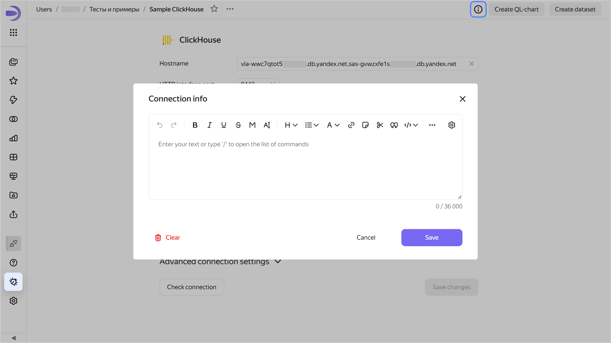
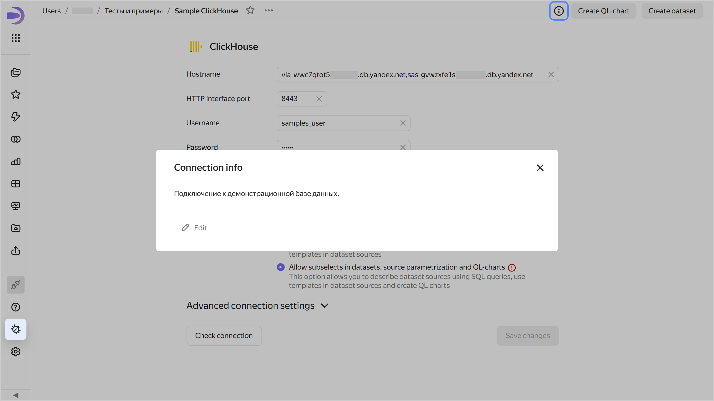

# Adding connection info in {{ datalens-full-name }}

To add connection info, do the following:

1. Open the connection to add info for.
1. Click  at the top of the screen.
1. Enter the information and click **Save**.

   

   

   

1. Click **Save changes** at the bottom.

Now all users will see the  icon in the top-right corner of the connection. Clicking it will open the **Connection info** window with the information.





To remove connection info, save an empty field in the **Connection info** window. Users will no longer see the  icon.
