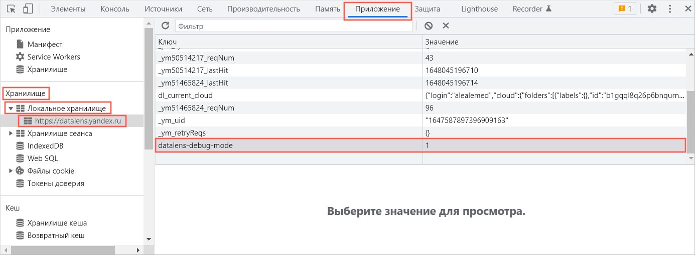
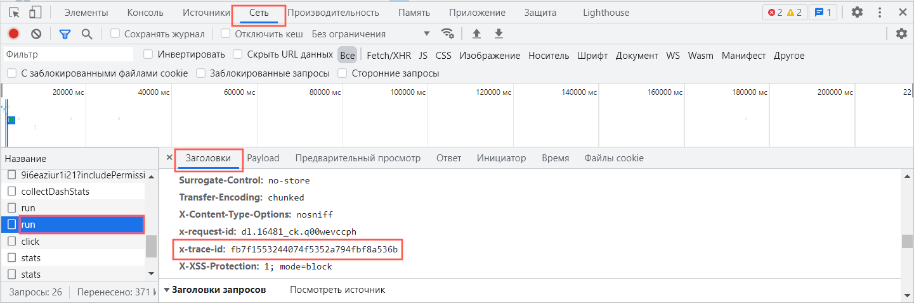
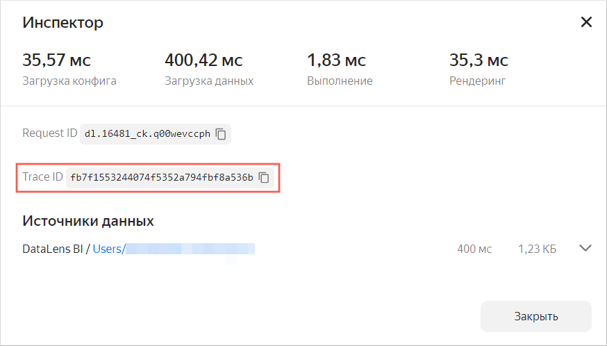
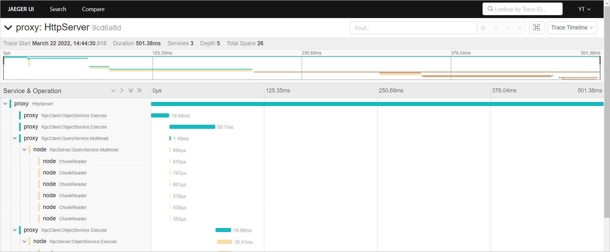

# Tracing requests from {{ datalens-short-name }} in YT

To trace a query sent from {{ datalens-short-name }} to YT, use the [jaeger](https://jaeger.yt.yandex-team.ru/yt/) tool. This tracing method can only be used with datasets, charts, and dashboards based on CHYT connections. It doesn't support tracing of queries that use other connections.

To trace a query sent from {{ datalens-short-name }} to YT:

1. Enable the {{ datalens-short-name }} debugging mode on the dashboard page in the browser:

   

   - Yandex Browser

      1. Open the Web Inspector: In the upper-right corner of the browser panel, click the hamburger icon of the **Yandex Browser settings**, then select**Advanced** → **More tools** → **Developer tools**. You can also click **Ctrl + Shift + I** to open the Web Inspector.
      1. In the Web Inspector, click **Application**.
      1. In the navigator's left panel, expand **Storage** → **Local storage** and select the {{ datalens-short-name }} service URL. In the working area, you'll see a table with the **Key** and **Value** columns.
      1. Double-click the empty line in the table, then enter: in the **Key** column: `datalens-debug-mode`, in the **Value** column: `1`.

   - Google Chrome

      1. Open the Web Inspector: in the upper-right corner of the browser panel, click the three-dots icon **Customize and control Google Chrome**, then select **More tools** → **Developer tools**. You can also click **Ctrl + Shift + I** to open the Web Inspector.
      1. In the Web Inspector, click **Application**.
      1. In the navigator's left panel, expand **Storage** → **Local storage** and select the {{ datalens-short-name }} service URL. In the working area, you'll see a table with the **Key** and **Value** columns.
      1. Double-click the empty line in the table, then enter: in the **Key** column: `datalens-debug-mode`, in the **Value** column: `1`.

   - Opera

      1. Open the Web Inspector: right-click on the browser's working area, then select **Inspect element**. You can also click **Ctrl + Shift + I** to open the Web Inspector.
      1. In the Web Inspector, click **Application**.
      1. In the navigator's left panel, expand **Storage** → **Local storage** and select the {{ datalens-short-name }} service URL. In the working area, you'll see a table with the **Key** and **Value** columns.
      1. Double-click the empty line in the table, then enter: in the **Key** column: `datalens-debug-mode`, in the **Value** column: `1`.

   - Microsoft Edge

      1. Open the Web Inspector: In the upper-right corner of the browser panel, click the three-dots icon **Settings and more (ALT + F)**, then select **More tools** → **Developer tools**. You can also click **Ctrl + Shift + I** to open the Web Inspector.
      1. In the Web Inspector, click **Application**.
      1. In the navigator's left panel, expand **Storage** → **Local storage** and select the {{ datalens-short-name }} service URL. In the working area, you'll see a table with the **Key** and **Value** columns.
      1. Double-click the empty line in the table, then enter: in the **Key** column: `datalens-debug-mode`, in the **Value** column: `1`.

   - Firefox

      1. Open the Web Inspector: In the upper-right corner of the browser panel, click the hamburger icon **Open application menu**, then select **More tools** → **Web Developer Tools**. You can also click **Ctrl + Shift + I** to open the Web Inspector.
      1. In the Web Inspector, click **Storage**. In the navigator's left panel, click **Local Storage**, then select the {{ datalens-short-name }} service URL. In the working area, you'll see a table with the **Key** and **Value** columns.
      1. Double-click the empty line in the table, then enter: in the **Key** column: `datalens-debug-mode`, in the **Value** column: `1`.

   - Safari

      1. Open Web Inspector: in the browser's top menu, click **Develop**, then select **Show Web Inspector**.
      1. In the Web Inspector, click **Storage**.
      1. In the navigator's left panel, go to **All Storage** → **Local Storage**, then select the {{ datalens-short-name }} service URL. In the working area, you'll see a table with the **Key** and **Value** columns.
      1. Double-click the empty line in the table, then enter: in the **Key** column: `datalens-debug-mode`, in the **Value** column: `1`.

   - Other

      1. If you have another browser, try to click **Ctrl + Shift + I** or use the Help to enable Web Inspector.
      1. In the Web Inspector, click **Storage**.
      1. In the navigator's left panel, go to **All Storage** → **Local Storage**, then select the {{ datalens-short-name }} service URL. In the working area, you'll see a table with the **Key** and **Value** columns.
      1. Double-click the empty line in the table, then enter: in the **Key** column: `datalens-debug-mode`, in the **Value** column: `1`.

   

   

1. Update the chart and find the query tracing ID using one of the methods

   

   - In the Web Inspector

      1. Click the **Network** tab.
      1. On the left of the query list in the **Name** column, find the **run** query (you'll have several of them in the dashboard because each chart and selector generates an independent query).
      1. In the query found, click **Headers**.
      1. Find the **x-trace-id** parameter and copy its value.

         

   - In the chart inspector

      1. Click  in the top-right corner of the chart on the dashboard and select **Inspector**.
      1. Find the **Trace ID** parameter and copy its value.

         

   

1. Add the resulting value after the slash to the `https://jaeger.yt.yandex-team.ru/yt/trace/` string without spaces. Paste the resulting address to the browser's address bar and follow the link to the [jaeger](https://jaeger.yt.yandex-team.ru/yt/) query tracer page.

   
