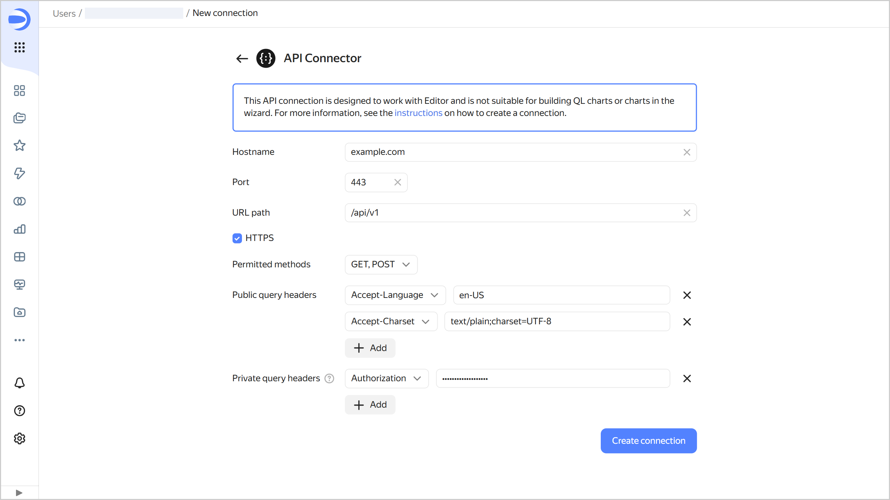

# Creating an API Connector connection



With the API Connector in {{ datalens-full-name }}, you can send HTTP requests to any API on the internet. Such a connection can only be used in Editor and is not supported in [QL charts](../../concepts/chart/ql-charts.md) or [dataset-based charts](../../concepts/chart/dataset-based-charts.md).

To create an API Connector connection, follow these steps:

1. Open the page you use to [create a new API Connector connection]({{ link-datalens-main }}/connections/new/json_api).
1. Specify the connection parameters:

   * **Hostname**. Specify the path to the host you will send a request to.
   * **Port**. Specify the API connection port.
   * **URL path**. Optionally, specify the path to the API (part of the [URL](https://developer.mozilla.org/en-US/docs/Learn/Common_questions/Web_mechanics/What_is_a_URL) without a protocol, host name, or port).
   * **HTTPS**. Enable the secure connection option if your server supports HTTPS.
   * **Allowed methods**. Select a method to send an HTTP request to the API. The available methods are `GET` and `POST`.
   * **Public request headers** and **Private request headers**. Add to your HTTP request the headers represented by key-value pairs. To do this, click **Add**, select a header, and enter its value. Private headers are stored privately in the connection settings. You cannot view any of them but you can replace them with new values.

   

1. Click **Create connection**.

1. Select a [workbook](../../workbooks-collections/index.md) to save your connection to or create a new one. If using legacy folder navigation, select a folder to save the connection to. Click **Create**.

1. Enter a name for the connection and click **Create**.
