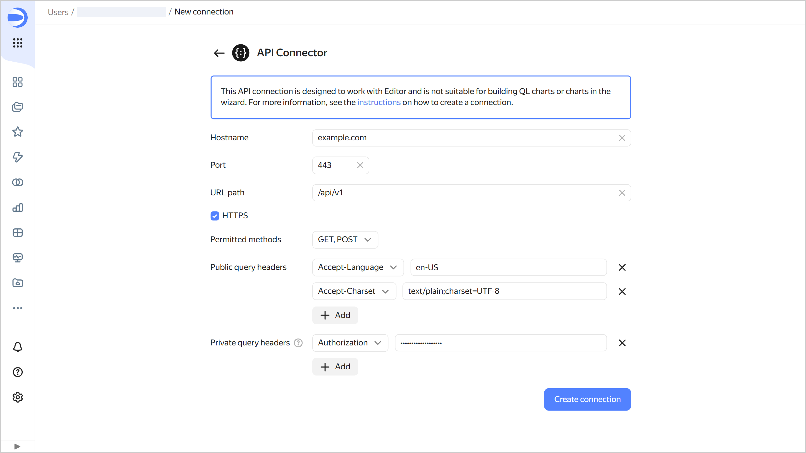

# Creating an API Connector connection

With API Connector in {{ datalens-full-name }}, you can send HTTP requests to any API on the internet. You can use such a connection only in [Editor](../../charts/editor/index.md) as it is not supported in [QL charts](../../concepts/chart/ql-charts.md) or [dataset-based charts](../../concepts/chart/dataset-based-charts.md).

To create an API Connector connection, follow these steps:

1. Open the [new connection creation page]({{ link-datalens-main }}/connections/new).
1. Under **Files and services**, select **API Connector**.
1. Configure the connection as follows:

   * **Hostname**. Specify the path to the host you will send a request to.
   * **Port**. Specify the API connection port.
   * **URL path**. Optionally, specify the path to the API (part of the [URL](https://developer.mozilla.org/en-US/docs/Learn/Common_questions/Web_mechanics/What_is_a_URL) without a protocol, host name, or port).
   * **HTTPS**. Enable the secure connection option if your server supports HTTPS.
   * **Allowed methods**. Select a method to send an HTTP request to the API. The available methods are `GET` and `POST`.
   * Add public and private headers to your HTTP request as key-value pairs. To do this, click **Add**, select a header, and enter its value.

     * **Public request headers** do not contain sensitive data. You can view public headers values at any time in the connection settings. The following public headers are available:
     
       * `Accept-Charset`: List of supported response encodings.
       * `Accept-Encoding`: List of supported response contents encoding methods.
       * `Accept-Language`: List of supported natural languages.
       * `Prefer`: HTTP status code to send in the response.
       * `X-Org-ID`: {{ ya-360 }} organization ID.
       * `X-Cloud-Org-ID`: [Cloud organization](../../../organization/concepts/organization.md) ID.
     
     * **Private request headers** are used for sensitive data. Their values are encrypted; you cannot view them in the connection settings, but you can replace them with new values. The following private headers are available:

       * `Authorization`: API authentication data.
       * `X-Api-Key`: API key for authentication in {{ CH }}.
       * `X-ClickHouse-User`: Username for authentication in {{ CH }}.
       * `X-ClickHouse-Key`: User password for authentication in {{ CH }}.

   

1. Click **Create connection**.
1. Select a [workbook](../../workbooks-collections/index.md) to save your connection to or create a new one. If using legacy folder navigation, select a folder to save the connection to. Click **Create**.
1. Enter a name for the connection and click **Create**.


