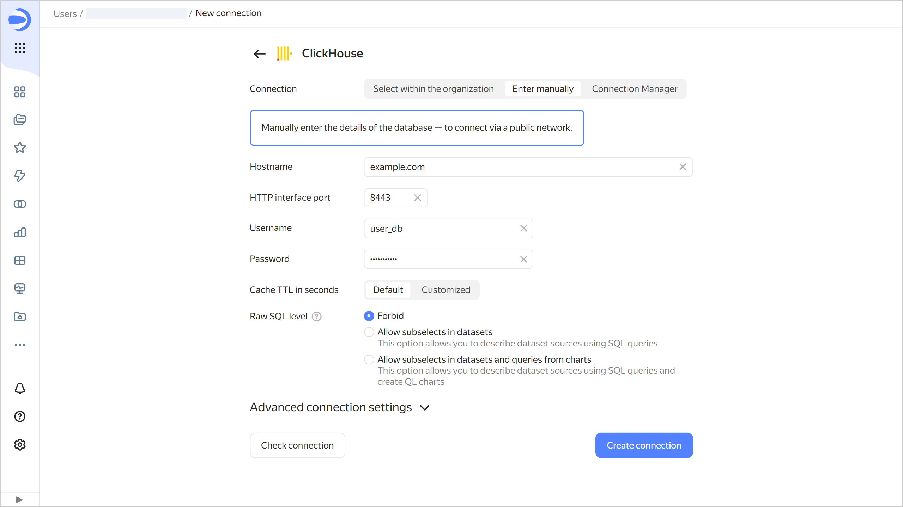

# Creating a {{ CH }} connection



All data requests must be made with the [join_use_nulls]({{ ch.docs }}/operations/settings/settings/#join_use_nulls) flag enabled. See [Specifics of using a connection to {{ CH }}](#ch-connection-specify) if you are using views or subqueries with the JOIN section in {{ datalens-short-name }}.






To create a {{ CH }} connection:

1. Open the page for [creating a new connection]({{ link-datalens-main }}/connections/new).
1. Under **Databases**, select the **{{ CH }}** connection.


1. Select the connection type:

   

   - Select in organization {#organization}

     

     * **Cloud and folder**. Select the folder the cluster is located in.
     * **Cluster**. Specify a cluster from the list of available {{ CH }} clusters. Cluster settings must have the **{{ datalens-short-name }}** access option enabled. If you do not have an available cluster, click **Create new**.

       

     * **Host type**. Select a host type:

       * **Regular** (default): Allows you to select regular hosts to connect to.
       * **Special FQDNs**: Allows you to select a [special FQDN](../../../managed-clickhouse/operations/connect/fqdn.md#auto) to connect to an available {{ CH }} cluster host.

     * **Hostname**. Select the host name from the list of hosts available in the {{ CH }} cluster. You can select multiple hosts. If you are unable to connect to the first host, {{ datalens-short-name }} will select the next one from the list.
     * **HTTP interface port**. Specify the {{ CH }} connection port. The default port is 8443.
     * **Username**. Specify the username for the {{ CH }} connection.

       

     * **Password**. Enter the password for the user.
     * **Cache TTL in seconds**. Specify the cache time-to-live or leave the default value. The recommended value is 300 seconds (5 minutes).

     

       Click **Check connection** to make sure the parameters are correct.

   - Specify manually {#manual}

     

     
     
     

     Click **Check connection** to make sure the parameters are correct.

   - {{ connection-manager-name }} {#conn-man}

     

     Select a [connection](../../../metadata-hub/concepts/connection-manager.md) to a {{ CH }} managed database cluster created in {{ connection-manager-full-name }}:

     * **Cloud and folder**. Select the folder where the connection to the cluster was created.
     * **Connection ID**. Select an available connection in {{ connection-manager-name }} or [create a new one](../../../metadata-hub/operations/create-connection.md).
     * **Host**. Select a host from the list of available hosts in the {{ CH }} cluster.
     * **Port**. It is set automatically depending on the selected host.
     * **Username**. It is set automatically from the selected connection data.
     * **Cache TTL in seconds**. Specify the cache time-to-live or leave the default value. The recommended value is 300 seconds (5 minutes).
     
     

   


1. Click **Create connection**.


1. Select a [workbook](../../workbooks-collections/index.md) to save your connection to or create a new one. If using legacy folder navigation, select a folder to save the connection to. Click **Create**.


1. Enter a name for the connection and click **Create**.


## Additional settings {#clickhouse-additional-settings}

You can specify additional connection settings in the **Advanced connection settings** section:

* **TLS**: If this option is enabled, the DB is accessed via `HTTPS`; if not, via `HTTP`.

* **CA Certificate**: To upload a certificate, click **Attach file** and select the certificate file. When the certificate is uploaded, the field shows the file name.

* 

* **Readonly**: Select a permission for requests to read data, write data, and change parameters. This setting must not exceed the user's corresponding setting in {{ CH }}:

  * `0`: All requests are allowed.
  * `1`: Only read data requests are allowed.
  * `2`: Allows requests to read data and edit settings.

## Specifics of using a connection to {{ CH }} {#ch-connection-specify}

In {{ CH }}, you can create a dataset on top of a `VIEW` that contains the `JOIN` section. To do this, make sure a view is created with the `join_use_nulls` option enabled. We recommend setting `join_use_nulls = 1` in the `SETTINGS` section:

```sql
CREATE VIEW ... (
    ...
) AS
    SELECT
        ...
    FROM
        ...
    SETTINGS join_use_nulls = 1
```

You should also enable this option for raw-sql subqueries that are used as a data source in your dataset.

To avoid errors when using views with the JOIN section in {{ datalens-short-name }}, re-create all views and set `join_use_nulls = 1`. This fills in empty cells with `NULL` values and converts the type of the relevant fields to [Nullable]({{ ch.docs }}/sql-reference/data-types/nullable/#data_type-nullable).




## Use cases {#examples}

* [{#T}](../../tutorials/bigquery-to-clickhouse.md)
* [{#T}](../../tutorials/data-from-ch-visualization.md)
* [{#T}](../../tutorials/data-from-ch-geocoder.md)
* [{#T}](../../tutorials/data-from-ch-to-sql-chart.md)
