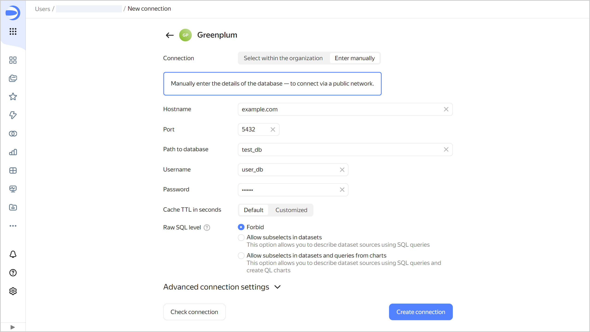

# Creating a {{ GP }} connection







To create a {{ GP }} connection:

1. Open the page for [creating a new connection]({{ link-datalens-main }}/connections/new).
1. Under **Databases**, select the **Greenplum** connection.

1. Select the connection type:

   

   - Select in organization {#organization}

     

     * **Cloud and folder**. Select the folder the cluster is located in.
     * **Cluster**. Specify a cluster from the list of available {{ GP }} clusters. Cluster settings must have the **{{ datalens-short-name }}** access option enabled. If you do not have an available cluster, click **Create new**.

       

     * **Host type**. Select a host type:
       
       * **Regular** (default): Allows you to select regular hosts to connect to.
       * **Special FQDNs**: Allows you to select a [special FQDN](../../../managed-greenplum/operations/connect.md#fqdn-master) for connection, which always points to the primary {{ GP }} master host.

     * **Hostname**. Select the host name from the list of hosts available in the {{ GP }} cluster. You can select multiple hosts. If you are unable to connect to the first host, {{ datalens-short-name }} will select the next one from the list.
     * **Port**. Specify the {{ GP }} connection port. The default port is {{ port-mgp }}.
     * **Path to database** Specify the name of the database to connect to.
     * **Username**. Specify the username for the {{ GP }} connection.
     * **Password**. Enter the password for the user.
     * **Cache TTL in seconds**. Specify the cache time-to-live or leave the default value. The recommended value is 300 seconds (5 minutes).
     
     

   - Specify manually {#manual}

     

      * **Hostname**. Specify the path to a master host or a {{ GP }} master host IP address. You can specify multiple hosts in a comma-separated list. If you are unable to connect to the first host, {{ datalens-short-name }} will select the next one from the list.
      * **Port**. Specify the {{ GP }} connection port. The default port is 5432.
      * **Path to database**. Specify the name of the database to connect to.
      * **Username**. Specify the username for the {{ GP }} connection.
      * **Password**. Enter the password for the user.
      * **Cache TTL in seconds**. Specify the cache time-to-live or leave the default value. The recommended value is 300 seconds (5 minutes).
      
      

      

   

1. (Optional) Test the connection. To do this, click **Check connection**.
1. Click **Create connection**.

1. Select a [workbook](../../workbooks-collections/index.md) to save your connection to or create a new one. If using legacy folder navigation, select a folder to save the connection to. Click **Create**.

1. Enter a name for the connection and click **Create**.

## Additional settings {#additional-settings}

You can specify additional connection settings in the **Advanced connection settings** section:

* **Setting collate in a query**: To explicitly define a collation for DB queries, select a mode:

  * **Auto**: Default setting is used, {{ datalens-short-name }} decides whether to enable the `en_US` locale.
  * **On**: {{ datalens-short-name }} setting is used, the `en_US` locale is specified for individual expressions in a query. This makes the server use the appropriate sorting logic, regardless of the server settings and specific tables. Use the {{ datalens-short-name }} setting if the DB locale is incompatible with {{ datalens-short-name }} performance. For more information on the locale and `LC_COLLATE`, see [{#T}](../../../managed-postgresql/operations/cluster-create.md#create-cluster).
  * **Off**: Default setting is used, {{ datalens-short-name }} only uses the existing parameters of the DB locale.

* 

