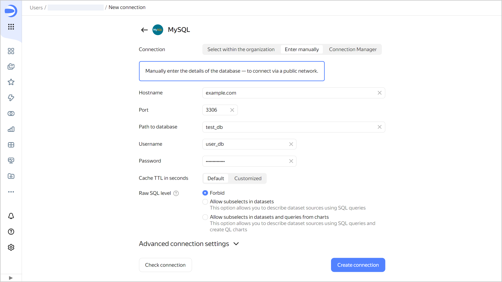

# Creating a {{ MY }} connection







To create a {{ MY }} connection:

1. Open the page for [creating a new connection]({{ link-datalens-main }}/connections/new).
1. Under **Databases**, select the **MySQL** connection.

1. Select the connection type:

   

   - Select in organization {#organization}

     

     * **Cloud and folder**. Select the folder the cluster is located in.
     * **Cluster**. Specify a cluster from the list of available {{ MY }} clusters. Cluster settings must have the **{{ datalens-short-name }}** access option enabled. If you do not have an available cluster, click **Create new**.

       

     * **Host type**. Select a host type:

       * **Regular** (default): Allows you to select regular hosts to connect to.
       * **Special FQDNs**: Allows you to select [special FQDNs](../../../managed-mysql/operations/connect.md#special-fqdns) for connection, which always point to the current master host or to its closest replica in the {{ MY }} cluster.

     * **Hostname**. Select the host name from the list of hosts available in the {{ MY }} cluster. You can select multiple hosts. If you are unable to connect to the first host, {{ datalens-short-name }} will select the next one from the list.
     * **Port**. Specify the {{ MY }} connection port. The default port is 3306.
     * **Path to database**. Specify the name of the database to connect to.
     * **Username**. Specify the username for the {{ MY }} connection.
     * **Password**. Enter the password for the user.
     * **Cache TTL in seconds**. Specify the cache time-to-live or leave the default value. The recommended value is 300 seconds (5 minutes).
     * **Raw SQL level**. Enables you to use an ad-hoc SQL query to [generate a dataset](../../dataset/settings.md#sql-request-in-datatset).

       Click **Check connection** to make sure the parameters are correct.

   - Specify manually {#manual}

     

     

     

     Click **Check connection** to make sure the parameters are correct.

   - {{ connection-manager-name }} {#conn-man}

     

     Select a [connection](../../../metadata-hub/concepts/connection-manager.md) to a {{ MY }} managed database cluster created in {{ connection-manager-full-name }}:

     * **Cloud and folder**. Select the folder where the connection to the cluster was created.
     * **Connection ID**. Select an available connection in {{ connection-manager-name }} or [create a new one](../../../metadata-hub/operations/create-connection.md).
     * **Host**. Select a host from the list of available hosts in the {{ MY }} cluster.
     * **Port**. It is set automatically depending on the selected host.
     * **Database**. Specify the name of the database to connect.
     * **Username**. It is set automatically from the selected connection data.
     * **Cache TTL in seconds**. Specify the cache time-to-live or leave the default value. The recommended value is 300 seconds (5 minutes).
     * **Raw SQL level**. Enables you to use an ad-hoc SQL query to [generate a dataset](../../dataset/settings.md#sql-request-in-datatset).

   

1. Click **Create connection**.

1. Select a [workbook](../../workbooks-collections/index.md) to save your connection to or create a new one. If using legacy folder navigation, select a folder to save the connection to. Click **Create**.

1. Enter a name for the connection and click **Create**.

## Additional settings {#additional-settings}


