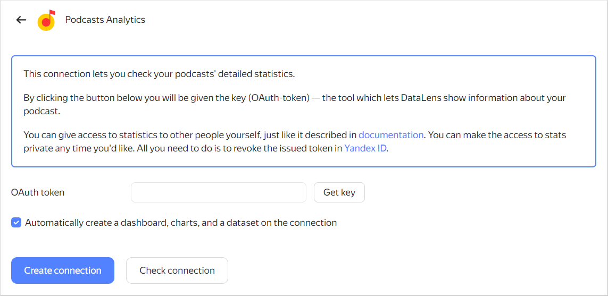

# Creating a Yandex Music podcast connection



Only users with permissions to a Yandex Music podcast can create connections and process podcast analytics. If you do not have access to any podcast, no data will be displayed on the dashboard.

You will get access after uploading a podcast to Yandex Music. The podcast is linked to the Yandex email address you specified when uploading it.



1. Open the page for [creating a new connection]({{ link-datalens-main }}/connections/new).
1. Under **Partner connections**, select the **Podcasts Analytics** connection.

   

1. Click **Get key**. If this is your first time creating a connection to Yandex Music podcasts, grant the service the required permissions.
1. Leave the **Automatically create a dashboard, charts, and a dataset on the connection** option enabled if you need a folder with a standard set of datasets and charts and a ready-made dashboard.
1. (Optional) Make sure the connection works properly. To do this, click **Check connection**.
1. Click **Create connection**.
1. Select a [workbook](../../workbooks-collections/index.md) to save your connection to or create a new one. If using legacy folder navigation, select a folder to save the connection to. Click **Create**.
1. Enter a name for the connection and click **Create**.
1. Go to the **Dashboards** menu and open the **Yandex Music podcast analytics** dashboard. If there is no data, check that your current account has access to podcasts by writing to [technical support](https://yandex.com/support/music/podcast-authors/statistics.html).
