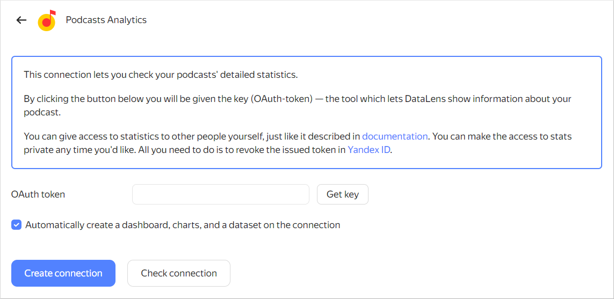

# Creating a connection to Yandex Music podcasts

 Only users with permissions for a Yandex Music podcast can create connections and process podcast analytics. If you do not have access to any podcast, no data will be displayed on the dashboard.
 
 You will get access after uploading a podcast to Yandex Music. The podcast is linked to the Yandex email address you specified when uploading it.



To create a connection to a Yandex Music podcast:

1. Open the [connection creation page]({{ link-datalens-main }}/connections/new).
1. Under **Partner connections**, select the **Podcasts Analytics** connection.

   

1. Click **Get key**. If this is your first time creating a connection to Yandex Music podcasts, grant the service the required permissions.
1. Leave the **Automatically create dashboard, charts, and dataset on top of connection** option enabled if you need a folder with a standard set of datasets and charts and a ready-made dashboard.
1. Optionally, test the connection by clicking **Check connection**.
1. Click **Create connection**.
1. Select the [workbook](../../workbooks-collections/index.md) to save your connection to or create a new one. If using legacy folder navigation, select a folder to save the connection to. Click **Create**.
1. Enter a name for the connection and click **Create**.
1. Go to the **Dashboards** menu and open the **Yandex Music podcast analytics** dashboard. If there is no data, make sure your current account has access to podcasts by contacting the [support team](https://yandex.com/support/music/podcast-authors/statistics.html).

## Use cases {#examples}

* [{#T}](../../tutorials/data-from-podcasts.md)
