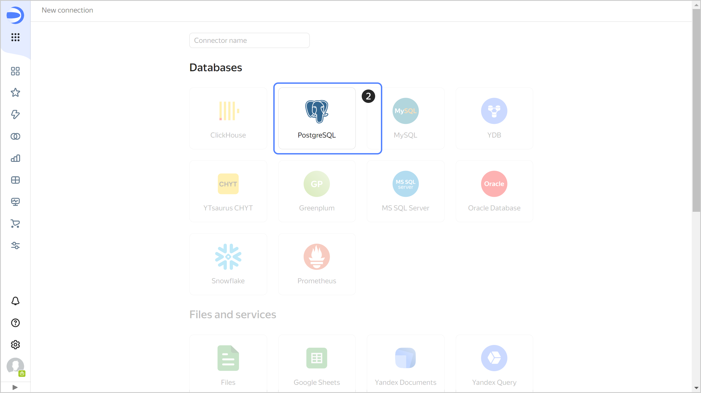
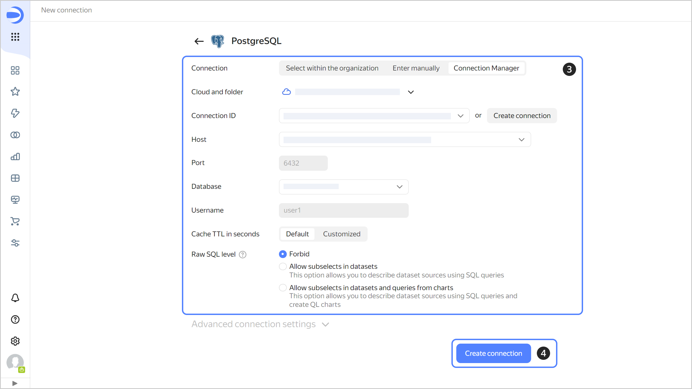
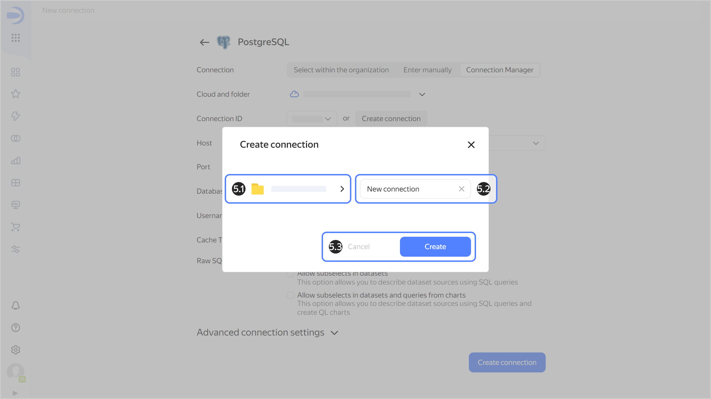
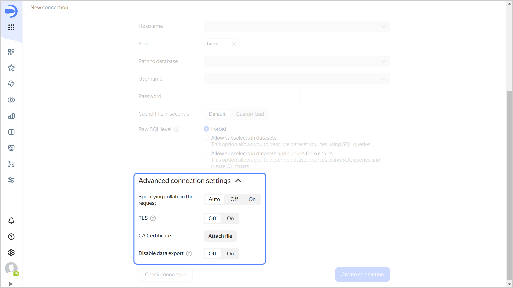

# Creating a {{ PG }} connection



To create a {{ PG }} connection:

1. Open the page for [creating a new connection]({{ link-datalens-main }}/connections/new).
1. Under **Databases**, select the **{{ PG }}** connection.

   

1. Select the connection type:

   

   - Select in organization {#organization}

     

     * **Cloud and folder**. Select the folder the cluster is located in.
     * **Cluster**. Specify a cluster from the list of available {{ PG }} clusters. Cluster settings must have the **{{ datalens-short-name }}** access option enabled. If you do not have an available cluster, click **Create new**.

       

     * **Host type**. Select a host type:

       * **Regular** (default): Allows you to select regular hosts to connect to.
       * **Special FQDNs**: Allows you to select [special FQDNs](../../../managed-postgresql/operations/connect.md#special-fqdns) for connection, which always point to the current master host or to its closest replica in the {{ PG }} cluster.

     * **Hostname**. Select the host name from the list of hosts available in the {{ PG }} cluster. You can select multiple hosts. If you are unable to connect to the first host, {{ datalens-short-name }} will select the next one from the list.
     * **Port**. Specify the {{ PG }} connection port. In {{ yandex-cloud }}, the default port is 6432.
     * **Path to database**. Specify the name of the database to connect to.
     * **Username**. Specify the username for the {{ PG }} connection.
     * **Password**. Enter the password for the user.
     * **Cache TTL in seconds**. Specify the cache time-to-live or leave the default value. The recommended value is 300 seconds (5 minutes).

     

       Click **Check connection** to make sure the parameters are correct.

     

   - Specify manually {#manual}

     

     

     Click **Check connection** to make sure the parameters are correct.

     

   - {{ connection-manager-name }} {#conn-man}

     

     Select a [connection](../../../metadata-hub/concepts/connection-manager.md) to a {{ PG }} managed database cluster created in {{ connection-manager-full-name }}:

     * **Cloud and folder**. Select the folder where the connection to the cluster was created.
     * **Connection ID**. Select an available connection in {{ connection-manager-name }} or [create a new one](../../../metadata-hub/operations/create-connection.md).
     * **Host**. Select a host from the list of available hosts in the {{ PG }} cluster.
     * **Port**. It is set automatically depending on the selected host.
     * **Database**. Specify the name of the database to connect.
     * **Username**. It is set automatically from the selected connection data.
     * **Cache TTL in seconds**. Specify the cache time-to-live or leave the default value. The recommended value is 300 seconds (5 minutes).
     
     

     

   

1. Click **Create connection**.

1. In the window that opens:

   
   1. Select a [workbook](../../workbooks-collections/index.md) to save your connection to or create a new one. If using legacy folder navigation, select a folder to save the connection to.

   1. Enter the connection name.
   
   1. Click **Create**.

   

## Additional settings {#postgresql-additional-settings}

You can specify additional connection settings in the **Advanced connection settings** section:

* **Setting collate in a query**: To explicitly define a collation for DB queries, select a mode:

  * **Auto**: Default setting is used, {{ datalens-short-name }} decides whether to enable the `en_US` locale.
  * **On**: {{ datalens-short-name }} setting is used, the `en_US` locale is specified for individual expressions in a query. This makes the server use the appropriate sorting logic, regardless of the server settings and specific tables. Use the {{ datalens-short-name }} setting if the DB locale is incompatible with {{ datalens-short-name }} performance. For more information on the locale and `LC_COLLATE`, see [{#T}](../../../managed-postgresql/operations/cluster-create.md#create-cluster).
  * **Off**: Default setting is used, {{ datalens-short-name }} only uses the existing parameters of the DB locale.

* **TLS**: Indicates whether TLS is required. When the option is enabled, the `sslmode` parameter is set to `required`. When the option is disabled, the parameter is set to `prefer`.
* **CA Certificate**: To upload a certificate, click **Attach file** and specify the certificate file. When the certificate is uploaded, the field shows the file name.
* 

