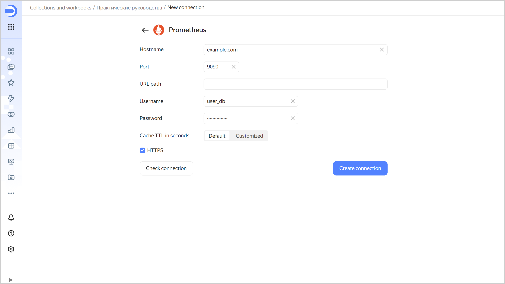

# Creating a {{ prometheus-name }} connection

To create a {{ prometheus-name }} connection:

1. Open the page for [creating a new connection]({{ link-datalens-main }}/connections/new).
1. Under **Databases**, select the **{{ prometheus-name }}** connection.
1. Specify the connection parameters:

   * **Hostname**: Specify the path to the {{ prometheus-name }} host. You can specify multiple hosts in a comma-separated list. If you are unable to connect to the first host, {{ datalens-short-name }} will select the next one from the list.
   * **Port**: Specify the {{ prometheus-name }} connection port.
   * **URL**: Specify the URL of the {{ prometheus-name }} API.
   * **Username**: Specify the username for the {{ prometheus-name }} connection.
   * **Password**: Enter the password for the user.
   * **Cache TTL in seconds**: Specify the cache time-to-live or leave the default value. The recommended value is 300 seconds (5 minutes).
   * **HTTPS**: Enable the secure connection option if your server supports HTTPS.

   

1. (Optional) Test the connection. To do this, click **Check connection**.
1. Click **Create connection**.

1. Select a [workbook](../../workbooks-collections/index.md) to save your connection to or create a new one. If using legacy folder navigation, select a folder to save the connection to. Click **Create**.

1. Enter a name for the connection and click **Create**.
