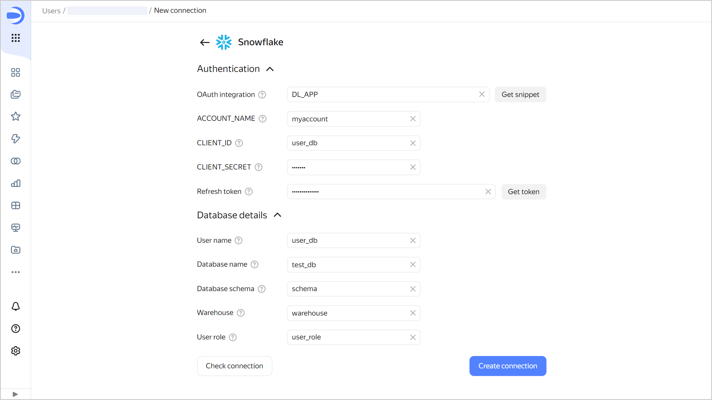

# Creating a Snowflake connection

To create a Snowflake connection:

1. Open the [connection creation page]({{ link-datalens-main }}/connections/new).
1. Under **Databases**, select the **Snowflake** connection.
1. Fill out the fields under **Authentication**:

   
   
   To get the token, create a Snowflake user with restricted access permissions.

   

   1. If this is your first connection to Snowflake in {{ datalens-short-name }}, set up the [OAuth integration](https://docs.snowflake.com/en/user-guide/oauth-custom#integration-example):

      1. In the **OAuth integration** field, add a name for the integration object using Latin characters, and then click **Get snippet**.
      1. Create an integration: in the Snowflake environment, run the snippet that you copied to the clipboard. Run the snippet code on behalf of the user with the relevant permission. In the request response, you will get values to insert to {{ datalens-name }}.
      
         

         You can use the parameters you got for other Snowflake connections from the same account.
         
         

   1. Fill out the parameters you got after running the snippet code in the Snowflake environment:

      * **ACCOUNT_NAME**: [Name of the account](https://docs.snowflake.com/en/user-guide/client-redirect#snowsight-the-snowflake-web-interface) in the Snowflake environment. 
      * **CLIENT_ID**: [Client ID](https://docs.snowflake.com/en/sql-reference/functions/system_show_oauth_client_secrets#system-show-oauth-client-secrets) for the integration object.
      * **CLIENT_SECRET**: [Client secret](https://docs.snowflake.com/en/sql-reference/functions/system_show_oauth_client_secrets#system-show-oauth-client-secrets).

   1. Click **Get token** next to the [**Refresh token**](https://docs.snowflake.com/en/user-guide/oauth-intro#refresh-token) field. This will open the Snowflake page for confirming access. Make sure you are logged in with the Snowflake user account with restricted access.

1. Specify the connection parameters under **Database details**:

   * **User name**: [Name of the user](https://docs.snowflake.com/en/sql-reference/sql/create-user#create-user) who confirmed the access permissions to Snowflake.
   * **Database name**: [Name](https://docs.snowflake.com/en/sql-reference/sql/create-database#create-database) of the database you are connecting to.
   * **Database schema**: Database [schema](https://docs.snowflake.com/en/sql-reference/sql/create-schema#create-schema).
   * **Warehouse**: [Storage](https://docs.snowflake.com/en/sql-reference/sql/create-warehouse#create-warehouse) used by the database.
   * **User role**: [Role of the user](https://docs.snowflake.com/en/sql-reference/sql/create-role#create-role) who has access to the database you are connecting to.

   

1. Optionally, test the connection by clicking **Check connection**.
1. Click **Create connection**.

1. Select the [workbook](../../workbooks-collections/index.md) to save your connection to or create a new one. If using legacy folder navigation, select a folder to save the connection to. Click **Create**.

1. Enter a name for the connection and click **Create**.
