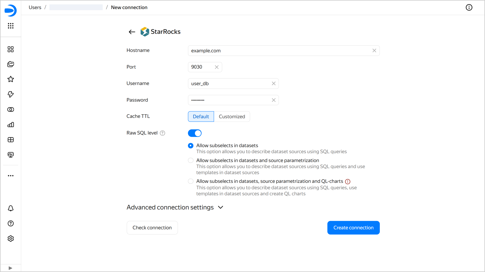
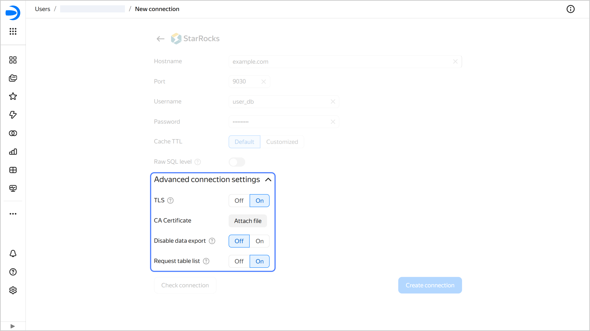

# Creating a connection to {{ SR }} from {{ datalens-full-name }}







To create a {{ SR }} connection:

1. Open the [connection creation page]({{ link-datalens-main }}/connections/new).
1. Under **Databases**, select the **{{ SR }}** connection.
1. Specify the connection parameters for the {{ SR }} database:

   * **Host name**: Specify the path to the {{ SR }} host. You can specify multiple hosts in a comma-separated list. If you fail to connect to the first host, {{ datalens-short-name }} will select the next one from the list.
   * **Port**: Specify the {{ SR }} connection port. The default port is 9030.
   * **Username**: Specify the username for the {{ SR }} connection.
   * **Password**: Enter the password for the user.
   * **Cache TTL in seconds**. Specify the cache TTL or leave the default value. The recommended value is 300 seconds (5 minutes).
   
   

   

1. Optionally, test the connection by clicking **Check connection**.
1. Click **Create connection**.

1. Select a [workbook](../../workbooks-collections/index.md) to save your connection to or create a new one. If using legacy folder navigation, select a folder to save the connection to. Click **Create**.

1. Enter a name for the connection and click **Create**.

## Additional settings {#additional-settings}

You can specify additional connection settings under **Advanced connection settings**:

* **TLS**: Indicates whether TLS is required. When this option is enabled, the connection requires using SSL.
* **CA Certificate**: To upload a certificate, click **Attach file** and select the certificate file. When the certificate is uploaded, the field shows the file name.
* 
* 

